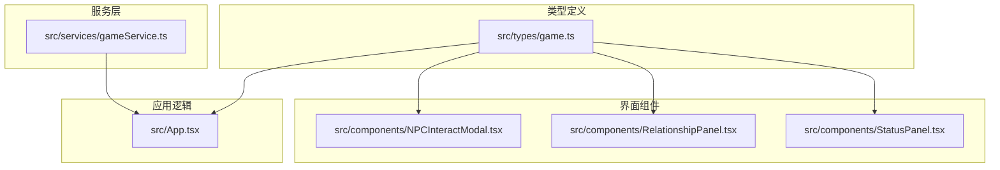
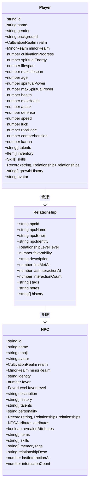
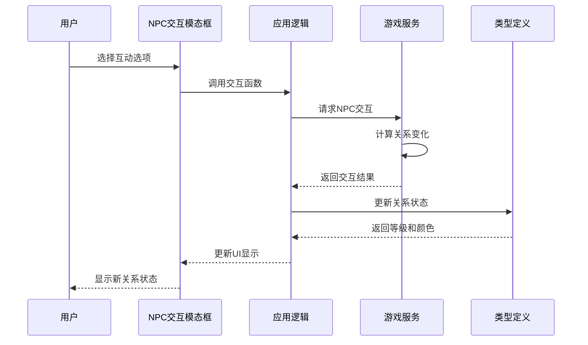
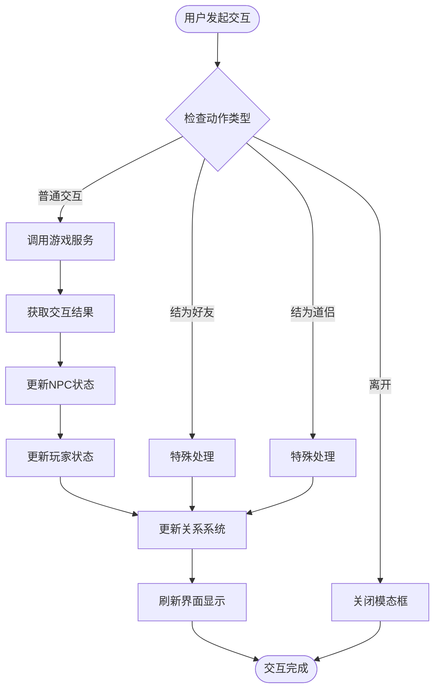
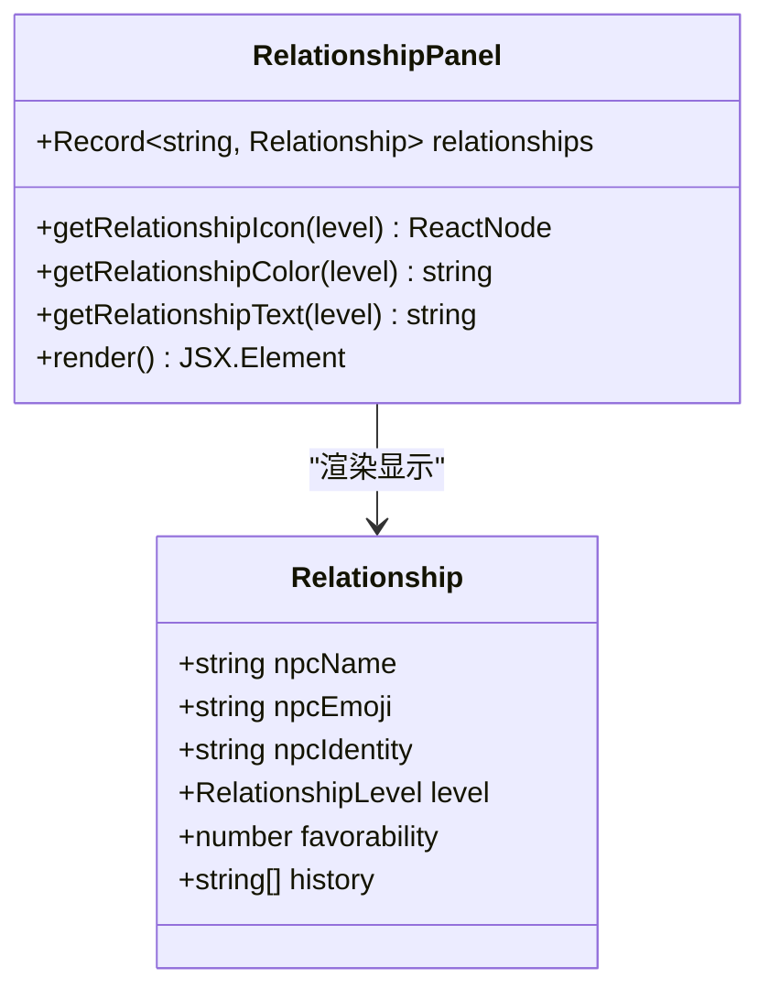
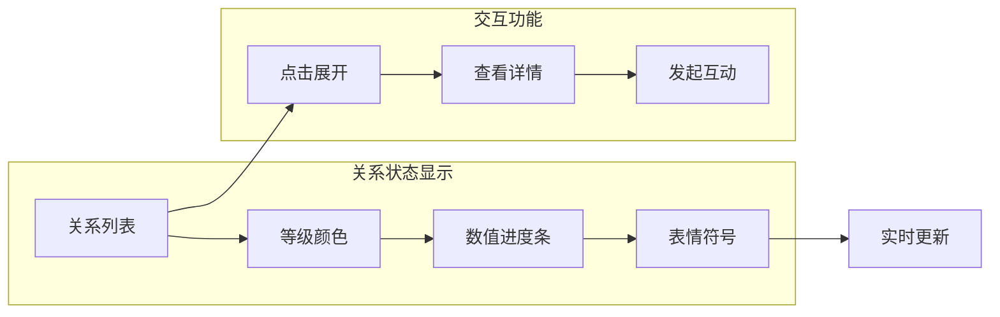
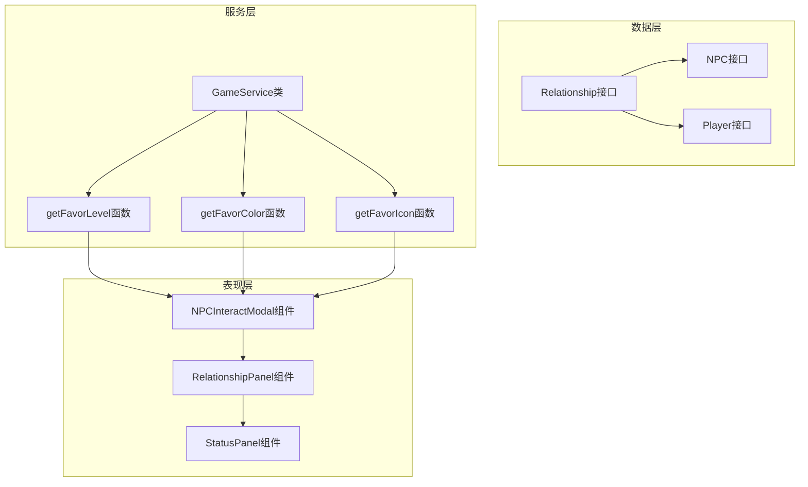

# 好感度系统

<cite>
**本文档引用的文件**
- [src/types/game.ts](file://src/types/game.ts)
- [src/App.tsx](file://src/App.tsx)
- [src/components/NPCInteractModal.tsx](file://src/components/NPCInteractModal.tsx)
- [src/components/RelationshipPanel.tsx](file://src/components/RelationshipPanel.tsx)
- [src/components/StatusPanel.tsx](file://src/components/StatusPanel.tsx)
- [src/services/gameService.ts](file://src/services/gameService.ts)
</cite>

## 目录
1. [简介](#简介)
2. [项目结构](#项目结构)
3. [核心组件](#核心组件)
4. [架构概览](#架构概览)
5. [详细组件分析](#详细组件分析)
6. [依赖关系分析](#依赖关系分析)
7. [性能考虑](#性能考虑)
8. [故障排除指南](#故障排除指南)
9. [结论](#结论)

## 简介

好感度系统是《仙侠 roguelike》游戏中的重要社交机制，用于量化玩家角色与其他 NPC 之间的关系亲密度。该系统采用 -100 到 100 的数值范围设计，通过七个等级划分来直观展示关系状态，并提供相应的视觉反馈和交互功能。

## 项目结构

好感度系统主要分布在以下文件中：

**图表来源**
- [src/types/game.ts](file://src/types/game.ts#L43-L108)
- [src/App.tsx](file://src/App.tsx#L370-L423)

**章节来源**
- [src/types/game.ts](file://src/types/game.ts#L1-L319)
- [src/App.tsx](file://src/App.tsx#L370-L423)

## 核心组件

### 数据模型设计

好感度系统的核心数据结构包括：

**图表来源**
- [src/types/game.ts](file://src/types/game.ts#L94-L139)
- [src/types/game.ts](file://src/types/game.ts#L173-L203)

### 等级划分体系

系统采用七个等级来描述关系状态：

| 等级 | 数值范围 | 描述 | 颜色方案 | 表情符号 |
|------|----------|------|----------|----------|
| 仇敌 | (-∞, -100] | 极度敌对，可能引发冲突 | 红色系 | 💀 |
| 敌视 | (-100, -50] | 强烈敌意，避免接触 | 橙红色系 | ⚔️ |
| 陌生 | (-50, 30) | 初次接触，保持距离 | 灰色系 | 😐 |
| 朋友 | [30, 60) | 友好交往，互相帮助 | 绿色系 | 🙂 |
| 好友 | [60, 80) | 深厚友谊，信任程度高 | 浅绿色系 | 😊 |
| 生死之交 | [80, 100) | 患难与共，生死相托 | 紫色系 | 💜 |
| 道侣 | (100, +∞) | 终生伴侣，灵魂契合 | 粉红色系 | 💗 |

**章节来源**
- [src/types/game.ts](file://src/types/game.ts#L287-L318)

## 架构概览

好感度系统采用分层架构设计，确保数据一致性与用户体验的平衡：

**图表来源**
- [src/components/NPCInteractModal.tsx](file://src/components/NPCInteractModal.tsx#L37-L54)
- [src/App.tsx](file://src/App.tsx#L481-L548)
- [src/services/gameService.ts](file://src/services/gameService.ts#L45-L48)

## 详细组件分析

### NPC 交互系统

NPC 交互模态框负责处理用户与 NPC 的直接互动：

**图表来源**
- [src/components/NPCInteractModal.tsx](file://src/components/NPCInteractModal.tsx#L37-L54)
- [src/App.tsx](file://src/App.tsx#L481-L548)

### 关系面板显示

关系面板提供全局关系概览：

**图表来源**
- [src/components/RelationshipPanel.tsx](file://src/components/RelationshipPanel.tsx#L11-L103)

### 状态面板集成

状态面板整合了关系信息的可视化展示：

**图表来源**
- [src/components/StatusPanel.tsx](file://src/components/StatusPanel.tsx#L448-L493)

**章节来源**
- [src/components/NPCInteractModal.tsx](file://src/components/NPCInteractModal.tsx#L1-L223)
- [src/components/RelationshipPanel.tsx](file://src/components/RelationshipPanel.tsx#L1-L103)
- [src/components/StatusPanel.tsx](file://src/components/StatusPanel.tsx#L448-L493)

## 依赖关系分析

好感度系统各组件间的依赖关系如下：

**图表来源**
- [src/types/game.ts](file://src/types/game.ts#L94-L203)
- [src/services/gameService.ts](file://src/services/gameService.ts#L45-L48)

**章节来源**
- [src/types/game.ts](file://src/types/game.ts#L1-L319)
- [src/services/gameService.ts](file://src/services/gameService.ts#L1-L200)

## 性能考虑

### 数据更新优化

系统采用以下策略优化性能：

1. **增量更新**：仅在关系发生变化时更新相关组件
2. **状态缓存**：避免重复计算等级和颜色
3. **虚拟滚动**：关系列表使用滚动区域组件优化渲染
4. **条件渲染**：根据关系数量动态调整显示内容

### 内存管理

- 关系历史记录限制长度，防止内存泄漏
- 定期清理过期的交互记录
- 使用不可变数据结构避免意外修改

## 故障排除指南

### 常见问题及解决方案

| 问题类型 | 症状 | 可能原因 | 解决方案 |
|----------|------|----------|----------|
| 关系数值异常 | 数值超出范围 | 业务逻辑错误 | 检查数值边界处理 |
| 等级显示错误 | 等级与数值不符 | 等级判断逻辑问题 | 验证 getFavorLevel 函数 |
| UI不更新 | 界面显示陈旧 | 状态同步问题 | 检查状态订阅机制 |
| 性能问题 | 页面卡顿 | 渲染优化不足 | 实施虚拟滚动和懒加载 |

### 调试技巧

1. **日志追踪**：在关系更新点添加详细日志
2. **状态检查**：定期验证关系对象的完整性
3. **边界测试**：测试 -100 和 100 的边界情况
4. **性能监控**：监控渲染时间和内存使用

**章节来源**
- [src/App.tsx](file://src/App.tsx#L370-L423)
- [src/types/game.ts](file://src/types/game.ts#L287-L318)

## 结论

好感度系统通过精心设计的数据模型、清晰的等级划分和直观的视觉反馈，为玩家提供了丰富的社交体验。系统采用模块化设计，确保了良好的可维护性和扩展性。未来可以考虑添加长期关系维护机制、特殊事件触发和更精细的互动效果，进一步提升游戏的沉浸感和策略深度。