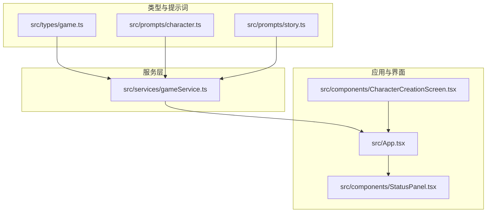
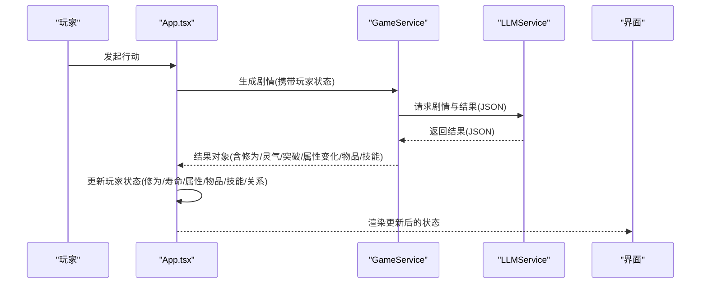
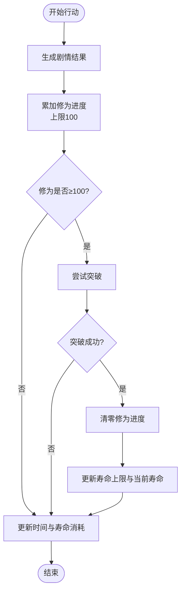
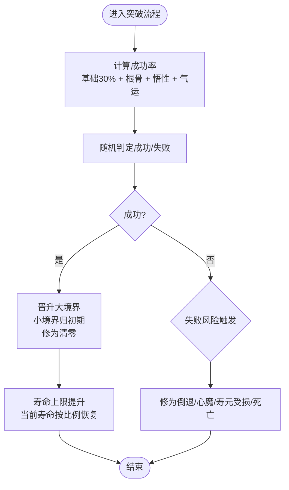
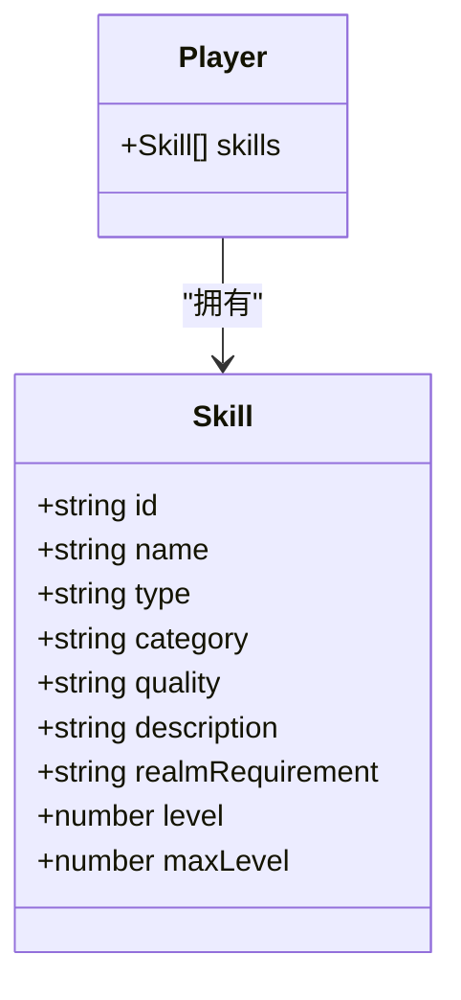
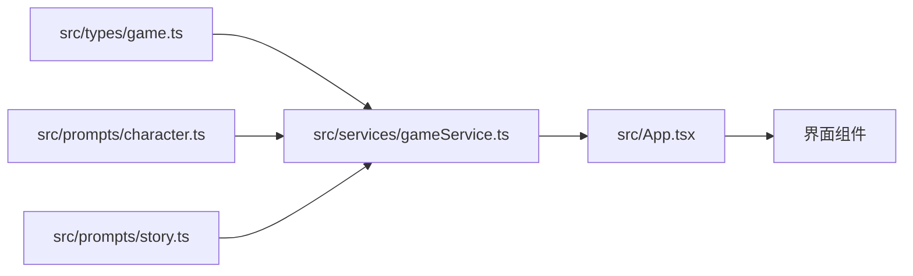

# 修仙境界体系

<cite>
**本文引用的文件**   
- [README.md](file://README.md)
- [src/types/game.ts](file://src/types/game.ts)
- [src/prompts/character.ts](file://src/prompts/character.ts)
- [src/prompts/story.ts](file://src/prompts/story.ts)
- [src/services/gameService.ts](file://src/services/gameService.ts)
- [src/App.tsx](file://src/App.tsx)
- [src/components/CharacterCreationScreen.tsx](file://src/components/CharacterCreationScreen.tsx)
- [src/components/StatusPanel.tsx](file://src/components/StatusPanel.tsx)
</cite>

## 目录
1. [简介](#简介)
2. [项目结构](#项目结构)
3. [核心组件](#核心组件)
4. [架构总览](#架构总览)
5. [详细组件分析](#详细组件分析)
6. [依赖分析](#依赖分析)
7. [性能考虑](#性能考虑)
8. [故障排查指南](#故障排查指南)
9. [结论](#结论)
10. [附录](#附录)

## 简介
本文件系统化梳理本项目的“修仙境界体系”，围绕九重天大境界（炼气期、筑基期、金丹期、元婴期、化神期、炼虚期、合体期、大乘期、渡劫期）及其小境界划分（初期、中期、后期、巅峰），解释其数值表现、升级条件、突破机制、对角色属性的影响，以及与技能解锁、功法学习、修为增长的平衡性设计。同时提供策略建议与数值优化思路，帮助玩家与开发者更好地理解与扩展该体系。

## 项目结构
本项目采用前端单页应用架构，核心与修仙境界体系相关的关键位置如下：
- 类型定义：集中于类型声明文件，明确境界枚举、小境界枚举、角色属性、技能与NPC结构等
- 角色与剧情提示词：定义角色生成、剧情推演与突破机制的系统规则
- 游戏服务层：封装与大模型交互、剧情生成、状态更新与持久化
- 应用入口与UI：处理剧情结果、更新玩家状态、展示功法与关系面板



图表来源
- [src/types/game.ts](file://src/types/game.ts#L1-L139)
- [src/prompts/character.ts](file://src/prompts/character.ts#L1-L97)
- [src/prompts/story.ts](file://src/prompts/story.ts#L1-L147)
- [src/services/gameService.ts](file://src/services/gameService.ts#L1-L541)
- [src/App.tsx](file://src/App.tsx#L267-L378)
- [src/components/CharacterCreationScreen.tsx](file://src/components/CharacterCreationScreen.tsx#L153-L188)
- [src/components/StatusPanel.tsx](file://src/components/StatusPanel.tsx#L406-L446)

章节来源
- [README.md](file://README.md#L77-L97)

## 核心组件
- 境界与小境界枚举：定义九重天大境界与四小境界，贯穿角色状态与技能需求
- 角色属性与修为：包含气血、真气、攻击、防御、速度、根骨、悟性、气运、业力、寿命等，支撑突破与成长
- 突破机制：修为达到阈值时尝试突破，成功率受根骨、悟性、气运影响，失败有风险
- 技能与功法：功法按品质与类别分类，部分功法需满足特定境界要求
- 剧情与时间：通过大模型推演出剧情、时间流逝、修为与灵气增长、突破与属性变化

章节来源
- [src/types/game.ts](file://src/types/game.ts#L1-L139)
- [src/prompts/character.ts](file://src/prompts/character.ts#L11-L58)
- [src/prompts/story.ts](file://src/prompts/story.ts#L26-L41)
- [src/services/gameService.ts](file://src/services/gameService.ts#L284-L391)
- [src/App.tsx](file://src/App.tsx#L267-L378)

## 架构总览
修仙境界体系在系统中的流转路径如下：
- 输入：玩家行动与当前状态
- 处理：服务层调用大模型生成剧情结果，包含修为增长、灵气增长、突破与否及属性变化
- 输出：应用层更新玩家状态（境界、小境界、修为进度、寿命上限、属性、物品、技能、关系）



图表来源
- [src/services/gameService.ts](file://src/services/gameService.ts#L284-L391)
- [src/App.tsx](file://src/App.tsx#L267-L378)

## 详细组件分析

### 境界与小境界划分
- 大境界（九重天）：炼气期、筑基期、金丹期、元婴期、化神期、炼虚期、合体期、大乘期、渡劫期
- 小境界：初期、中期、后期、巅峰
- 角色初始状态：境界=炼气期，小境界=初期，修为进度=0，灵气值=0

```mermaid
classDiagram
class Player {
+string id
+string name
+string realm
+string minorRealm
+number cultivationProgress
+number spiritualEnergy
+number age
+number lifespan
+number maxLifespan
+number health
+number maxHealth
+number spiritualPower
+number maxSpiritualPower
+number attack
+number defense
+number speed
+number luck
+number rootBone
+number comprehension
+number karma
+string[] talents
+Item[] inventory
+Skill[] skills
+Record~string,Relationship~ relationships
+string[] growthHistory
+string avatar
}
class CultivationRealm {
<<枚举>>
"炼气期"
"筑基期"
"金丹期"
"元婴期"
"化神期"
"炼虚期"
"合体期"
"大乘期"
"渡劫期"
}
class MinorRealm {
<<枚举>>
"初期"
"中期"
"后期"
"巅峰"
}
Player --> CultivationRealm : "拥有"
Player --> MinorRealm : "拥有"
```

图表来源
- [src/types/game.ts](file://src/types/game.ts#L110-L139)
- [src/types/game.ts](file://src/types/game.ts#L1-L12)

章节来源
- [src/types/game.ts](file://src/types/game.ts#L1-L139)
- [src/prompts/character.ts](file://src/prompts/character.ts#L40-L58)
- [src/components/CharacterCreationScreen.tsx](file://src/components/CharacterCreationScreen.tsx#L153-L159)

### 修为进度与升级条件
- 修为进度范围：0 到 100
- 升级条件：修为达到 100% 时可尝试突破
- 增长来源：剧情推演返回的“获得修为”数值，系统自动累加并限制在 0-100
- 时间与寿命：剧情推演返回的时间消耗会折算为年龄与寿命消耗



图表来源
- [src/App.tsx](file://src/App.tsx#L302-L336)
- [src/prompts/story.ts](file://src/prompts/story.ts#L79-L86)

章节来源
- [src/App.tsx](file://src/App.tsx#L302-L336)
- [src/prompts/story.ts](file://src/prompts/story.ts#L79-L86)

### 突破机制与随机性设计
- 成功率构成：基础成功率（30%）+ 根骨（0-30%）+ 悟性（0-20%）+ 气运（0-20%）
- 失败风险：修为倒退、心魔入侵、寿元受损、甚至死亡
- 成功收益：境界提升至新大境界，小境界归位初期，修为进度清零；寿命上限提升，当前寿命按一定比例恢复



图表来源
- [src/prompts/story.ts](file://src/prompts/story.ts#L26-L30)
- [src/App.tsx](file://src/App.tsx#L314-L336)

章节来源
- [src/prompts/story.ts](file://src/prompts/story.ts#L26-L30)
- [src/App.tsx](file://src/App.tsx#L314-L336)

### 不同境界对角色属性的影响
- 寿命上限：随大境界提升而显著增长（例如炼气期约150年，金丹期500年，元婴期1000年，化神期2000年，炼虚期5000年，合体期10000年，大乘期50000年，渡劫期99999年）
- 其他属性：剧情推演可带来气血、真气、攻击、防御、速度、根骨、悟性、气运、业力等变化，系统在更新时进行边界保护（如真气不超过最大值）

章节来源
- [src/prompts/character.ts](file://src/prompts/character.ts#L50-L56)
- [src/App.tsx](file://src/App.tsx#L267-L286)
- [src/App.tsx](file://src/App.tsx#L319-L335)

### 技能解锁与功法学习
- 技能结构：包含名称、类型、类别、品质、描述、境界需求、等级与最大等级
- 解锁条件：部分功法需满足特定大境界要求
- 学习与提升：剧情推演可返回“获得功法”和“提升技能”的结果，系统将其合并到玩家技能列表并按名称提升等级（不超过最大等级）



图表来源
- [src/types/game.ts](file://src/types/game.ts#L82-L92)
- [src/types/game.ts](file://src/types/game.ts#L110-L139)

章节来源
- [src/types/game.ts](file://src/types/game.ts#L82-L92)
- [src/App.tsx](file://src/App.tsx#L353-L369)
- [src/components/StatusPanel.tsx](file://src/components/StatusPanel.tsx#L406-L446)

### 境界限制的技能解锁与功法学习条件
- 技能的 realmRequirement 字段用于约束功法学习的最低境界门槛
- 玩家当前境界决定可学习功法的范围；突破后可解锁更高阶功法

章节来源
- [src/types/game.ts](file://src/types/game.ts#L89-L89)

### 修为增长的平衡性设计
- 成长来源：剧情推演返回的“获得修为”和“获得灵气”数值
- 边界控制：修为进度上限100%，真气不超过最大值
- 时间成本：每次行动均伴随时间消耗，进而转化为寿命消耗
- 随机性：突破成功率与失败风险，避免线性单调

章节来源
- [src/prompts/story.ts](file://src/prompts/story.ts#L79-L86)
- [src/App.tsx](file://src/App.tsx#L290-L306)
- [src/App.tsx](file://src/App.tsx#L267-L286)

### 境界进化的策略指导与数值优化建议
- 策略建议
  - 优先稳定积累修为，避免频繁尝试突破导致失败风险
  - 在突破前尽量提升根骨与悟性，提高成功率
  - 合理利用气运，选择高奇遇概率的行动路径
  - 注意寿命消耗，避免因时间流逝过快导致早衰
- 数值优化
  - 对突破成功率进行分段设计（如基础30%，根骨每点+1%，悟性每点+0.5%，气运每点+0.5%），保持总和不超过100%
  - 设计失败惩罚的下限（如修为倒退幅度与失败概率匹配），避免极端负反馈
  - 为高阶境界设置更高的寿命上限与更稳健的突破收益，维持长期成长曲线

## 依赖分析
- 类型依赖：Player、Skill、CultivationRealm、MinorRealm 等类型贯穿服务层与应用层
- 提示词依赖：角色生成与剧情推演依赖系统提示词，决定初始属性、突破机制与结果格式
- 服务层依赖：GameService 调用 LLMService 生成剧情结果，再由 App.tsx 更新状态



图表来源
- [src/types/game.ts](file://src/types/game.ts#L1-L139)
- [src/prompts/character.ts](file://src/prompts/character.ts#L1-L97)
- [src/prompts/story.ts](file://src/prompts/story.ts#L1-L147)
- [src/services/gameService.ts](file://src/services/gameService.ts#L1-L541)
- [src/App.tsx](file://src/App.tsx#L267-L378)

章节来源
- [src/types/game.ts](file://src/types/game.ts#L1-L139)
- [src/services/gameService.ts](file://src/services/gameService.ts#L1-L541)
- [src/App.tsx](file://src/App.tsx#L267-L378)

## 性能考虑
- 大模型调用：剧情生成与角色生成均为异步请求，应合理控制调用频率与并发
- 状态更新：批量更新玩家状态时，避免不必要的重渲染，可按需拆分更新
- 数据边界：对数值进行边界保护（修为进度、真气、寿命等），减少异常分支判断

## 故障排查指南
- 突破失败后修为倒退或寿命受损：确认剧情结果中的突破字段是否正确传递到应用层
- 属性更新异常：检查 statChanges 的数值是否越界，系统已在应用层进行边界保护
- 技能未生效：确认返回的 skillsGained 与 skillsImproved 是否正确合并到玩家技能列表

章节来源
- [src/App.tsx](file://src/App.tsx#L267-L286)
- [src/App.tsx](file://src/App.tsx#L353-L369)

## 结论
本项目的修仙境界体系以“九重天+小境界”为核心，结合修为进度、突破机制与属性成长，形成完整的角色演化闭环。通过剧情推演与大模型交互，系统实现了高自由度的体验与可扩展的数值设计。建议在后续迭代中进一步细化突破失败的惩罚与收益曲线，完善高阶境界的挑战与回报，以增强长期可玩性与策略深度。

## 附录
- 术语
  - 境界：角色修炼阶段的代名词
  - 小境界：大境界内的阶段性划分
  - 修为：角色修炼进度的量化指标
  - 灵气：角色内功储备，影响部分属性与技能
  - 突破：从当前大境界向更高大境界跃迁的过程