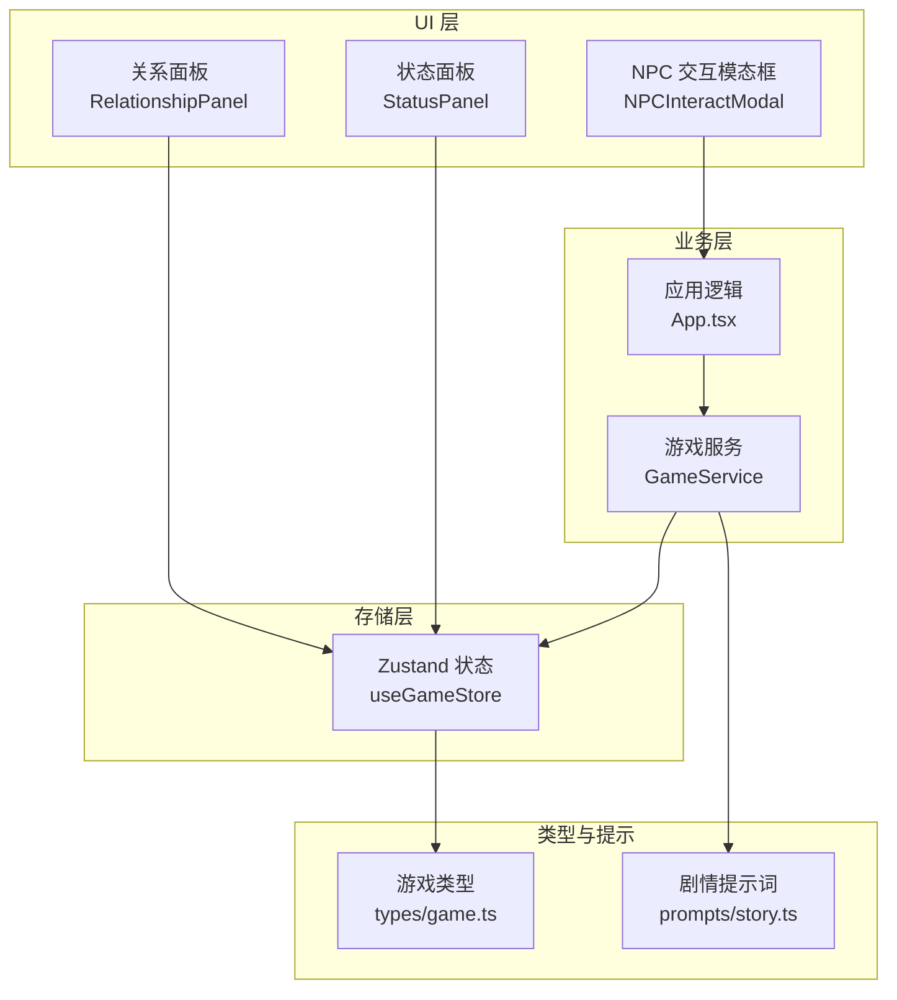
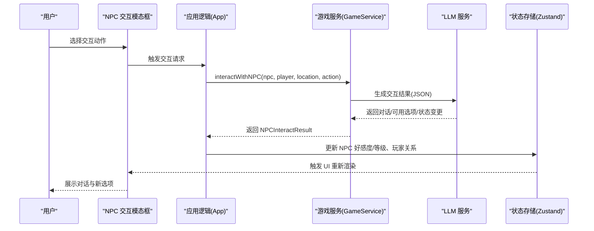
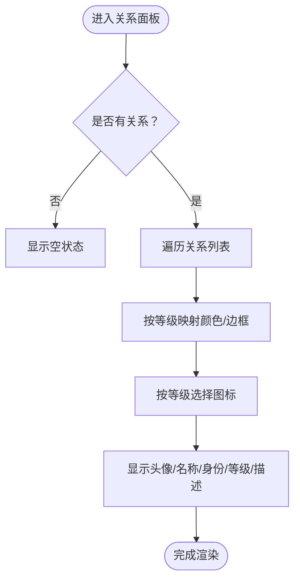
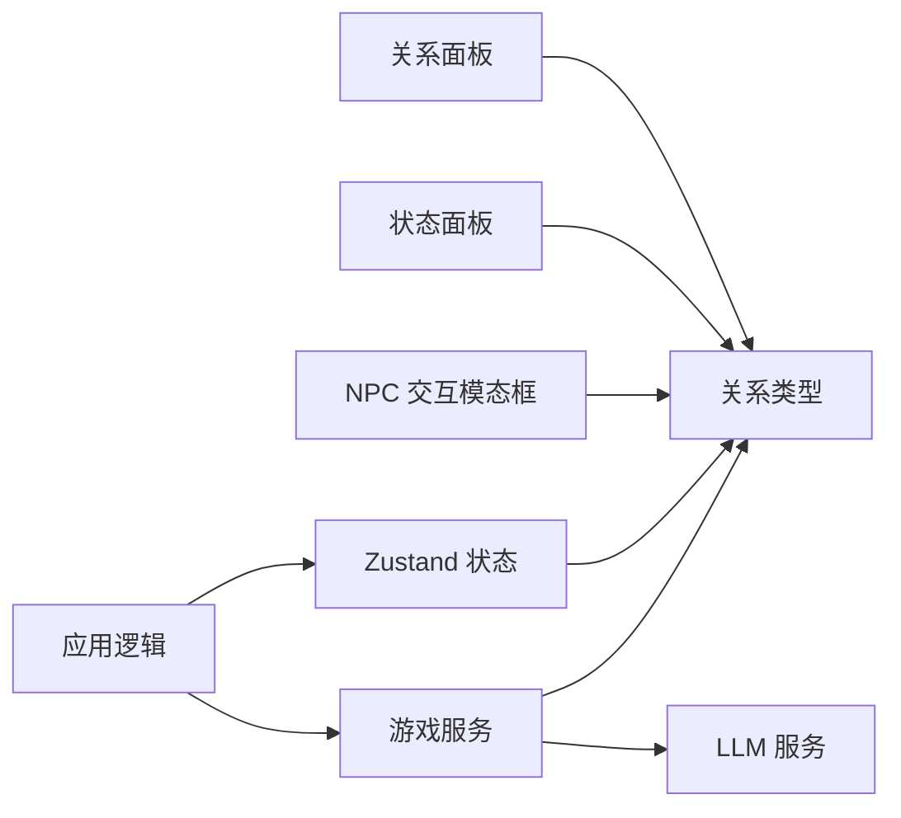

# 关系网络系统

<cite>
**本文引用的文件**
- [src/components/RelationshipPanel.tsx](file://src/components/RelationshipPanel.tsx)
- [src/components/NPCInteractModal.tsx](file://src/components/NPCInteractModal.tsx)
- [src/components/StatusPanel.tsx](file://src/components/StatusPanel.tsx)
- [src/App.tsx](file://src/App.tsx)
- [src/stores/useGameStore.ts](file://src/stores/useGameStore.ts)
- [src/services/gameService.ts](file://src/services/gameService.ts)
- [src/types/game.ts](file://src/types/game.ts)
- [src/prompts/story.ts](file://src/prompts/story.ts)
</cite>

## 目录
1. [简介](#简介)
2. [项目结构](#项目结构)
3. [核心组件](#核心组件)
4. [架构总览](#架构总览)
5. [详细组件分析](#详细组件分析)
6. [依赖关系分析](#依赖关系分析)
7. [性能考量](#性能考量)
8. [故障排除指南](#故障排除指南)
9. [结论](#结论)
10. [附录](#附录)

## 简介
本文件系统性梳理“关系网络系统”的设计与实现，覆盖关系等级体系（敌对、冷淡、中立、友好、亲密、挚爱）、影响因素（互动频率、行为选择、礼物交换、共同经历）、对玩法的影响（战斗支援、信息获取、任务协助、特殊事件触发）、可视化展示、历史记录追踪与保存机制，并提供关系修复策略、冲突化解方法与长期维护技巧。

## 项目结构
关系系统围绕以下模块协同工作：
- 数据模型层：定义关系实体、等级、好感度及交互结果类型
- 存储层：Zustand 状态持久化，支持本地存储与增量序列化
- 服务层：LLM 驱动的剧情生成与 NPC 交互，产出关系变更
- UI 层：关系面板、状态面板、NPC 交互模态框，提供可视化与交互入口

图表来源
- [src/components/RelationshipPanel.tsx](file://src/components/RelationshipPanel.tsx#L1-L103)
- [src/components/StatusPanel.tsx](file://src/components/StatusPanel.tsx#L448-L503)
- [src/components/NPCInteractModal.tsx](file://src/components/NPCInteractModal.tsx#L1-L223)
- [src/App.tsx](file://src/App.tsx#L370-L569)
- [src/stores/useGameStore.ts](file://src/stores/useGameStore.ts#L84-L225)
- [src/services/gameService.ts](file://src/services/gameService.ts#L50-L541)
- [src/types/game.ts](file://src/types/game.ts#L94-L108)
- [src/prompts/story.ts](file://src/prompts/story.ts#L51-L147)

章节来源
- [src/components/RelationshipPanel.tsx](file://src/components/RelationshipPanel.tsx#L1-L103)
- [src/components/StatusPanel.tsx](file://src/components/StatusPanel.tsx#L448-L503)
- [src/components/NPCInteractModal.tsx](file://src/components/NPCInteractModal.tsx#L1-L223)
- [src/App.tsx](file://src/App.tsx#L370-L569)
- [src/stores/useGameStore.ts](file://src/stores/useGameStore.ts#L84-L225)
- [src/services/gameService.ts](file://src/services/gameService.ts#L50-L541)
- [src/types/game.ts](file://src/types/game.ts#L94-L108)
- [src/prompts/story.ts](file://src/prompts/story.ts#L51-L147)

## 核心组件
- 关系实体与等级
  - 关系对象包含 NPC 标识、名称、头像、身份、关系等级、好感度、描述、首次/最近互动时间、互动次数、标签、备注、历史记录等字段
  - 关系等级枚举：敌对、冷淡、中立、友好、亲密、挚爱
- 好感度系统
  - NPC 好感度区间与等级映射：-100~100，分段映射为“仇敌/敌视/陌生/朋友/好友/生死之交/道侣”
  - UI 提供颜色与图标区分
- 关系面板
  - 展示所有 NPC 的关系等级、头像、身份、简要描述与等级图标
- NPC 交互模态框
  - 提供“打听消息”“赠送礼物”“切磋”“探查”“结为好友/道侣”等交互选项，展示当前 NPC 好感度与属性
- 状态面板
  - 展示关系列表、等级颜色、好感度条与数值
- 游戏服务
  - 通过 LLM 生成剧情与交互结果，返回关系变更（包括新增 NPC 的初始关系与既有关系的调整）

章节来源
- [src/types/game.ts](file://src/types/game.ts#L43-L46)
- [src/types/game.ts](file://src/types/game.ts#L94-L108)
- [src/types/game.ts](file://src/types/game.ts#L181-L203)
- [src/types/game.ts](file://src/types/game.ts#L287-L318)
- [src/components/RelationshipPanel.tsx](file://src/components/RelationshipPanel.tsx#L11-L103)
- [src/components/NPCInteractModal.tsx](file://src/components/NPCInteractModal.tsx#L14-L22)
- [src/components/StatusPanel.tsx](file://src/components/StatusPanel.tsx#L448-L503)
- [src/services/gameService.ts](file://src/services/gameService.ts#L415-L469)

## 架构总览
关系系统采用“类型驱动 + LLM 驱动 + UI 展示 + 状态持久化”的分层架构。核心流程：
- 用户在 UI 中发起交互（如与 NPC 对话、赠送礼物、切磋）
- 应用逻辑调用游戏服务，结合当前场景与记忆上下文生成交互结果
- 服务层返回关系变更（新增 NPC 的初始关系、既有关系的好感度变化与等级切换）
- 应用逻辑更新玩家关系数据与 NPC 状态，UI 实时刷新

图表来源
- [src/components/NPCInteractModal.tsx](file://src/components/NPCInteractModal.tsx#L37-L54)
- [src/App.tsx](file://src/App.tsx#L481-L548)
- [src/services/gameService.ts](file://src/services/gameService.ts#L415-L469)
- [src/stores/useGameStore.ts](file://src/stores/useGameStore.ts#L84-L225)

## 详细组件分析

### 关系等级体系与可视化
- 等级与颜色映射
  - 敌对：红色警示
  - 冷淡：灰色
  - 中立：蓝色
  - 友好：浅绿色
  - 亲密：粉色
  - 挚爱：紫色
- 图标与文本
  - 敌对使用骷髅图标，友好/亲密/挚爱使用爱心图标，其他使用减号占位
- 面板展示
  - 关系面板按等级分色边框与背景，显示 NPC 头像、名称、身份、等级与描述
  - 状态面板提供更紧凑的关系列表，含等级颜色与好感度条

图表来源
- [src/components/RelationshipPanel.tsx](file://src/components/RelationshipPanel.tsx#L11-L103)
- [src/components/StatusPanel.tsx](file://src/components/StatusPanel.tsx#L448-L503)

章节来源
- [src/components/RelationshipPanel.tsx](file://src/components/RelationshipPanel.tsx#L11-L103)
- [src/components/StatusPanel.tsx](file://src/components/StatusPanel.tsx#L448-L503)

### 影响因素与变化机制
- 互动频率
  - 关系对象包含“最近互动时间”“互动次数”，每次交互会更新这两项
- 行为选择
  - 不同交互动作（打听消息、赠送礼物、切磋、探查、结为好友/道侣）由 LLM 评估并返回对关系的影响
- 礼物交换
  - “赠送礼物”作为提升关系的常用手段，LLM 在交互结果中体现对好感度的增益
- 共同经历
  - 关系对象维护“历史记录”，每次交互会追加地点与事件描述，形成关系记忆链

章节来源
- [src/types/game.ts](file://src/types/game.ts#L94-L108)
- [src/App.tsx](file://src/App.tsx#L378-L407)
- [src/App.tsx](file://src/App.tsx#L411-L423)

### 关系对玩法的影响
- 战斗支援
  - 好感度/关系等级越高，NPC 更可能提供帮助或减少敌对倾向
- 信息获取
  - 好感度提升后，NPC 更愿意分享情报或解锁隐藏对话
- 任务协助
  - 高关系等级可解锁特殊任务或降低任务难度
- 特殊事件触发
  - LLM 在剧情生成中根据关系状态决定事件走向与奖励

章节来源
- [src/prompts/story.ts](file://src/prompts/story.ts#L35-L41)
- [src/services/gameService.ts](file://src/services/gameService.ts#L415-L469)

### 可视化展示与历史记录
- 可视化
  - 关系面板与状态面板分别提供卡片式与列表式展示，统一使用等级颜色与图标
- 历史记录
  - 关系对象维护 history 字段，每次交互追加“在某地相遇”等描述
  - NPC 交互模态框展示已探查属性，增强关系深度

章节来源
- [src/components/RelationshipPanel.tsx](file://src/components/RelationshipPanel.tsx#L89-L95)
- [src/components/StatusPanel.tsx](file://src/components/StatusPanel.tsx#L477-L488)
- [src/components/NPCInteractModal.tsx](file://src/components/NPCInteractModal.tsx#L143-L162)

### 保存机制
- 状态持久化
  - Zustand middleware 将玩家、NPC、世界、日志、事件、记忆、回合数、游戏状态等写入 localStorage
  - 仅持久化必要字段，避免冗余
- 自动存档
  - 生成剧情后触发自动保存，确保关系状态随游戏进程同步落盘

章节来源
- [src/stores/useGameStore.ts](file://src/stores/useGameStore.ts#L207-L224)
- [src/App.tsx](file://src/App.tsx#L454-L455)

### 关系修复策略与冲突化解
- 修复路径
  - 通过“赠送礼物”“探查”“切磋”等动作逐步恢复关系
  - 在 NPC 交互模态框中选择合适选项，观察 LLM 返回的可用交互与原因
- 冲突化解
  - 若 NPC 处于“敌视/仇敌”等级，优先选择非对抗性选项（如“打听消息”“赠送礼物”）
  - 结合剧情提示词中的“势力分布”“地理环境”等背景，寻找和平解决途径

章节来源
- [src/components/NPCInteractModal.tsx](file://src/components/NPCInteractModal.tsx#L172-L214)
- [src/types/game.ts](file://src/types/game.ts#L287-L318)
- [src/prompts/story.ts](file://src/prompts/story.ts#L14-L18)

### 重要关系的维护技巧
- 长期策略
  - 定期互动，保持互动频率与次数
  - 根据 NPC 性别/身份/背景选择合适的礼物与话题
  - 在关键节点（突破、获得资源、遭遇危机）优先考虑关系等级带来的收益
- 社交玩法
  - 利用关系等级影响 NPC 的“关系描述”“记忆标签”，逐步深化关系
  - 在状态面板中关注关系等级与好感度条，及时调整策略

章节来源
- [src/components/StatusPanel.tsx](file://src/components/StatusPanel.tsx#L448-L503)
- [src/types/game.ts](file://src/types/game.ts#L181-L203)

## 依赖关系分析
关系系统的关键依赖链：
- UI 组件依赖类型定义（等级、关系、交互结果）
- 应用逻辑依赖游戏服务与状态存储
- 游戏服务依赖 LLM 与记忆服务，输出关系变更
- 状态存储依赖持久化中间件，保障关系状态可恢复

图表来源
- [src/components/RelationshipPanel.tsx](file://src/components/RelationshipPanel.tsx#L1-L103)
- [src/components/StatusPanel.tsx](file://src/components/StatusPanel.tsx#L448-L503)
- [src/components/NPCInteractModal.tsx](file://src/components/NPCInteractModal.tsx#L1-L223)
- [src/App.tsx](file://src/App.tsx#L370-L569)
- [src/services/gameService.ts](file://src/services/gameService.ts#L50-L541)
- [src/stores/useGameStore.ts](file://src/stores/useGameStore.ts#L84-L225)
- [src/types/game.ts](file://src/types/game.ts#L94-L108)

章节来源
- [src/types/game.ts](file://src/types/game.ts#L94-L108)
- [src/stores/useGameStore.ts](file://src/stores/useGameStore.ts#L84-L225)
- [src/services/gameService.ts](file://src/services/gameService.ts#L50-L541)
- [src/App.tsx](file://src/App.tsx#L370-L569)

## 性能考量
- LLM 调用成本控制
  - 通过提示词精简输入，限制返回字段数量，避免过度计算
- UI 渲染优化
  - 关系面板与状态面板使用虚拟滚动与条件渲染，减少 DOM 压力
- 状态持久化
  - 仅持久化必要字段，避免频繁写入 localStorage 导致卡顿

## 故障排除指南
- 关系未更新
  - 检查应用逻辑是否正确接收并应用 LLM 返回的关系变更
  - 确认 NPC 交互结果中的“favorabilityChange/newLevel”字段是否存在
- 好感度异常
  - 核对“getFavorLevel/getFavorColor/getFavorIcon”映射逻辑
  - 检查 NPC 状态更新是否包含 favor 与 favorLevel 的同步
- 保存失败
  - 确认 Zustand 持久化配置与序列化字段完整
  - 检查浏览器本地存储权限与容量

章节来源
- [src/App.tsx](file://src/App.tsx#L481-L548)
- [src/types/game.ts](file://src/types/game.ts#L287-L318)
- [src/stores/useGameStore.ts](file://src/stores/useGameStore.ts#L207-L224)

## 结论
关系网络系统通过类型化数据模型、LLM 驱动的交互与剧情、以及直观的 UI 展示，构建了可玩、可观测、可持续的社交机制。配合持久化与自动存档，玩家可以在修仙旅程中灵活经营关系，解锁更多玩法与事件。

## 附录
- 关键接口与字段路径
  - 关系实体：[src/types/game.ts](file://src/types/game.ts#L94-L108)
  - NPC 好感度映射：[src/types/game.ts](file://src/types/game.ts#L287-L318)
  - 关系面板渲染：[src/components/RelationshipPanel.tsx](file://src/components/RelationshipPanel.tsx#L11-L103)
  - 状态面板关系列表：[src/components/StatusPanel.tsx](file://src/components/StatusPanel.tsx#L448-L503)
  - NPC 交互模态框：[src/components/NPCInteractModal.tsx](file://src/components/NPCInteractModal.tsx#L1-L223)
  - 应用逻辑关系更新：[src/App.tsx](file://src/App.tsx#L370-L423)
  - 游戏服务交互与保存：[src/services/gameService.ts](file://src/services/gameService.ts#L415-L469)
  - 状态持久化配置：[src/stores/useGameStore.ts](file://src/stores/useGameStore.ts#L207-L224)
  - 剧情提示词（关系影响）：[src/prompts/story.ts](file://src/prompts/story.ts#L35-L41)