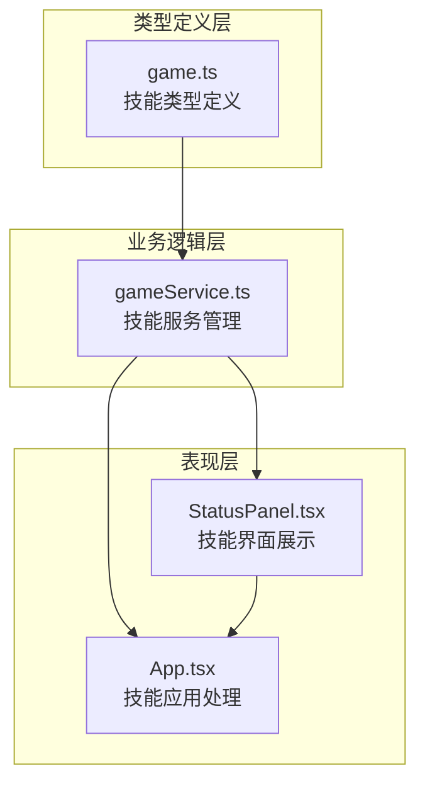
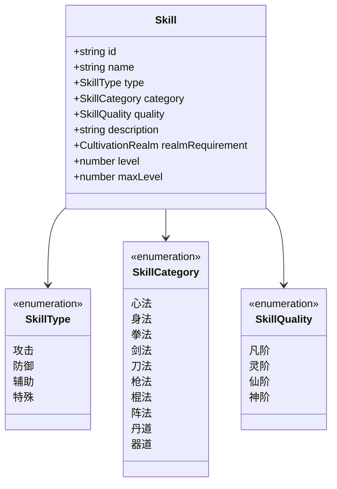
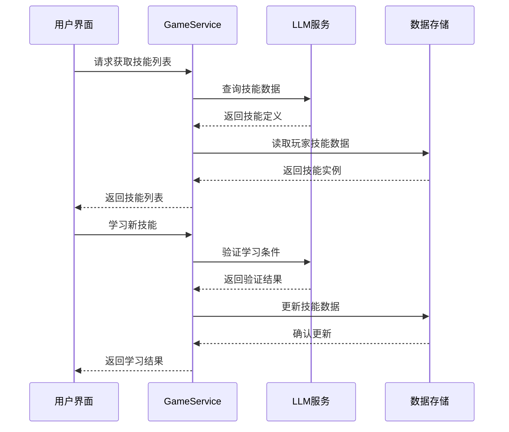
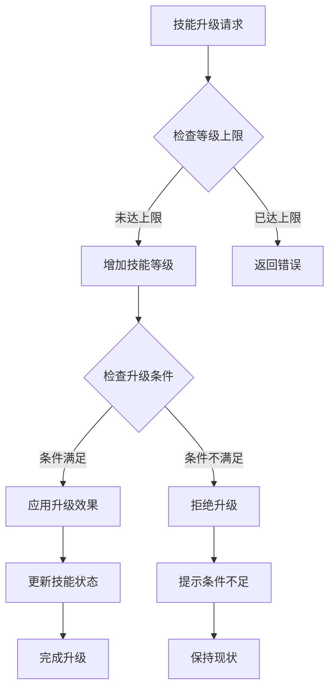
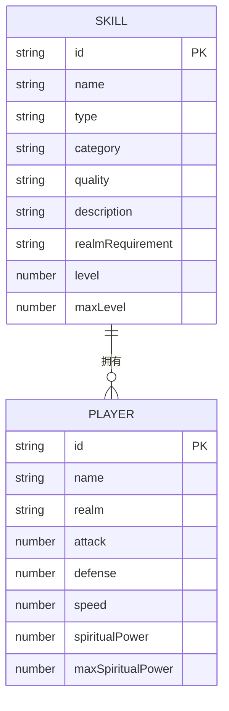
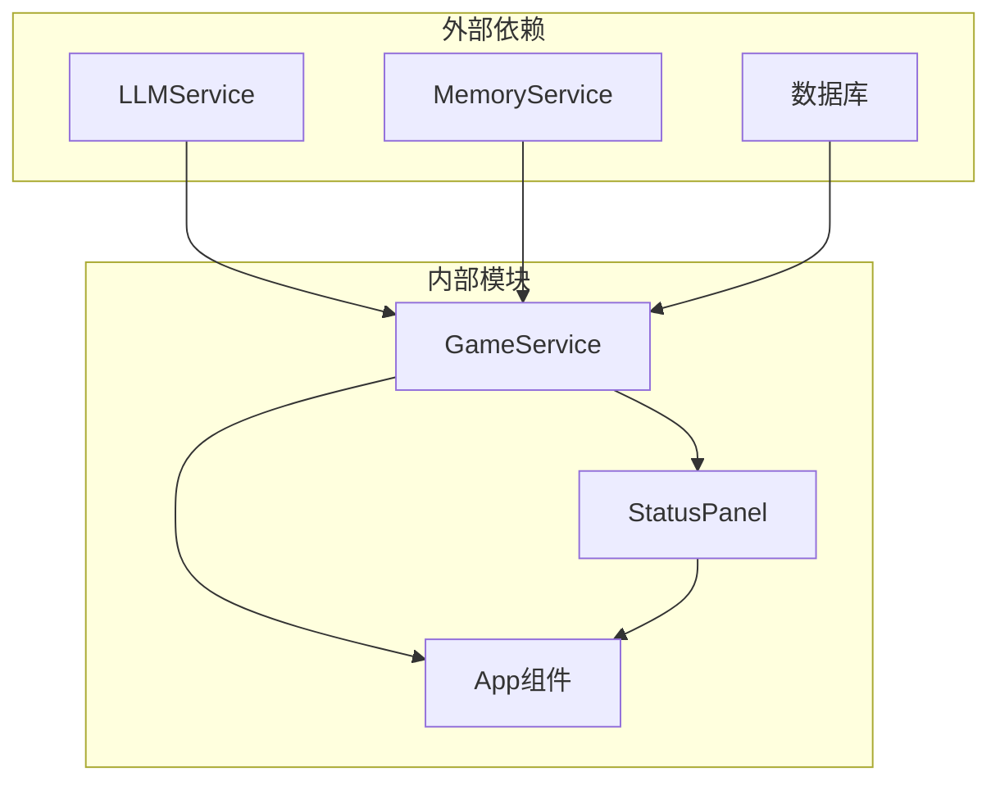

# 技能与功法系统

<cite>
**本文档引用的文件**
- [game.ts](file://src/types/game.ts)
- [gameService.ts](file://src/services/gameService.ts)
- [StatusPanel.tsx](file://src/components/StatusPanel.tsx)
- [App.tsx](file://src/App.tsx)
</cite>

## 目录
1. [简介](#简介)
2. [项目结构](#项目结构)
3. [核心组件](#核心组件)
4. [架构概览](#架构概览)
5. [详细组件分析](#详细组件分析)
6. [依赖关系分析](#依赖关系分析)
7. [性能考虑](#性能考虑)
8. [故障排除指南](#故障排除指南)
9. [结论](#结论)

## 简介

本系统是基于修仙Roguelike游戏的技能与功法管理框架。系统实现了完整的技能分类体系，包括四大技能类型（攻击、防御、辅助、特殊）和十大技能类别（心法、身法、拳法、剑法、刀法、枪法、棍法、阵法、丹道、器道），以及四阶技能品质（凡阶、灵阶、仙阶、神阶）。

系统采用数据驱动的设计理念，通过类型定义确保技能数据的完整性和一致性，通过服务层处理技能的学习、升级和效果应用，通过UI层提供直观的技能展示和管理界面。

## 项目结构

技能系统在项目中的组织结构如下：

**图表来源**
- [game.ts](file://src/types/game.ts#L82-L92)
- [gameService.ts](file://src/services/gameService.ts#L50-L541)
- [StatusPanel.tsx](file://src/components/StatusPanel.tsx#L1-L503)

**章节来源**
- [game.ts](file://src/types/game.ts#L1-L319)
- [gameService.ts](file://src/services/gameService.ts#L1-L541)

## 核心组件

### 技能数据模型

技能系统的核心数据结构由以下关键要素组成：

#### 技能基本属性
- **技能ID**: 唯一标识符，用于区分不同技能实例
- **技能名称**: 技能的显示名称
- **技能类型**: 攻击、防御、辅助或特殊
- **技能类别**: 心法、身法、拳法、剑法等十种分类之一
- **技能品质**: 凡阶、灵阶、仙阶或神阶
- **描述信息**: 技能效果和用途的详细说明
- **境界要求**: 学习技能所需的最低修仙境界
- **当前等级**: 技能当前熟练度等级
- **最大等级**: 技能可达到的最高等级

#### 技能分类体系

**图表来源**
- [game.ts](file://src/types/game.ts#L82-L92)
- [game.ts](file://src/types/game.ts#L27-L41)

**章节来源**
- [game.ts](file://src/types/game.ts#L82-L92)

### 技能品质系统

技能品质系统采用四阶分级机制：

| 品质等级 | 显示颜色 | 特征描述 |
|---------|---------|----------|
| 凡阶 | 灰色 | 普通品质，基础效果 |
| 灵阶 | 蓝色 | 稀有品质，增强效果 |
| 仙阶 | 紫色 | 神秘品质，显著增强 |
| 神阶 | 金色 | 传奇品质，顶级效果 |

**章节来源**
- [game.ts](file://src/types/game.ts#L41-L41)
- [StatusPanel.tsx](file://src/components/StatusPanel.tsx#L411-L416)

## 架构概览

技能系统采用分层架构设计，确保职责分离和代码可维护性：

**图表来源**
- [gameService.ts](file://src/services/gameService.ts#L284-L391)
- [gameService.ts](file://src/services/gameService.ts#L415-L469)

**章节来源**
- [gameService.ts](file://src/services/gameService.ts#L50-L541)

## 详细组件分析

### 技能学习与升级机制

技能系统实现了完整的生命周期管理：

#### 技能学习流程
1. **条件验证**: 检查玩家境界是否满足技能要求
2. **数据创建**: 生成技能实例并初始化等级
3. **状态更新**: 将新技能添加到玩家技能列表
4. **效果应用**: 根据技能品质应用基础效果

#### 技能升级机制

**图表来源**
- [App.tsx](file://src/App.tsx#L358-L369)

**章节来源**
- [App.tsx](file://src/App.tsx#L358-L369)

### 技能界面展示系统

技能界面采用响应式设计，支持桌面端和移动端：

#### 技能分类展示
- **类别图标**: 每个技能类别对应特定的emoji图标
- **品质颜色**: 不同品质使用相应的颜色标识
- **等级显示**: 实时显示技能当前等级
- **描述信息**: 提供技能效果的详细说明

#### 界面交互特性
- **动画效果**: 使用Framer Motion实现流畅的加载动画
- **响应式布局**: 自适应不同屏幕尺寸
- **状态反馈**: 实时反映技能学习和升级状态

**章节来源**
- [StatusPanel.tsx](file://src/components/StatusPanel.tsx#L406-L446)

### 技能与角色属性关联

技能系统与角色属性建立了紧密的关联关系：

**图表来源**
- [game.ts](file://src/types/game.ts#L82-L92)
- [game.ts](file://src/types/game.ts#L110-L139)

**章节来源**
- [game.ts](file://src/types/game.ts#L110-L139)

## 依赖关系分析

技能系统与其他模块的依赖关系如下：

**图表来源**
- [gameService.ts](file://src/services/gameService.ts#L2-L9)
- [StatusPanel.tsx](file://src/components/StatusPanel.tsx#L1-L10)

**章节来源**
- [gameService.ts](file://src/services/gameService.ts#L2-L9)

## 性能考虑

### 数据优化策略
- **懒加载**: 技能列表按需加载，减少初始渲染负担
- **虚拟滚动**: 大量技能时使用虚拟滚动提升性能
- **缓存机制**: 技能定义数据进行内存缓存

### 渲染优化
- **React.memo**: 对技能项组件进行记忆化处理
- **key优化**: 使用技能ID作为React key提升列表更新效率
- **条件渲染**: 仅在需要时重新渲染技能界面

## 故障排除指南

### 常见问题及解决方案

#### 技能学习失败
**症状**: 尝试学习技能时出现错误
**原因分析**:
- 玩家境界未达到技能要求
- 技能已达到最大等级
- 内存不足导致数据丢失

**解决方法**:
1. 检查玩家当前修仙境界
2. 验证技能是否已满级
3. 重启游戏客户端恢复数据

#### 技能升级异常
**症状**: 技能升级后效果未生效
**原因分析**:
- 技能升级逻辑执行失败
- 状态更新同步问题
- 数据持久化异常

**解决方法**:
1. 查看控制台错误日志
2. 检查技能升级条件
3. 重新加载游戏存档

**章节来源**
- [App.tsx](file://src/App.tsx#L267-L378)

## 结论

技能与功法系统通过清晰的分层架构和完善的类型定义，为修仙Roguelike游戏提供了强大的技能管理能力。系统支持完整的技能生命周期管理，从学习到升级的每个环节都有相应的机制保障。

未来可以考虑的功能扩展包括：
- 技能组合效果计算
- 连招系统实现
- 技能平衡性调整工具
- 更丰富的技能视觉效果

该系统为游戏的核心玩法奠定了坚实的基础，为玩家提供了深度的修仙体验。