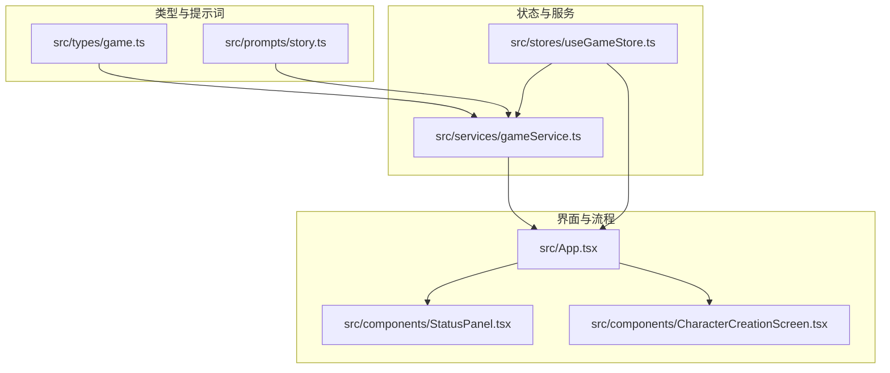
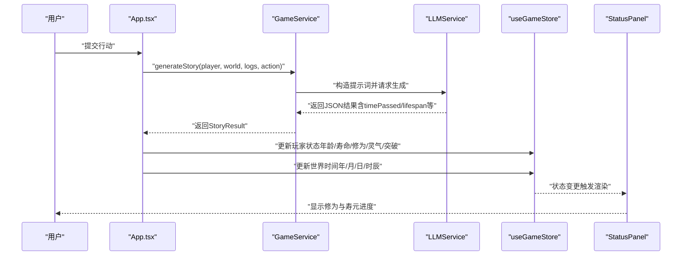
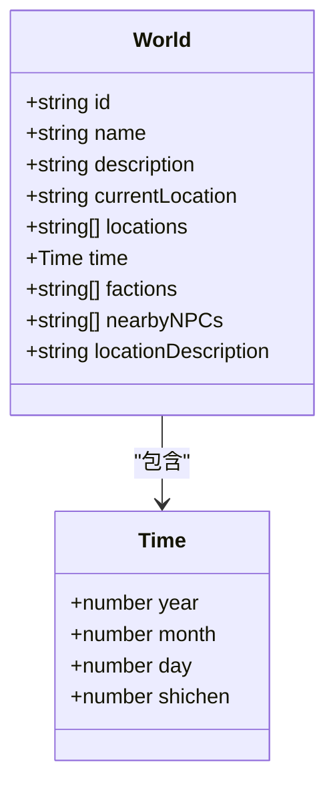
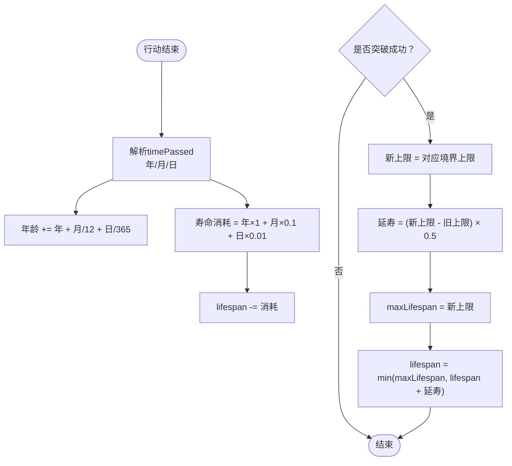
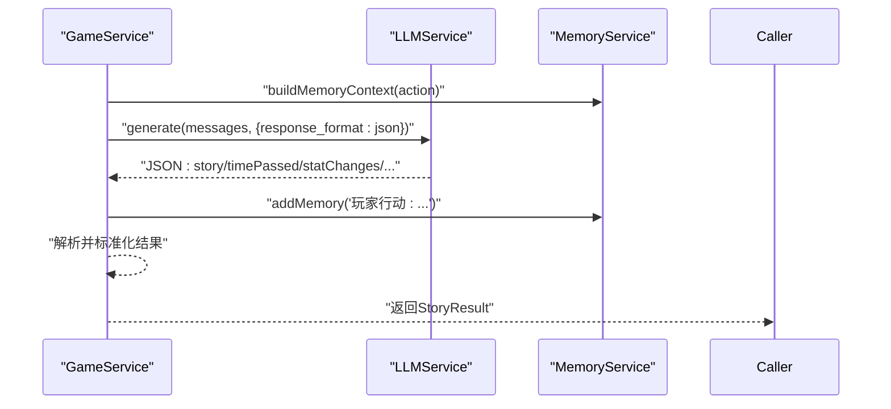
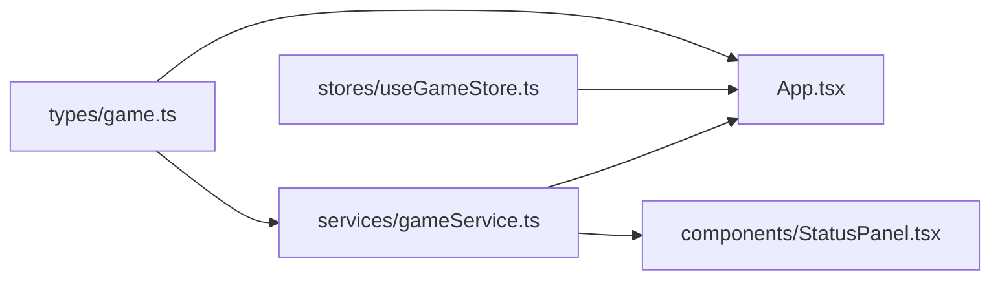

# 时间与寿命管理

<cite>
**本文引用的文件**
- [README.md](file://README.md)
- [src/types/game.ts](file://src/types/game.ts)
- [src/stores/useGameStore.ts](file://src/stores/useGameStore.ts)
- [src/services/gameService.ts](file://src/services/gameService.ts)
- [src/prompts/story.ts](file://src/prompts/story.ts)
- [src/App.tsx](file://src/App.tsx)
- [src/components/StatusPanel.tsx](file://src/components/StatusPanel.tsx)
- [src/components/CharacterCreationScreen.tsx](file://src/components/CharacterCreationScreen.tsx)
</cite>

## 目录
1. [简介](#简介)
2. [项目结构](#项目结构)
3. [核心组件](#核心组件)
4. [架构总览](#架构总览)
5. [详细组件分析](#详细组件分析)
6. [依赖分析](#依赖分析)
7. [性能考虑](#性能考虑)
8. [故障排查指南](#故障排查指南)
9. [结论](#结论)

## 简介
本文件系统化梳理“修仙 Roguelike”游戏中“时间与寿命管理”的设计与实现，围绕四维时间结构（年、月、日、时辰）与寿命系统展开，解释时间流逝如何影响游戏进程、寿命消耗机制、突破延寿、道具与状态变更对寿命的影响，以及时间管理策略与Roguelike永久死亡带来的挑战。

## 项目结构
本项目采用前端纯技术栈，核心模块包括：
- 类型定义：统一的数据结构与领域模型（含时间、玩家、NPC、事件等）
- 状态管理：基于 Zustand 的游戏状态持久化存储
- 服务层：LLM 驱动的故事生成、NPC 交互与记忆管理
- 组件层：UI 展示与交互（状态面板、角色创建、剧情日志等）

图表来源
- [src/types/game.ts](file://src/types/game.ts#L50-L55)
- [src/stores/useGameStore.ts](file://src/stores/useGameStore.ts#L84-L225)
- [src/services/gameService.ts](file://src/services/gameService.ts#L50-L541)
- [src/prompts/story.ts](file://src/prompts/story.ts#L1-L147)
- [src/App.tsx](file://src/App.tsx#L267-L548)
- [src/components/StatusPanel.tsx](file://src/components/StatusPanel.tsx#L1-L120)
- [src/components/CharacterCreationScreen.tsx](file://src/components/CharacterCreationScreen.tsx#L153-L159)

章节来源
- [README.md](file://README.md#L1-L106)
- [src/types/game.ts](file://src/types/game.ts#L50-L55)
- [src/stores/useGameStore.ts](file://src/stores/useGameStore.ts#L84-L225)
- [src/services/gameService.ts](file://src/services/gameService.ts#L50-L541)
- [src/prompts/story.ts](file://src/prompts/story.ts#L1-L147)
- [src/App.tsx](file://src/App.tsx#L267-L548)
- [src/components/StatusPanel.tsx](file://src/components/StatusPanel.tsx#L1-L120)
- [src/components/CharacterCreationScreen.tsx](file://src/components/CharacterCreationScreen.tsx#L153-L159)

## 核心组件
- 时间结构与世界：四维时间（年、月、日、时辰）嵌入世界对象，作为全局时间锚点
- 寿命系统：玩家初始寿命与最大寿命，随时间流逝与行动消耗，突破时按比例延寿
- LLM 推演：每次行动返回“时间流逝”、“寿命变化”、“修为/灵气增益”、“突破”等结果
- UI 展示：状态面板直观呈现修为与寿元，移动端紧凑展示与桌面端完整面板

章节来源
- [src/types/game.ts](file://src/types/game.ts#L50-L55)
- [src/types/game.ts](file://src/types/game.ts#L110-L139)
- [src/stores/useGameStore.ts](file://src/stores/useGameStore.ts#L112-L142)
- [src/services/gameService.ts](file://src/services/gameService.ts#L289-L391)
- [src/components/StatusPanel.tsx](file://src/components/StatusPanel.tsx#L36-L92)

## 架构总览
下图展示从玩家行动到结果落地的关键流程：输入动作 → LLM 推演 → 更新时间与寿命 → 更新玩家状态 → UI 展示。

图表来源
- [src/App.tsx](file://src/App.tsx#L267-L548)
- [src/services/gameService.ts](file://src/services/gameService.ts#L289-L391)
- [src/stores/useGameStore.ts](file://src/stores/useGameStore.ts#L84-L225)
- [src/components/StatusPanel.tsx](file://src/components/StatusPanel.tsx#L36-L92)

## 详细组件分析

### 时间系统：四维结构与控制流
- 结构定义：时间对象包含年、月、日、时辰四个维度，世界对象内嵌时间，作为全局时间轴
- 初始化：世界初始化时设置初始时间（年、月、日、时辰）
- 更新：通过状态更新函数按需修改时间，确保 UI 与逻辑一致

图表来源
- [src/types/game.ts](file://src/types/game.ts#L50-L55)
- [src/types/game.ts](file://src/types/game.ts#L205-L217)
- [src/stores/useGameStore.ts](file://src/stores/useGameStore.ts#L112-L142)

章节来源
- [src/types/game.ts](file://src/types/game.ts#L50-L55)
- [src/types/game.ts](file://src/types/game.ts#L205-L217)
- [src/stores/useGameStore.ts](file://src/stores/useGameStore.ts#L112-L142)

### 寿命系统：初始值、增长、消耗与突破延寿
- 初始值：角色创建时设定初始寿命与最大寿命
- 年龄增长：按“年+月/12+日/365”折算计入年龄
- 寿命消耗：按“年×1 + 月×0.1 + 日×0.01”折算消耗
- 突破延寿：每突破一次，按“新上限与旧上限差值的一半”进行部分恢复，同时更新最大寿命

图表来源
- [src/App.tsx](file://src/App.tsx#L287-L336)
- [src/services/gameService.ts](file://src/services/gameService.ts#L346-L372)
- [src/components/CharacterCreationScreen.tsx](file://src/components/CharacterCreationScreen.tsx#L153-L159)

章节来源
- [src/App.tsx](file://src/App.tsx#L287-L336)
- [src/services/gameService.ts](file://src/services/gameService.ts#L346-L372)
- [src/components/CharacterCreationScreen.tsx](file://src/components/CharacterCreationScreen.tsx#L153-L159)

### LLM 推演与时间/寿命产出
- 推演接口：每次行动调用故事生成接口，返回包含“时间流逝”、“寿命变化”、“修为/灵气增益”、“突破”等字段的 JSON
- 默认值保护：对缺失字段进行安全默认值处理，避免 NaN
- 记忆与上下文：将行动与结果写入记忆库，供后续推演复用

图表来源
- [src/services/gameService.ts](file://src/services/gameService.ts#L289-L391)
- [src/prompts/story.ts](file://src/prompts/story.ts#L51-L147)

章节来源
- [src/services/gameService.ts](file://src/services/gameService.ts#L289-L391)
- [src/prompts/story.ts](file://src/prompts/story.ts#L51-L147)

### UI 展示：状态面板与时间/寿命可视化
- 桌面端完整面板：包含修为与寿元两条进度条，寿元低于阈值时以警示色显示
- 移动端紧凑面板：在弹窗中展开完整详情，便于快速查看
- 实时更新：状态变更自动触发渲染，保证时间与寿命的即时反馈

章节来源
- [src/components/StatusPanel.tsx](file://src/components/StatusPanel.tsx#L36-L92)
- [src/components/StatusPanel.tsx](file://src/components/StatusPanel.tsx#L122-L206)

### 行动与时间消耗：策略与差异
- LLM 在提示词中明确“时间流逝”是核心机制之一，不同行动（探索、战斗、修炼、社交）将带来不同的时间消耗权重
- 玩家可依据当前寿命与目标选择行动节奏，平衡短期收益与长期寿命成本
- 建议策略：
  - 优先在寿命充裕期进行高耗时修炼或探索
  - 在寿命临界时谨慎选择高风险高回报行动
  - 利用突破延寿窗口期集中资源推进

章节来源
- [src/prompts/story.ts](file://src/prompts/story.ts#L39-L48)
- [src/services/gameService.ts](file://src/services/gameService.ts#L346-L372)

### 修炼时长与计算方式
- 修炼时长由 LLM 推演输出的“timePassed”决定，系统按“年/月/日”拆分累加到年龄与寿命消耗
- 修为/灵气增益与突破概率受根骨、悟性、气运等属性影响，突破成功后按比例延寿

章节来源
- [src/services/gameService.ts](file://src/services/gameService.ts#L346-L372)
- [src/App.tsx](file://src/App.tsx#L287-L336)

### 紧急事件与时间压力
- 事件系统以时间戳记录，结合当前世界时间与玩家状态，形成动态的时间压力
- 玩家需在有限寿命内规划行动，避免因过度消耗导致寿命耗尽

章节来源
- [src/types/game.ts](file://src/types/game.ts#L219-L226)
- [src/stores/useGameStore.ts](file://src/stores/useGameStore.ts#L156-L159)

### 寿命相关道具、延寿机制与时间加速
- 道具效果：通过“statChanges.lifespan”等字段体现，可在角色创建或后续行动中增加寿命或寿命上限
- 延寿机制：突破成功时按“新上限与旧上限差值的一半”进行部分恢复，同时更新最大寿命
- 时间加速：当前实现未见专门的“时间加速”机制，系统以“timePassed”线性累加为主

章节来源
- [src/services/gameService.ts](file://src/services/gameService.ts#L26-L48)
- [src/App.tsx](file://src/App.tsx#L283-L336)

### 时间管理策略、生命规划与Roguelike挑战
- 生命规划：在角色创建阶段即确定初始寿命，需在漫长修仙路中持续评估风险与收益
- 策略建议：以“稳健推进”为主，在突破窗口期集中资源，避免在寿命末期进行高耗时行动
- 永久死亡挑战：寿命耗尽即为失败，促使玩家在高风险行动前进行充分权衡，增强Roguelike体验

章节来源
- [src/components/CharacterCreationScreen.tsx](file://src/components/CharacterCreationScreen.tsx#L153-L159)
- [src/prompts/story.ts](file://src/prompts/story.ts#L39-L48)

## 依赖分析
- 类型依赖：时间结构与玩家状态紧密耦合，世界时间作为全局时间源
- 状态依赖：UI 依赖状态存储，状态变更驱动渲染
- 服务依赖：故事生成依赖 LLM 服务与记忆服务，结果回写状态与 UI

图表来源
- [src/types/game.ts](file://src/types/game.ts#L50-L55)
- [src/stores/useGameStore.ts](file://src/stores/useGameStore.ts#L84-L225)
- [src/services/gameService.ts](file://src/services/gameService.ts#L50-L541)
- [src/App.tsx](file://src/App.tsx#L267-L548)
- [src/components/StatusPanel.tsx](file://src/components/StatusPanel.tsx#L1-L120)

章节来源
- [src/types/game.ts](file://src/types/game.ts#L50-L55)
- [src/stores/useGameStore.ts](file://src/stores/useGameStore.ts#L84-L225)
- [src/services/gameService.ts](file://src/services/gameService.ts#L50-L541)
- [src/App.tsx](file://src/App.tsx#L267-L548)
- [src/components/StatusPanel.tsx](file://src/components/StatusPanel.tsx#L1-L120)

## 性能考虑
- LLM 调用成本：每次行动均会产生 token 使用，建议在 UI 中提供加载态与节流策略
- 状态更新：批量更新时尽量合并，减少不必要的重渲染
- 记忆检索：记忆摘要与检索需控制频率，避免频繁 IO

## 故障排查指南
- 时间异常（NaN）：确保 LLM 返回的“timePassed”字段存在且为数字，默认值已做保护
- 寿命异常：检查 statChanges.lifespan 与突破延寿逻辑，确认最大寿命更新顺序
- UI 不刷新：确认状态更新函数已正确调用，组件订阅了对应状态

章节来源
- [src/services/gameService.ts](file://src/services/gameService.ts#L346-L372)
- [src/App.tsx](file://src/App.tsx#L287-L336)
- [src/components/StatusPanel.tsx](file://src/components/StatusPanel.tsx#L36-L92)

## 结论
本系统以四维时间为轴心，将寿命消耗与突破延寿贯穿整个修仙进程，配合 LLM 的动态推演，形成高自由度且具挑战性的Roguelike体验。玩家需在有限寿命内制定长期策略，平衡短期收益与长期生存，从而在修仙路上做出有意义的抉择。