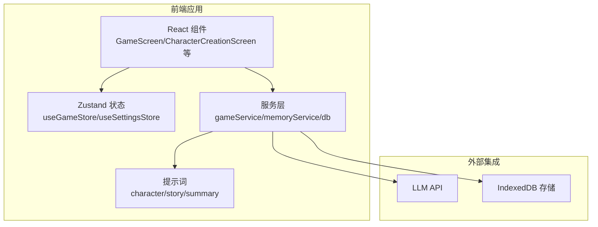
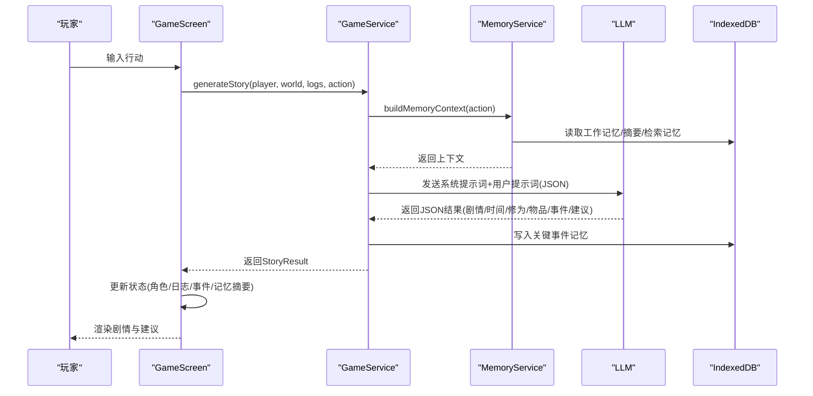
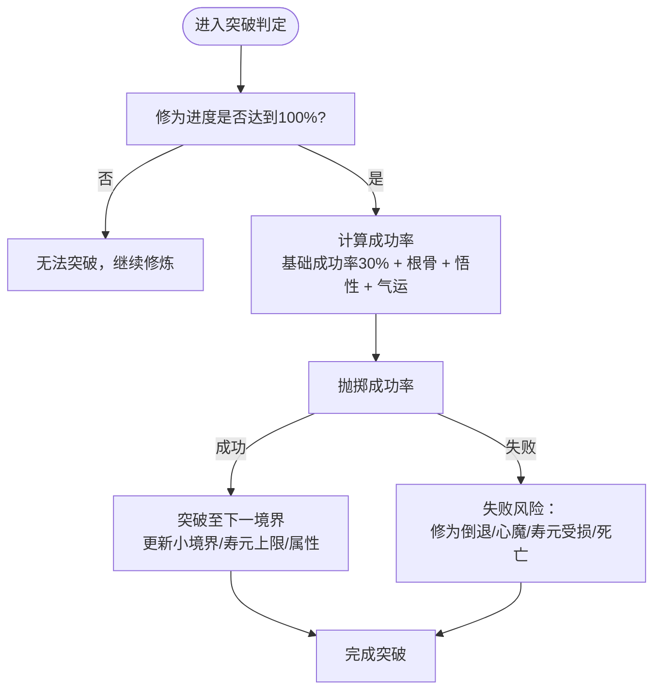
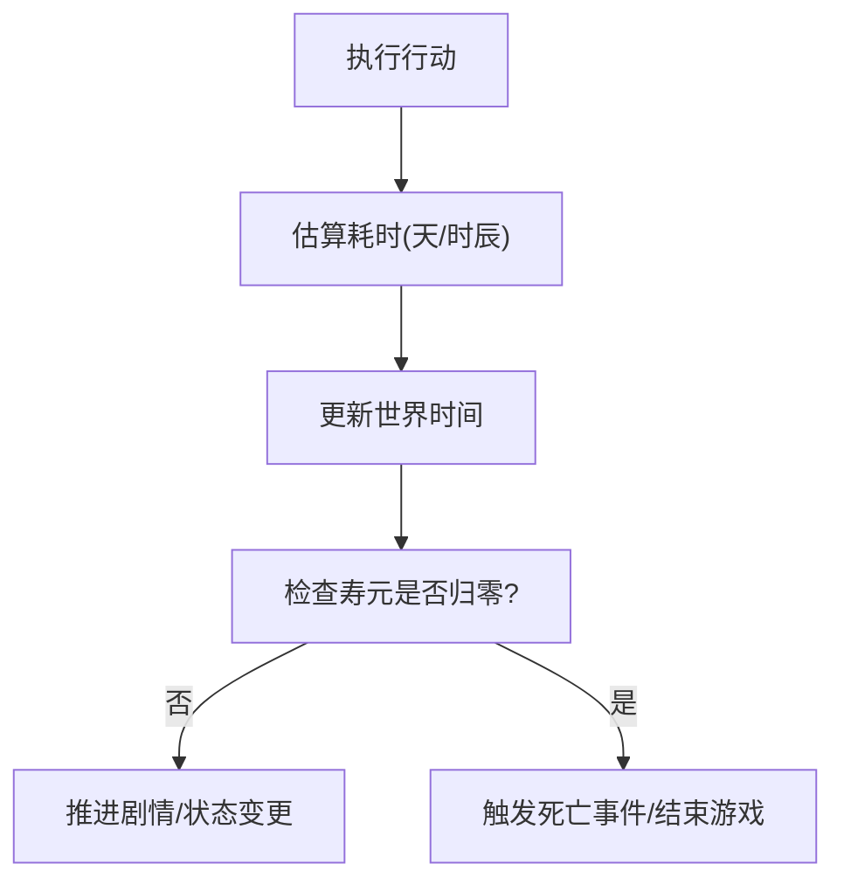
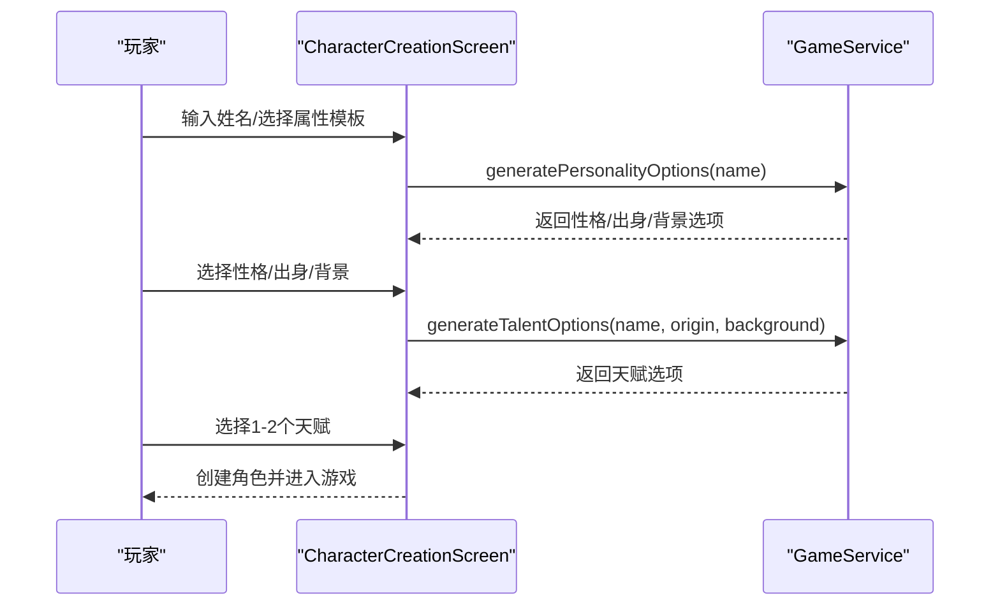
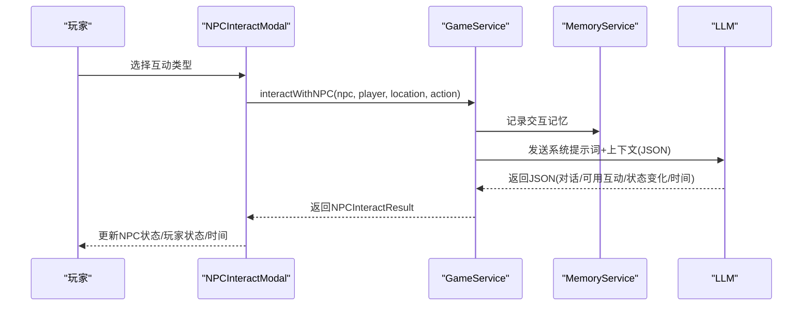
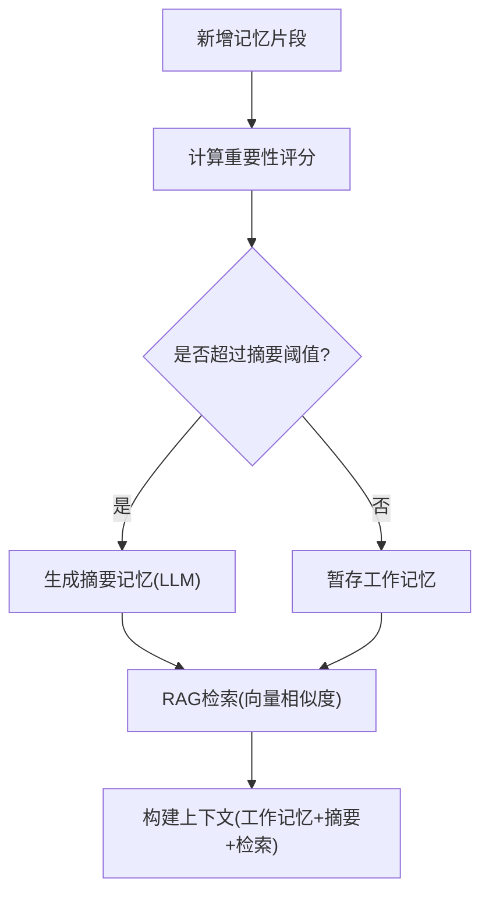
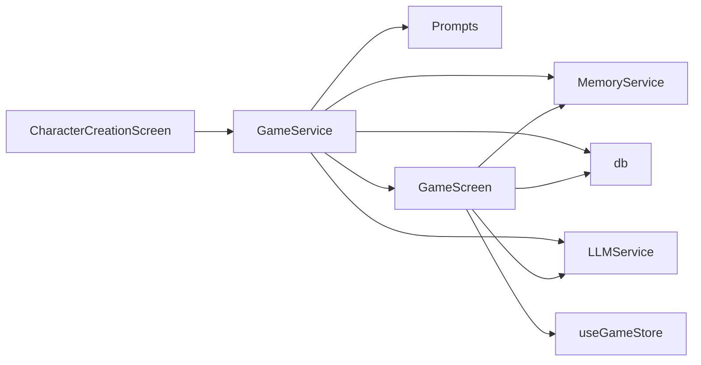

# 游戏机制

<cite>
**本文引用的文件**
- [README.md](file://README.md)
- [AGENTS.md](file://AGENTS.md)
- [src/types/game.ts](file://src/types/game.ts)
- [src/services/gameService.ts](file://src/services/gameService.ts)
- [src/services/memoryService.ts](file://src/services/memoryService.ts)
- [src/services/db.ts](file://src/services/db.ts)
- [src/components/CharacterCreationScreen.tsx](file://src/components/CharacterCreationScreen.tsx)
- [src/components/GameScreen.tsx](file://src/components/GameScreen.tsx)
- [src/stores/useGameStore.ts](file://src/stores/useGameStore.ts)
- [src/prompts/character.ts](file://src/prompts/character.ts)
- [src/prompts/story.ts](file://src/prompts/story.ts)
- [src/prompts/summary.ts](file://src/prompts/summary.ts)
</cite>

## 目录
1. [简介](#简介)
2. [项目结构](#项目结构)
3. [核心组件](#核心组件)
4. [架构总览](#架构总览)
5. [详细组件分析](#详细组件分析)
6. [依赖分析](#依赖分析)
7. [性能考量](#性能考量)
8. [故障排查指南](#故障排查指南)
9. [结论](#结论)
10. [附录](#附录)

## 简介
本项目是一个纯前端的修仙主题 Roguelike 游戏，采用 LLM 实时驱动内容生成，覆盖角色创建、剧情推演、NPC 交互、记忆与存档等核心玩法。游戏围绕“修仙”这一主题，构建了完整的境界体系、修为系统、时间消耗机制、寿元管理、资源循环与随机生成、永久死亡等 Roguelike 机制，并通过提示词工程与记忆检索增强叙事连贯性与策略深度。

## 项目结构
- 前端技术栈：Vite + React 18 + TypeScript，TailwindCSS + shadcn/ui
- 状态管理：Zustand（持久化存储 localStorage/IndexedDB）
- LLM 集成：通过服务层调用外部 LLM，提示词集中管理
- 数据持久化：本地存档（IndexedDB）+ 记忆片段（向量化检索）

图表来源
- [src/components/GameScreen.tsx](file://src/components/GameScreen.tsx#L1-L172)
- [src/components/CharacterCreationScreen.tsx](file://src/components/CharacterCreationScreen.tsx#L1-L482)
- [src/stores/useGameStore.ts](file://src/stores/useGameStore.ts#L1-L226)
- [src/services/gameService.ts](file://src/services/gameService.ts#L1-L541)
- [src/services/memoryService.ts](file://src/services/memoryService.ts#L1-L224)
- [src/services/db.ts](file://src/services/db.ts#L1-L236)
- [src/prompts/character.ts](file://src/prompts/character.ts#L1-L97)
- [src/prompts/story.ts](file://src/prompts/story.ts#L1-L147)
- [src/prompts/summary.ts](file://src/prompts/summary.ts#L1-L26)

章节来源
- [README.md](file://README.md#L1-L106)
- [AGENTS.md](file://AGENTS.md#L225-L283)

## 核心组件
- 类型系统与数据模型：定义了角色、NPC、物品、技能、关系、世界、事件、时间等核心数据结构，支撑修仙体系的数值与交互。
- 游戏服务：封装角色生成、剧情推演、NPC 交互、区域 NPC 生成、存档/读档等业务逻辑。
- 记忆服务：实现工作记忆、摘要记忆与 RAG 检索，增强叙事一致性与上下文感知。
- 存储服务：基于 IndexedDB 的存档与记忆持久化。
- 状态管理：Zustand 管理玩家状态、世界、日志、事件、记忆摘要、NPC 列表、交互状态等。
- 提示词工程：角色生成、剧情推演、记忆摘要三类提示词，约束输出结构与风格。

章节来源
- [src/types/game.ts](file://src/types/game.ts#L1-L319)
- [src/services/gameService.ts](file://src/services/gameService.ts#L1-L541)
- [src/services/memoryService.ts](file://src/services/memoryService.ts#L1-L224)
- [src/services/db.ts](file://src/services/db.ts#L1-L236)
- [src/stores/useGameStore.ts](file://src/stores/useGameStore.ts#L1-L226)
- [src/prompts/character.ts](file://src/prompts/character.ts#L1-L97)
- [src/prompts/story.ts](file://src/prompts/story.ts#L1-L147)
- [src/prompts/summary.ts](file://src/prompts/summary.ts#L1-L26)

## 架构总览
游戏采用“提示词驱动 + 记忆检索 + 状态驱动”的架构：
- 输入动作（玩家指令）经由提示词构造上下文，结合工作记忆、摘要记忆与检索到的相关记忆，调用 LLM 生成剧情结果。
- 结果写入状态与记忆，推进世界、角色、事件、日志与 NPC 关系的变化。
- UI 通过状态渲染，提供角色状态、剧情日志、行动建议、NPC 交互等体验。

图表来源
- [src/services/gameService.ts](file://src/services/gameService.ts#L283-L391)
- [src/services/memoryService.ts](file://src/services/memoryService.ts#L175-L188)
- [src/services/db.ts](file://src/services/db.ts#L134-L150)
- [src/prompts/story.ts](file://src/prompts/story.ts#L51-L147)

章节来源
- [src/services/gameService.ts](file://src/services/gameService.ts#L283-L391)
- [src/services/memoryService.ts](file://src/services/memoryService.ts#L175-L188)
- [src/prompts/story.ts](file://src/prompts/story.ts#L1-L147)

## 详细组件分析

### 境界体系与修为系统
- 境界层级：炼气期 → 筑基期 → 金丹期 → 元婴期 → 化神期 → 炼虚期 → 合体期 → 大乘期 → 渡劫期 → 飞升
- 小境界：初期/中期/后期/巅峰
- 修为进度：cultivationProgress（0-100%），突破条件与成功率由根骨、悟性、气运决定
- 灵气值：spiritualEnergy，用于奇遇/突破/丹药等
- 寿元：lifespan/maxLifespan，随境界提升而增加；寿元耗尽即死亡

图表来源
- [src/prompts/story.ts](file://src/prompts/story.ts#L26-L30)
- [src/types/game.ts](file://src/types/game.ts#L110-L139)

章节来源
- [src/types/game.ts](file://src/types/game.ts#L1-L139)
- [src/prompts/story.ts](file://src/prompts/story.ts#L20-L47)

### 时间消耗机制与寿元管理
- 时间结构：年/月/日/时辰（shichen），用于刻画修仙节奏
- 行动耗时参考：短途移动（1-6 时辰）、长途移动（1-30 天）、修炼（1-7 天）、闭关（1-12 个月）、探索/炼制/学习（1-30 天）、战斗（数时辰）
- 寿元上限：随境界递增（炼气期约100-150岁，筑基期200-300岁，金丹期500岁，元婴期1000岁，更高境界可达数千至上万年）
- 寿元耗尽即死亡，体现 Roguelike 的永久死亡与资源稀缺

图表来源
- [src/types/game.ts](file://src/types/game.ts#L50-L55)
- [src/services/gameService.ts](file://src/services/gameService.ts#L283-L391)
- [AGENTS.md](file://AGENTS.md#L101-L117)

章节来源
- [src/types/game.ts](file://src/types/game.ts#L50-L55)
- [AGENTS.md](file://AGENTS.md#L76-L82)
- [AGENTS.md](file://AGENTS.md#L101-L117)

### 角色创建与属性面板
- 名字与外观：随机生成或手动输入
- 基础属性面板：提供多种职业/流派模板（体修、剑修、道修、法修、医修、符修、阵修、灵修、魔修、妖修、佛修、儒修），每类模板带有属性加成与描述
- 性格/出身/背景：由 LLM 推演，提供多样化选项
- 天赋：初始选择1-2个，影响后续成长与玩法

图表来源
- [src/components/CharacterCreationScreen.tsx](file://src/components/CharacterCreationScreen.tsx#L1-L482)
- [src/services/gameService.ts](file://src/services/gameService.ts#L204-L281)
- [src/prompts/character.ts](file://src/prompts/character.ts#L1-L97)

章节来源
- [src/components/CharacterCreationScreen.tsx](file://src/components/CharacterCreationScreen.tsx#L1-L482)
- [src/services/gameService.ts](file://src/services/gameService.ts#L121-L160)
- [src/prompts/character.ts](file://src/prompts/character.ts#L17-L58)

### NPC 交互系统与关系网络
- NPC 属性：攻击、防御、速度、气运、根骨、悟性、气血、真气等（探查后可见）
- 好感度系统：favor（-100~100），映射为“仇敌/敌视/陌生/朋友/好友/生死之交/道侣”
- 交互类型：打听消息、赠送礼物、切磋、探查、结为好友、结为道侣、离开
- 交互结果：对话、可用互动选项、双方状态变化（好感度、记忆标签、关系描述、属性揭示）、物品增减、时间流逝、剧情更新

图表来源
- [src/services/gameService.ts](file://src/services/gameService.ts#L415-L469)
- [src/services/memoryService.ts](file://src/services/memoryService.ts#L441-L467)
- [src/types/game.ts](file://src/types/game.ts#L155-L171)
- [src/types/game.ts](file://src/types/game.ts#L265-L285)

章节来源
- [src/types/game.ts](file://src/types/game.ts#L141-L203)
- [src/types/game.ts](file://src/types/game.ts#L265-L285)
- [src/services/gameService.ts](file://src/services/gameService.ts#L415-L469)

### 物品与技能系统
- 物品类型：武器、防具、丹药、符箓、功法、法宝、材料、杂物、灵石
- 品质：凡品/灵品/仙品/神品
- 技能类型：攻击/防御/辅助/特殊；类别：心法/身法/拳法/剑法/刀法/枪法/棍法/阵法/丹道/器道；品质：凡阶/灵阶/仙阶/神阶
- 技能上限：level/maxLevel，随修为与境界解锁

章节来源
- [src/types/game.ts](file://src/types/game.ts#L14-L92)

### 记忆系统与叙事增强
- 三层记忆架构：
  - 工作记忆：最近 N 条（默认10条）完整记忆
  - 摘要记忆：超过阈值后由 LLM 生成摘要
  - RAG 检索：基于语义相似度检索相关记忆
- 记忆重要性评分：高/中/低，用于筛选与摘要生成
- 记忆写入：剧情关键事件、NPC 交互、角色状态变化等

图表来源
- [src/services/memoryService.ts](file://src/services/memoryService.ts#L106-L137)
- [src/services/memoryService.ts](file://src/services/memoryService.ts#L144-L173)
- [src/services/db.ts](file://src/services/db.ts#L175-L207)

章节来源
- [src/services/memoryService.ts](file://src/services/memoryService.ts#L1-L224)
- [src/services/db.ts](file://src/services/db.ts#L1-L236)
- [src/prompts/summary.ts](file://src/prompts/summary.ts#L1-L26)

### 存档与持久化
- 游戏状态：玩家、NPC、世界、日志、事件、记忆、记忆摘要、回合数、是否进行中、是否加载中、错误信息、存档ID、上次保存时间
- 存档数据：saveId → GameState
- 记忆数据：按 saveId 分组，支持按时间戳与重要性索引查询
- 持久化：Zustand 持久化 + IndexedDB

章节来源
- [src/stores/useGameStore.ts](file://src/stores/useGameStore.ts#L13-L55)
- [src/stores/useGameStore.ts](file://src/stores/useGameStore.ts#L61-L77)
- [src/services/db.ts](file://src/services/db.ts#L21-L34)
- [src/services/db.ts](file://src/services/db.ts#L134-L150)

## 依赖分析
- 组件依赖：GameScreen 依赖状态与服务；CharacterCreationScreen 依赖 GameService 生成角色；NPCInteractModal 依赖 GameService 进行交互
- 服务依赖：GameService 依赖 LLMService、MemoryService、db；MemoryService 依赖 LLMService、db；db 封装 IndexedDB
- 类型依赖：所有组件与服务共享 src/types/game.ts 的类型定义

图表来源
- [src/components/CharacterCreationScreen.tsx](file://src/components/CharacterCreationScreen.tsx#L1-L482)
- [src/components/GameScreen.tsx](file://src/components/GameScreen.tsx#L1-L172)
- [src/stores/useGameStore.ts](file://src/stores/useGameStore.ts#L1-L226)
- [src/services/gameService.ts](file://src/services/gameService.ts#L1-L541)
- [src/services/memoryService.ts](file://src/services/memoryService.ts#L1-L224)
- [src/services/db.ts](file://src/services/db.ts#L1-L236)

章节来源
- [src/components/CharacterCreationScreen.tsx](file://src/components/CharacterCreationScreen.tsx#L1-L482)
- [src/components/GameScreen.tsx](file://src/components/GameScreen.tsx#L1-L172)
- [src/stores/useGameStore.ts](file://src/stores/useGameStore.ts#L1-L226)
- [src/services/gameService.ts](file://src/services/gameService.ts#L1-L541)

## 性能考量
- LLM 调用成本：通过温度与响应格式控制输出稳定性，记录 token 使用量，避免过度请求
- 记忆检索：向量化嵌入与余弦相似度计算，建议在浏览器端使用轻量嵌入模型，失败时回退简单哈希向量
- 存储优化：IndexedDB 索引（saveId、timestamp、importance），定期清理低重要性记忆，保留最近与高重要性记忆
- UI 渲染：Zustand 精细化状态更新，避免不必要的重渲染

## 故障排查指南
- LLM 生成失败：检查提示词格式（必须返回 JSON）、重试机制、错误提示
- 记忆检索异常：确认嵌入模型加载状态，回退到简单哈希向量；检查 IndexedDB 记忆读取
- 存档读取失败：确认 IndexedDB 初始化、索引是否存在、权限是否允许
- UI 交互异常：检查 Zustand 状态更新路径、组件 props 传入、错误边界与 toast 提示

章节来源
- [src/services/memoryService.ts](file://src/services/memoryService.ts#L27-L37)
- [src/services/memoryService.ts](file://src/services/memoryService.ts#L58-L68)
- [src/services/db.ts](file://src/services/db.ts#L39-L72)
- [AGENTS.md](file://AGENTS.md#L371-L411)

## 结论
本项目以“修仙”为核心主题，通过提示词工程与记忆检索实现了高度动态的叙事体验，结合完善的数值系统与 Roguelike 机制，为玩家提供了沉浸式的成长旅程。类型系统、服务层与状态管理共同保证了系统的可维护性与扩展性，适合进一步拓展为成熟的修仙 RPG。

## 附录
- 游戏规则与策略要点
  - 境界突破：优先提升根骨与悟性，结合气运与环境灵气，谨慎选择突破时机
  - 时间管理：根据目标选择行动（修炼/探索/炼制/社交），平衡短期收益与长期成长
  - 寿元规划：注意寿元上限与消耗，避免过度冒险导致早夭
  - NPC 关系：通过赠送礼物、切磋、探查等方式提升好感度，建立道侣/好友等强力关系网
  - 记忆与存档：充分利用记忆摘要与检索，合理安排存档点，避免无意义的重复探索

章节来源
- [src/prompts/story.ts](file://src/prompts/story.ts#L20-L47)
- [AGENTS.md](file://AGENTS.md#L101-L117)
- [src/types/game.ts](file://src/types/game.ts#L43-L46)
- [src/types/game.ts](file://src/types/game.ts#L287-L319)