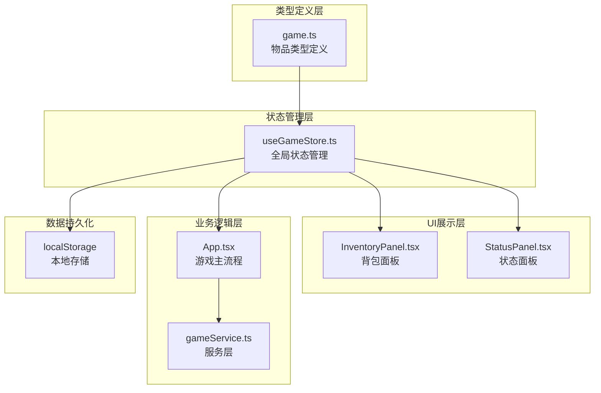
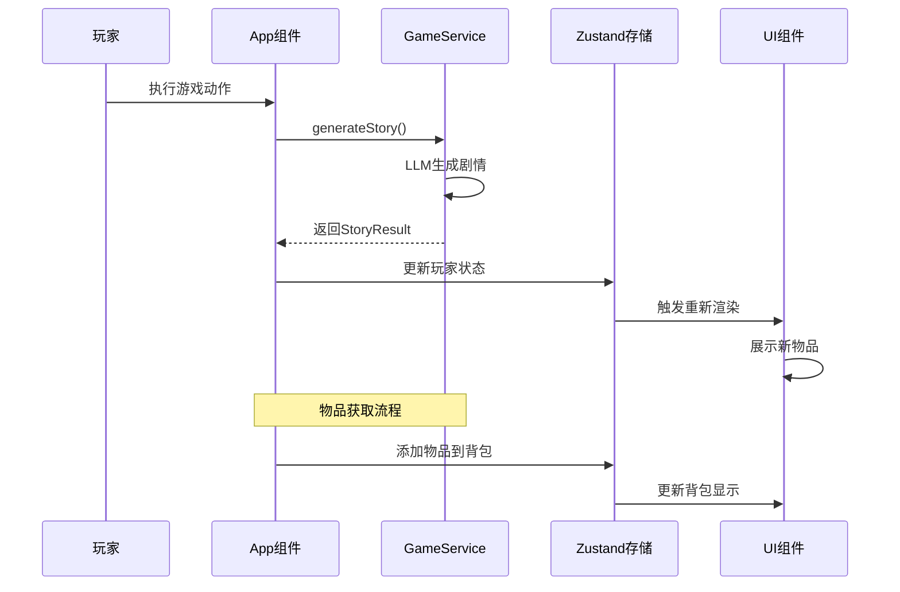
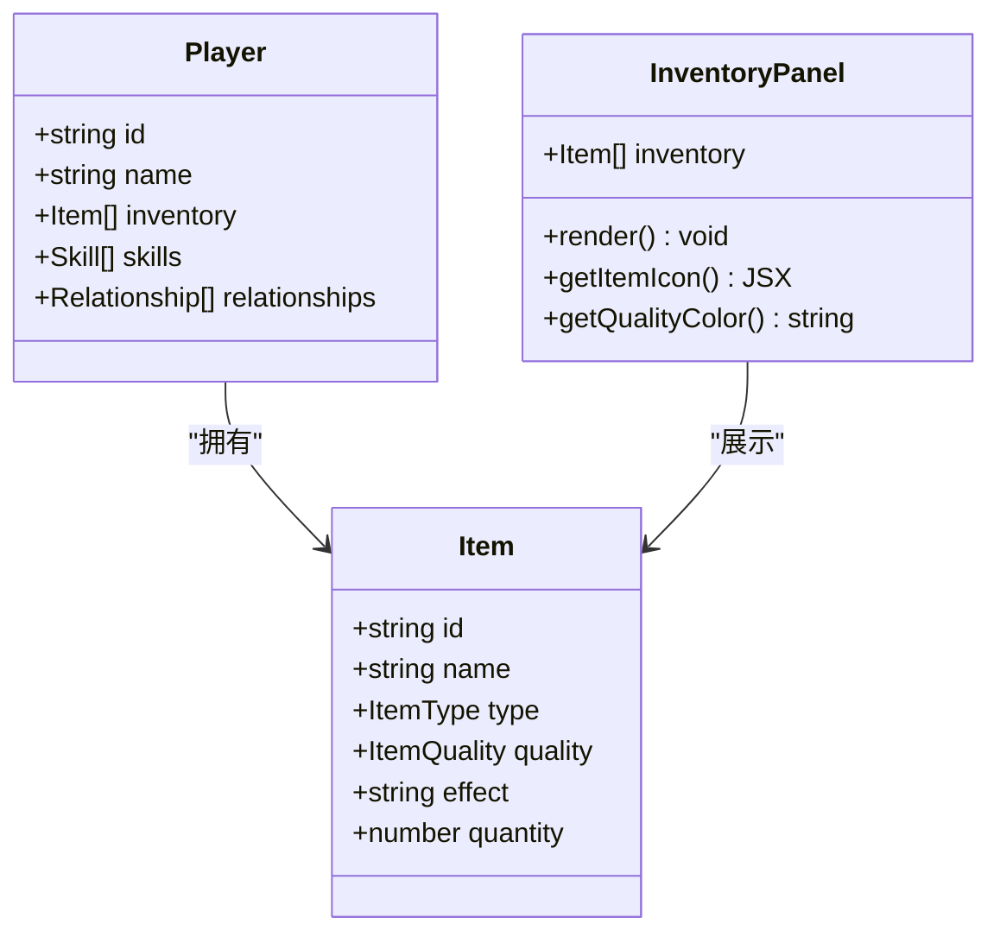
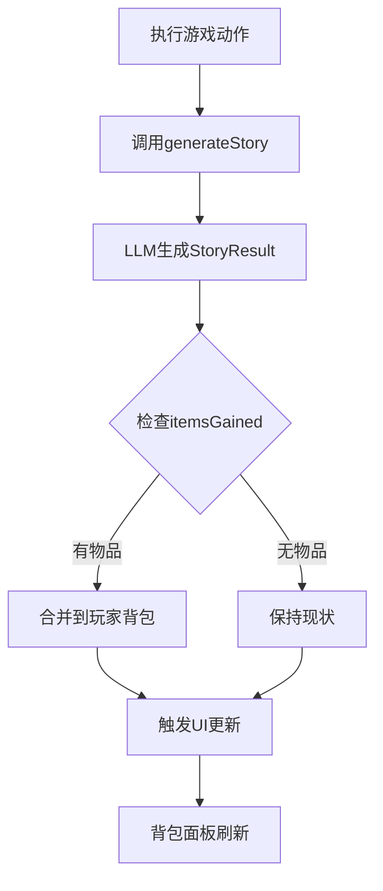
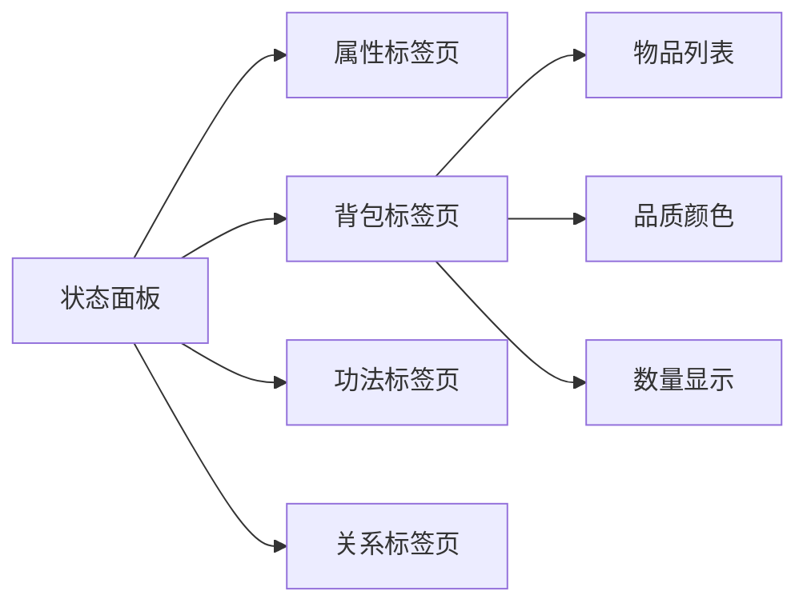
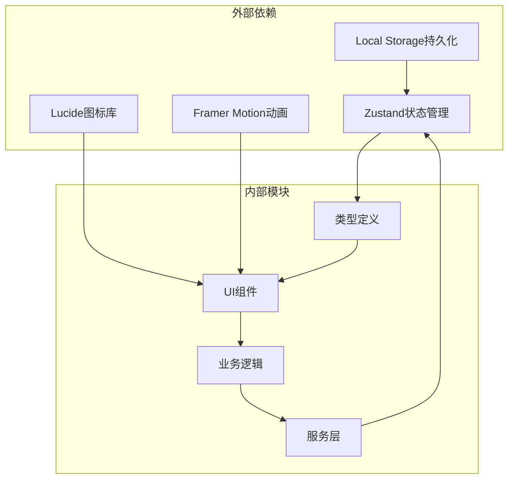

# 物品与背包系统

<cite>
**本文档引用的文件**
- [game.ts](file://src/types/game.ts)
- [useGameStore.ts](file://src/stores/useGameStore.ts)
- [InventoryPanel.tsx](file://src/components/InventoryPanel.tsx)
- [StatusPanel.tsx](file://src/components/StatusPanel.tsx)
- [App.tsx](file://src/App.tsx)
- [gameService.ts](file://src/services/gameService.ts)
- [story.ts](file://src/prompts/story.ts)
</cite>

## 目录
1. [简介](#简介)
2. [项目结构](#项目结构)
3. [核心组件](#核心组件)
4. [架构概览](#架构概览)
5. [详细组件分析](#详细组件分析)
6. [依赖关系分析](#依赖关系分析)
7. [性能考虑](#性能考虑)
8. [故障排除指南](#故障排除指南)
9. [结论](#结论)

## 简介

本系统是修仙Roguelike游戏中物品与背包管理的核心模块。系统实现了完整的物品生命周期管理，包括物品生成、存储、展示、使用和销毁。基于LLM驱动的剧情系统，物品作为重要的游戏要素参与角色成长、战斗体验和世界探索。

系统支持九种物品类型（武器、防具、丹药、符箓、功法、法宝、材料、杂物、灵石）和四种品质等级（凡品、灵品、仙品、神品），为玩家提供丰富的收集和养成体验。

## 项目结构

**图表来源**
- [game.ts](file://src/types/game.ts#L73-L80)
- [useGameStore.ts](file://src/stores/useGameStore.ts#L13-L55)
- [InventoryPanel.tsx](file://src/components/InventoryPanel.tsx#L1-L95)
- [StatusPanel.tsx](file://src/components/StatusPanel.tsx#L1-L503)

**章节来源**
- [game.ts](file://src/types/game.ts#L1-L319)
- [useGameStore.ts](file://src/stores/useGameStore.ts#L1-L226)

## 核心组件

### 物品类型系统

系统定义了完整的物品分类体系：

| 物品类别 | 描述 | 示例 |
|---------|------|------|
| 武器 | 近战/远程攻击装备 | 青钢剑、紫电弓、玄铁刀 |
| 防具 | 防护装备 | 云锦袍、玄甲、金丝靴 |
| 丹药 | 恢复类消耗品 | 气血丹、真气丸、凝元散 |
| 符箓 | 法术载体 | 破邪符、定身符、隐身符 |
| 功法 | 技能学习材料 | 剑诀心法、身法口诀、阵法图谱 |
| 法宝 | 主动/被动装备 | 紫檀扇、青玉瓶、七宝玲珑塔 |
| 材料 | 合成/制作原料 | 灵芝草、千年何首乌、玄武岩 |
| 杂物 | 通用物品 | 普通钱币、布匹、书籍 |
| 灵石 | 货币单位 | 各级灵石，用于交易 |

### 品质系统

品质等级从低到高依次为：凡品 → 灵品 → 仙品 → 神品

| 品质 | 稀有度 | 显示颜色 | 属性加成 |
|------|--------|----------|----------|
| 凡品 | 普通 | 灰色 | 基础属性 |
| 灵品 | 稀有 | 绿色 | +10%属性 |
| 仙品 | 珍贵 | 紫色 | +25%属性 |
| 神品 | 传奇 | 金色 | +50%属性 |

**章节来源**
- [game.ts](file://src/types/game.ts#L14-L25)

## 架构概览

**图表来源**
- [App.tsx](file://src/App.tsx#L338-L351)
- [gameService.ts](file://src/services/gameService.ts#L284-L391)
- [useGameStore.ts](file://src/stores/useGameStore.ts#L84-L225)

## 详细组件分析

### 背包管理系统

#### 数据结构设计

**图表来源**
- [game.ts](file://src/types/game.ts#L73-L80)
- [game.ts](file://src/types/game.ts#L110-L139)
- [InventoryPanel.tsx](file://src/components/InventoryPanel.tsx#L7-L47)

#### 背包容量与显示

背包系统采用响应式设计，支持：

- **动态数量显示**：物品数量大于1时显示"x数量"
- **品质颜色编码**：不同品质使用对应颜色标识
- **类型图标映射**：每种物品类型对应专属图标
- **滚动区域**：超过显示范围时提供滚动浏览

**章节来源**
- [InventoryPanel.tsx](file://src/components/InventoryPanel.tsx#L11-L95)

### 物品获取与管理

#### 获取流程

**图表来源**
- [App.tsx](file://src/App.tsx#L338-L341)
- [gameService.ts](file://src/services/gameService.ts#L284-L391)

#### 物品移除机制

系统支持物品的主动移除：

- **按名称匹配**：通过物品名称进行精确匹配
- **按ID匹配**：支持通过唯一ID进行删除
- **批量操作**：支持同时移除多个物品

**章节来源**
- [App.tsx](file://src/App.tsx#L343-L351)

### 状态面板集成

#### 多维度展示

状态面板提供三种展示模式：

1. **桌面端完整面板**：包含属性、背包、功法、关系四个标签页
2. **移动端紧凑视图**：简化显示核心信息
3. **弹窗详情**：移动端点击展开完整信息

**图表来源**
- [StatusPanel.tsx](file://src/components/StatusPanel.tsx#L171-L203)
- [StatusPanel.tsx](file://src/components/StatusPanel.tsx#L360-L404)

**章节来源**
- [StatusPanel.tsx](file://src/components/StatusPanel.tsx#L1-L503)

### LLM驱动的物品生成

#### 剧情物品系统

系统通过LLM生成符合剧情的物品，支持：

- **随机物品生成**：根据剧情需要生成相应物品
- **品质随机化**：物品品质根据剧情重要性随机决定
- **效果描述生成**：自动生成符合修仙风格的效果描述
- **数量控制**：支持单个或批量物品生成

**章节来源**
- [story.ts](file://src/prompts/story.ts#L98-L106)
- [gameService.ts](file://src/services/gameService.ts#L284-L391)

## 依赖关系分析

**图表来源**
- [useGameStore.ts](file://src/stores/useGameStore.ts#L1-L2)
- [InventoryPanel.tsx](file://src/components/InventoryPanel.tsx#L4-L5)
- [StatusPanel.tsx](file://src/components/StatusPanel.tsx#L5)

### 组件耦合度分析

- **低耦合设计**：UI组件与业务逻辑通过状态管理器解耦
- **单一职责**：每个组件专注于特定功能领域
- **类型安全**：完整的TypeScript类型定义确保编译时安全

**章节来源**
- [useGameStore.ts](file://src/stores/useGameStore.ts#L84-L225)
- [game.ts](file://src/types/game.ts#L1-L319)

## 性能考虑

### 渲染优化

1. **虚拟滚动**：大量物品时使用滚动区域组件
2. **条件渲染**：空背包状态下的占位符显示
3. **动画渐变**：使用Framer Motion实现流畅过渡

### 存储优化

1. **增量更新**：只更新变化的数据部分
2. **本地持久化**：使用localStorage减少服务器压力
3. **状态分区**：将大型对象分割存储

## 故障排除指南

### 常见问题

1. **物品不显示**
   - 检查物品数量是否大于0
   - 验证品质颜色映射配置
   - 确认UI组件正确接收props

2. **物品丢失**
   - 检查itemsLost数组格式
   - 验证名称匹配逻辑
   - 确认ID匹配优先级

3. **状态同步问题**
   - 检查Zustand状态更新函数
   - 验证persist中间件配置
   - 确认组件订阅状态正确

**章节来源**
- [App.tsx](file://src/App.tsx#L343-L351)
- [useGameStore.ts](file://src/stores/useGameStore.ts#L84-L225)

## 结论

本物品与背包系统通过模块化设计实现了完整的物品生命周期管理。系统具有以下特点：

- **完整的物品分类**：覆盖修仙世界的各种物品类型
- **灵活的品质系统**：提供渐进式的属性加成
- **LLM驱动的内容生成**：确保物品与剧情的契合度
- **优秀的用户体验**：响应式设计适配多种设备
- **可扩展的架构**：为未来功能扩展预留空间

系统为玩家提供了丰富的收集和养成体验，是修仙Roguelike游戏的重要组成部分。