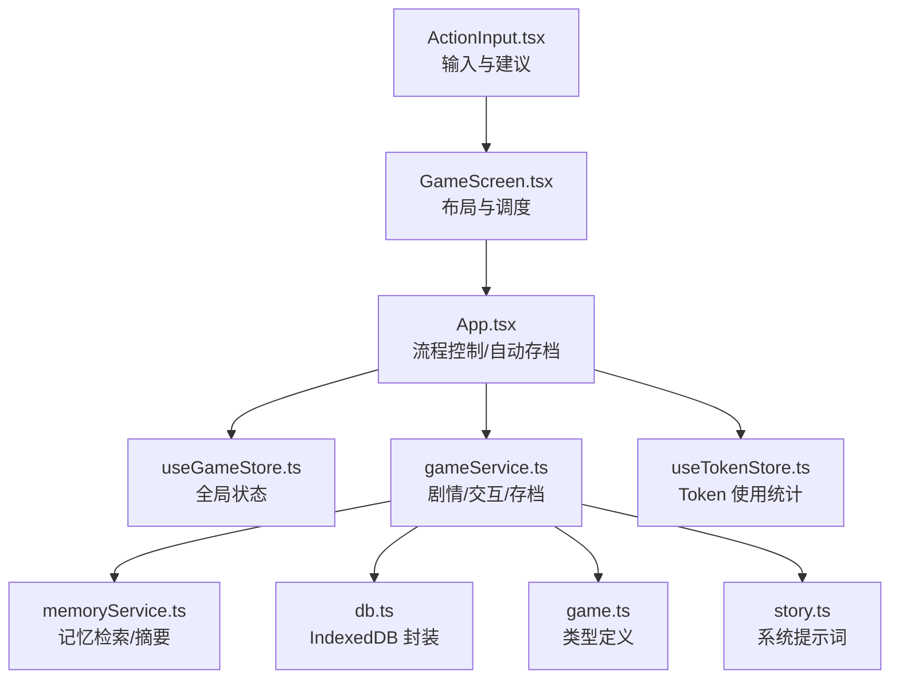
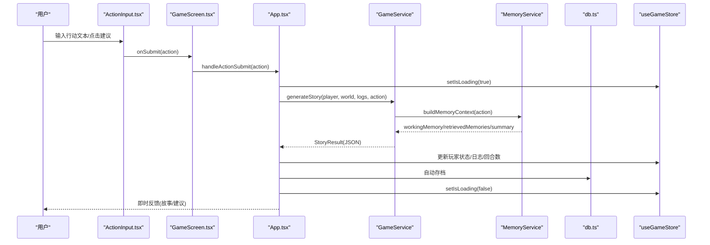
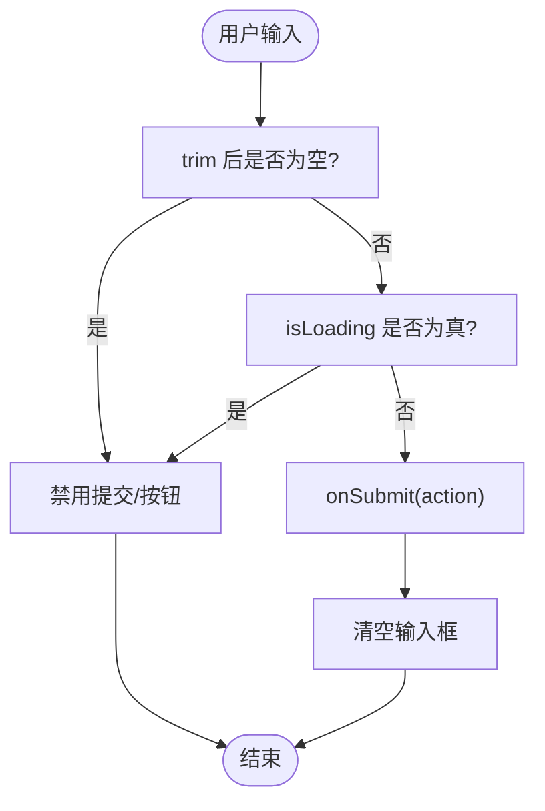
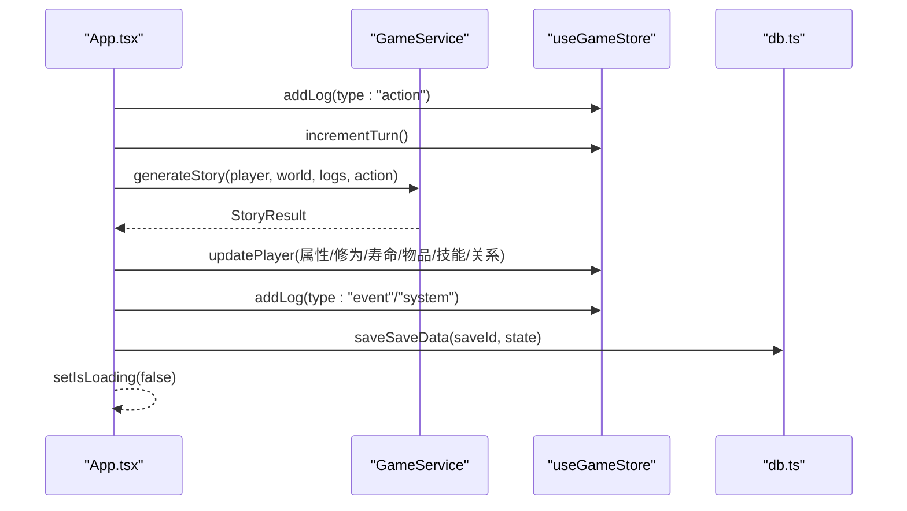
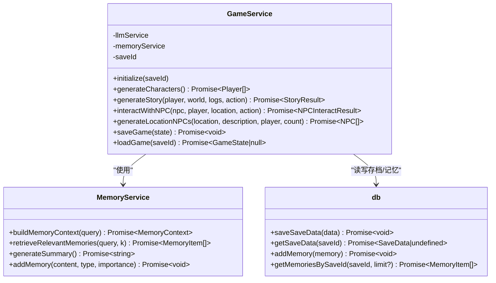
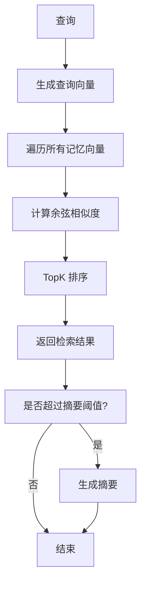
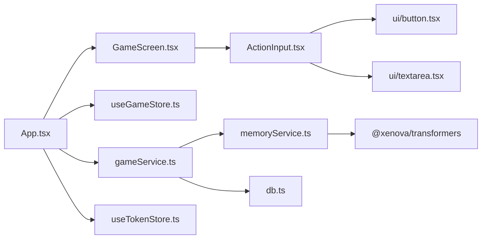

# 行动输入与执行

<cite>
**本文引用的文件**
- [ActionInput.tsx](file://src/components/ActionInput.tsx)
- [GameScreen.tsx](file://src/components/GameScreen.tsx)
- [App.tsx](file://src/App.tsx)
- [useGameStore.ts](file://src/stores/useGameStore.ts)
- [gameService.ts](file://src/services/gameService.ts)
- [memoryService.ts](file://src/services/memoryService.ts)
- [db.ts](file://src/services/db.ts)
- [game.ts](file://src/types/game.ts)
- [story.ts](file://src/prompts/story.ts)
- [useTokenStore.ts](file://src/stores/useTokenStore.ts)
- [package.json](file://src/package.json)
</cite>

## 目录
1. [简介](#简介)
2. [项目结构](#项目结构)
3. [核心组件](#核心组件)
4. [架构总览](#架构总览)
5. [详细组件分析](#详细组件分析)
6. [依赖分析](#依赖分析)
7. [性能考虑](#性能考虑)
8. [故障排除指南](#故障排除指南)
9. [结论](#结论)
10. [附录](#附录)

## 简介
本文件系统性阐述“行动输入与执行”子系统的设计与实现，覆盖用户界面、输入验证、命令解析、错误处理、行动类型、时序控制、并发处理、回滚机制、成功率计算、随机事件、即时反馈、限制条件、冷却与资源消耗，以及策略与优化建议。该系统围绕“玩家输入 → 服务层推演 → 状态更新 → 记忆与存档”的闭环展开，结合修仙题材的奇遇、突破、战斗、交互、探索、移动、使用物品等可执行行动类型，提供沉浸式体验。

## 项目结构
行动输入与执行系统主要由以下层次构成：
- 用户界面层：ActionInput 输入组件、GameScreen 展示与编排
- 应用层：App 控制流程、状态协调、自动存档
- 业务服务层：GameService 负责剧情推演、NPC 交互、存档读写
- 记忆与检索层：MemoryService 实现 RAG 式记忆检索与摘要
- 存储层：IndexedDB 封装 db.ts，持久化存档与记忆
- 类型与提示：game.ts 定义数据模型，story.ts 提供系统提示词

图表来源
- [ActionInput.tsx](file://src/components/ActionInput.tsx#L1-L146)
- [GameScreen.tsx](file://src/components/GameScreen.tsx#L1-L172)
- [App.tsx](file://src/App.tsx#L1-L588)
- [useGameStore.ts](file://src/stores/useGameStore.ts#L1-L226)
- [gameService.ts](file://src/services/gameService.ts#L1-L541)
- [memoryService.ts](file://src/services/memoryService.ts#L1-L224)
- [db.ts](file://src/services/db.ts#L1-L236)
- [game.ts](file://src/types/game.ts#L1-L319)
- [story.ts](file://src/prompts/story.ts#L1-L147)
- [useTokenStore.ts](file://src/stores/useTokenStore.ts#L1-L73)

章节来源
- [ActionInput.tsx](file://src/components/ActionInput.tsx#L1-L146)
- [GameScreen.tsx](file://src/components/GameScreen.tsx#L1-L172)
- [App.tsx](file://src/App.tsx#L1-L588)
- [useGameStore.ts](file://src/stores/useGameStore.ts#L1-L226)
- [gameService.ts](file://src/services/gameService.ts#L1-L541)
- [memoryService.ts](file://src/services/memoryService.ts#L1-L224)
- [db.ts](file://src/services/db.ts#L1-L236)
- [game.ts](file://src/types/game.ts#L1-L319)
- [story.ts](file://src/prompts/story.ts#L1-L147)
- [useTokenStore.ts](file://src/stores/useTokenStore.ts#L1-L73)

## 核心组件
- 行动输入组件 ActionInput：提供输入框、快捷键、建议按钮、加载指示与禁用状态管理
- 游戏主界面 GameScreen：组织状态面板、故事日志、行动输入、地图/NPC 面板与沉浸式加载
- 应用入口 App：统一处理角色创建、剧情生成、NPC 交互、自动存档与错误提示
- 全局状态 useGameStore：集中管理玩家、世界、日志、事件、记忆、回合数、加载状态等
- 业务服务 GameService：封装 LLM 推演、NPC 交互、存档读写、记忆注入
- 记忆服务 MemoryService：工作记忆、检索相似记忆、生成摘要、清理旧记忆
- 存储 db：IndexedDB 封装，提供存档、记忆 CRUD 与索引查询
- 类型与提示：game.ts 定义角色、NPC、物品、技能、关系、事件、日志等类型；story.ts 提供系统提示词

章节来源
- [ActionInput.tsx](file://src/components/ActionInput.tsx#L1-L146)
- [GameScreen.tsx](file://src/components/GameScreen.tsx#L1-L172)
- [App.tsx](file://src/App.tsx#L1-L588)
- [useGameStore.ts](file://src/stores/useGameStore.ts#L1-L226)
- [gameService.ts](file://src/services/gameService.ts#L1-L541)
- [memoryService.ts](file://src/services/memoryService.ts#L1-L224)
- [db.ts](file://src/services/db.ts#L1-L236)
- [game.ts](file://src/types/game.ts#L1-L319)
- [story.ts](file://src/prompts/story.ts#L1-L147)

## 架构总览
行动输入与执行遵循“UI → 应用层 → 服务层 → 存储/记忆”的分层架构。输入通过 ActionInput 校验与提交，App 统一调度，GameService 调用 LLM 生成剧情结果，useGameStore 更新全局状态，MemoryService 注入记忆并检索上下文，db 持久化存档与记忆。系统通过 isLoading 状态实现时序控制与并发保护，自动存档保障数据安全。

图表来源
- [ActionInput.tsx](file://src/components/ActionInput.tsx#L14-L28)
- [GameScreen.tsx](file://src/components/GameScreen.tsx#L126-L130)
- [App.tsx](file://src/App.tsx#L239-L468)
- [gameService.ts](file://src/services/gameService.ts#L283-L391)
- [memoryService.ts](file://src/services/memoryService.ts#L175-L188)
- [db.ts](file://src/services/db.ts#L134-L150)
- [useGameStore.ts](file://src/stores/useGameStore.ts#L179-L185)

## 详细组件分析

### 行动输入组件 ActionInput 设计
- 用户界面
  - 文本输入框：支持 Enter 发送、Shift+Enter 换行、禁用态与占位符
  - 建议按钮：桌面端弹性布局、移动端横向滚动，点击即提交
  - 发送按钮：加载态旋转动画、禁用态、悬停缩放
  - 底部提示：Enter 发送、加载中提示
- 输入验证
  - 非空校验：trim 后为空则拒绝提交
  - 并发保护：isLoading 期间禁用输入与按钮
- 命令解析
  - 作为纯 UI 组件，不进行本地解析，直接透传字符串给 App 处理
- 错误处理
  - 通过父组件的 isLoading 与错误日志实现反馈
- 即时反馈
  - 建议项与加载态提供即时响应

图表来源
- [ActionInput.tsx](file://src/components/ActionInput.tsx#L17-L28)
- [ActionInput.tsx](file://src/components/ActionInput.tsx#L95-L111)

章节来源
- [ActionInput.tsx](file://src/components/ActionInput.tsx#L1-L146)

### 游戏主界面 GameScreen 编排
- 布局：左侧状态、中间故事日志与行动输入、右侧地图与 NPC 面板
- 交互：ActionInput 透传 onSubmit，ImmersionLoading 显示加载态
- NPC 交互：通过 NPCInteractModal 与 App 的 handleNPCInteract 协作

章节来源
- [GameScreen.tsx](file://src/components/GameScreen.tsx#L1-L172)

### 应用层 App 流程控制
- 角色创建与初始化：生成初始 NPC、生成初始剧情、首次自动存档
- 行动处理：记录行动日志、推进回合、调用 GameService 生成剧情、应用结果、更新日志与建议、自动存档
- NPC 交互：调用 GameService.interactWithNPC，更新双方状态与日志
- 自动存档：每 30 秒一次，且每次行动后触发
- 错误处理：捕获异常，记录系统日志，Toast 提示

图表来源
- [App.tsx](file://src/App.tsx#L239-L468)
- [gameService.ts](file://src/services/gameService.ts#L283-L391)
- [db.ts](file://src/services/db.ts#L134-L150)

章节来源
- [App.tsx](file://src/App.tsx#L1-L588)

### 业务服务 GameService
- 剧情生成：构建记忆上下文（工作记忆、检索记忆、摘要），调用 LLM 生成 JSON 结果，注入记忆
- NPC 交互：根据当前场景与玩家状态生成对话与交互结果
- 存档读写：保存/加载 GameState，记录 Token 使用
- 初始 NPC 生成：按区域与玩家境界生成 NPC 列表

图表来源
- [gameService.ts](file://src/services/gameService.ts#L50-L541)
- [memoryService.ts](file://src/services/memoryService.ts#L16-L224)
- [db.ts](file://src/services/db.ts#L36-L236)

章节来源
- [gameService.ts](file://src/services/gameService.ts#L1-L541)
- [memoryService.ts](file://src/services/memoryService.ts#L1-L224)
- [db.ts](file://src/services/db.ts#L1-L236)

### 记忆服务 MemoryService
- 工作记忆：最近 N 条记忆
- 相似检索：嵌入向量 + 余弦相似度，按阈值检索 TopK
- 摘要生成：超过阈值时对旧记忆生成摘要
- 重要性：根据关键词动态赋值，保留高重要性记忆
- 备用嵌入：无 transformers 时使用简单哈希向量

图表来源
- [memoryService.ts](file://src/services/memoryService.ts#L121-L188)
- [memoryService.ts](file://src/services/memoryService.ts#L27-L81)

章节来源
- [memoryService.ts](file://src/services/memoryService.ts#L1-L224)

### 存储层 db（IndexedDB）
- 对象存储：saves、saveData、memories
- 索引：memories 按 saveId、timestamp、importance 建立索引
- 能力：增删改查、批量插入、按重要性检索、删除同存档的记忆

章节来源
- [db.ts](file://src/services/db.ts#L1-L236)

### 类型与提示 game.ts / story.ts
- 类型：Player、NPC、Item、Skill、Relationship、Event、GameLog、World、Time 等
- NPC 交互结果：对话、可用交互、双方状态增量、时间流逝、剧情更新
- 提示词：系统提示词定义修仙世界规则、叙事风格与核心机制，生成提示词模板

章节来源
- [game.ts](file://src/types/game.ts#L1-L319)
- [story.ts](file://src/prompts/story.ts#L1-L147)

## 依赖分析
- 组件依赖
  - ActionInput 仅依赖 UI 组件库与动画库，无业务耦合
  - GameScreen 依赖 ActionInput、StoryLog、MapPanel、NPCPanel、NPCInteractModal
  - App 依赖 GameScreen、useGameStore、useSettingsStore、db、toaster
- 服务依赖
  - GameService 依赖 LLMService、MemoryService、db、TokenStore
  - MemoryService 依赖 LLMService、db、@xenova/transformers（可选）
- 外部依赖
  - @xenova/transformers：用于特征提取与嵌入
  - framer-motion：动画与过渡
  - zustand：状态管理
  - sonner：通知

图表来源
- [ActionInput.tsx](file://src/components/ActionInput.tsx#L1-L146)
- [GameScreen.tsx](file://src/components/GameScreen.tsx#L1-L172)
- [App.tsx](file://src/App.tsx#L1-L588)
- [useGameStore.ts](file://src/stores/useGameStore.ts#L1-L226)
- [gameService.ts](file://src/services/gameService.ts#L1-L541)
- [memoryService.ts](file://src/services/memoryService.ts#L1-L224)
- [db.ts](file://src/services/db.ts#L1-L236)
- [useTokenStore.ts](file://src/stores/useTokenStore.ts#L1-L73)
- [package.json](file://src/package.json#L15-L36)

章节来源
- [package.json](file://src/package.json#L1-L55)

## 性能考虑
- 嵌入与检索
  - 优先使用 @xenova/transformers 的特征提取；失败时降级为简单哈希向量，保证可用性
  - 相似度计算采用余弦相似度，TopK 限制检索规模
- 记忆摘要
  - 达到阈值才生成摘要，减少不必要的 LLM 调用
- 并发与节流
  - isLoading 期间禁用输入与按钮，避免重复请求
  - 自动存档每 30 秒一次，降低频繁 IO
- 状态更新
  - 使用局部更新与不可变更新策略，减少渲染抖动
- Token 统计
  - 记录 prompt/completion/total，便于成本控制与优化

章节来源
- [memoryService.ts](file://src/services/memoryService.ts#L27-L81)
- [memoryService.ts](file://src/services/memoryService.ts#L144-L173)
- [App.tsx](file://src/App.tsx#L107-L122)
- [useTokenStore.ts](file://src/stores/useTokenStore.ts#L1-L73)

## 故障排除指南
- 输入无效
  - 现象：提交按钮禁用、无反应
  - 排查：确认输入非空、isLoading 为 false
  - 参考：ActionInput 校验逻辑
- 推演失败
  - 现象：系统日志出现“天道反噬”、Toast 提示
  - 排查：检查网络与 LLM 配置、查看错误堆栈
  - 处理：重试或调整输入表述
- 存档异常
  - 现象：无法加载/保存存档
  - 排查：IndexedDB 初始化、对象存储是否存在、事务权限
  - 处理：刷新页面、清除浏览器缓存后重试
- 记忆检索异常
  - 现象：检索结果为空或报错
  - 排查：嵌入模型加载失败、向量维度不匹配
  - 处理：启用备用嵌入、检查文本编码
- NPC 交互异常
  - 现象：交互无结果或状态未更新
  - 排查：selectedNPC/player/world 是否就绪、LLM 返回结构是否完整
  - 处理：重新选择 NPC、检查交互结果字段

章节来源
- [ActionInput.tsx](file://src/components/ActionInput.tsx#L17-L28)
- [App.tsx](file://src/App.tsx#L455-L466)
- [db.ts](file://src/services/db.ts#L39-L72)
- [memoryService.ts](file://src/services/memoryService.ts#L27-L56)
- [gameService.ts](file://src/services/gameService.ts#L415-L469)

## 结论
该系统以清晰的分层架构实现了“行动输入与执行”的完整闭环：UI 层简洁直观、应用层统一调度、服务层以 LLM 为核心进行剧情与交互推演、记忆与存储层提供上下文与持久化能力。通过 isLoading 时序控制、自动存档与 Token 统计，系统在可用性与性能之间取得平衡。未来可在行动类型扩展、成功率与随机事件细化、冷却与资源消耗机制、以及回滚与审计方面进一步增强。

## 附录

### 行动类型与执行要点
- 探索：生成区域描述与 NPC，推动剧情与关系发展
- 修炼：消耗时间与寿命，提升修为与属性，突破概率受根骨/悟性/气运影响
- 战斗：胜负取决于境界、功法、属性与气运，逃跑需速度优势
- 交互：与 NPC 对话，改变好感度、揭示属性、获得物品或触发事件
- 移动：更新位置与描述，影响后续剧情与 NPC 生成
- 使用物品：根据物品类型与品质产生即时/持续效果

章节来源
- [story.ts](file://src/prompts/story.ts#L20-L47)
- [gameService.ts](file://src/services/gameService.ts#L283-L391)
- [gameService.ts](file://src/services/gameService.ts#L415-L469)

### 成功率计算与随机事件
- 突破成功率：基础成功率 + 根骨(0-30%) + 悟性(0-20%) + 气运(0-20%)，失败可能带来倒退、心魔、寿元受损或死亡
- 随机事件：通过关键词重要性与 LLM 生成，融入奇遇、传承、天劫、飞升等节点

章节来源
- [story.ts](file://src/prompts/story.ts#L26-L47)
- [App.tsx](file://src/App.tsx#L312-L336)

### 时序控制、并发与回滚
- 时序控制：isLoading 在 App.handleActionSubmit 中开启/关闭，确保单次推演完成再接受下一次输入
- 并发处理：通过 isLoading 与 Promise 链路避免竞态；自动存档使用间隔定时器与每次行动后触发
- 回滚机制：当前未实现显式回滚；可通过存档恢复至最近一次自动存档点

章节来源
- [App.tsx](file://src/App.tsx#L107-L122)
- [App.tsx](file://src/App.tsx#L240-L468)

### 行动策略与效率优化
- 策略建议
  - 优先探索与交互，建立关系网与获取情报
  - 修炼应结合功法与资源，避免过度消耗寿命
  - 战斗前评估境界差距与逃跑机会
- 效率优化
  - 使用建议按钮快速试错
  - 合理利用 Token 统计，减少不必要的重复调用
  - 保持存档目录整洁，定期清理旧存档

章节来源
- [useTokenStore.ts](file://src/stores/useTokenStore.ts#L1-L73)
- [App.tsx](file://src/App.tsx#L107-L122)