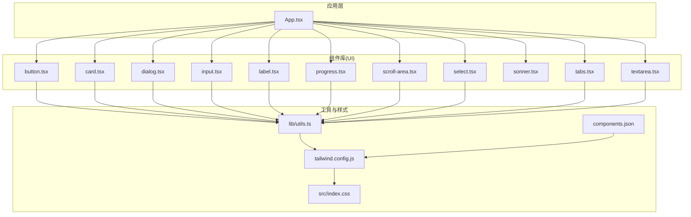
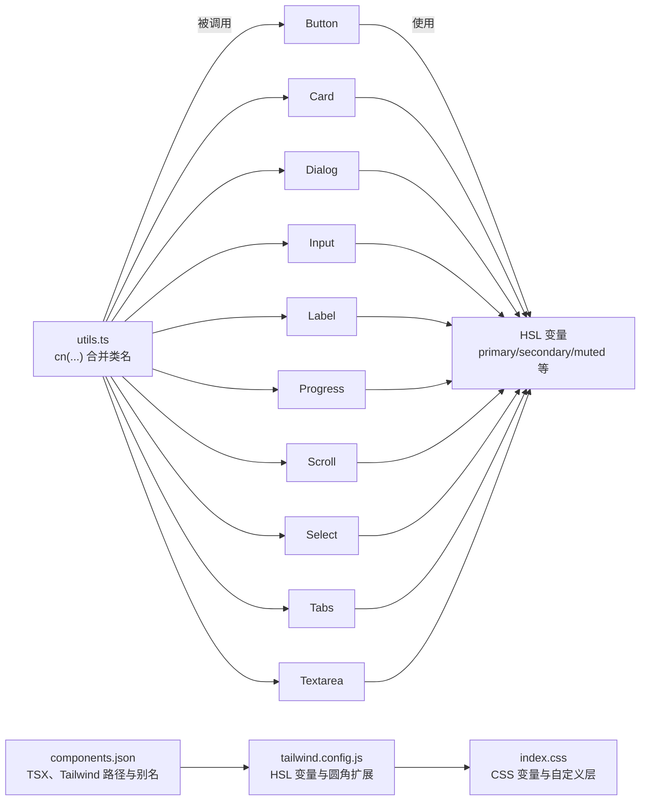
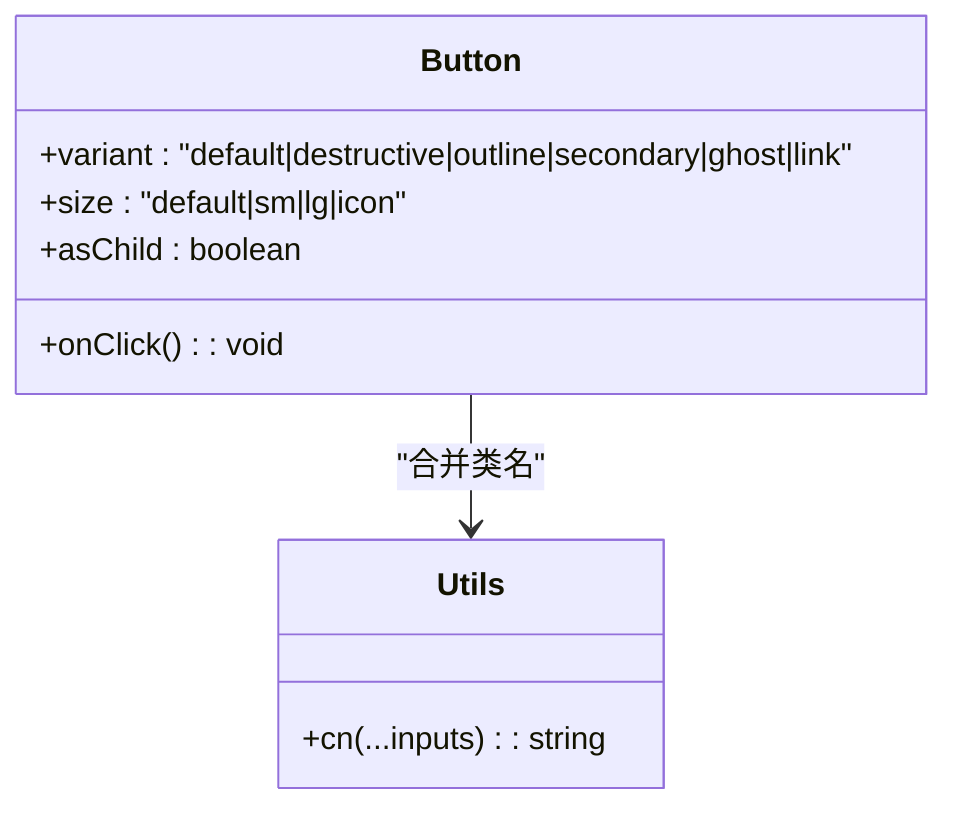
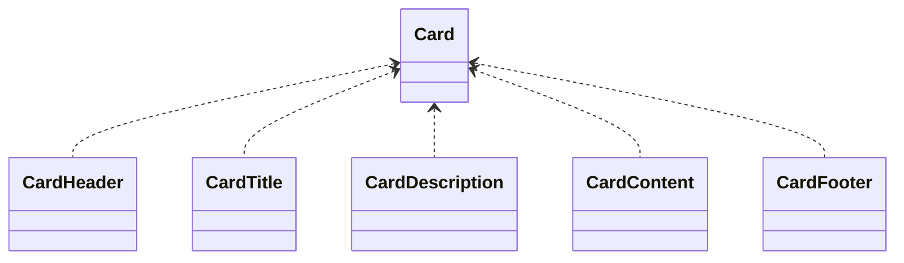
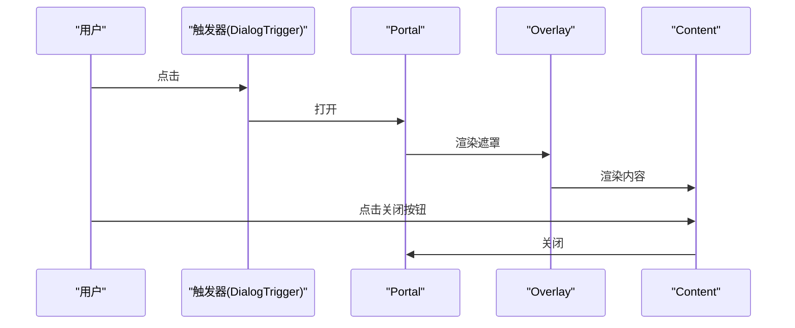
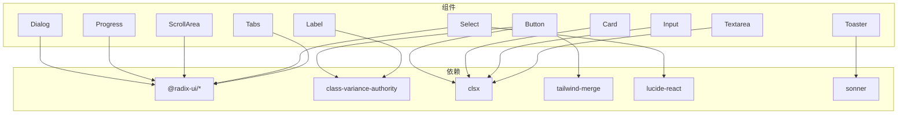

# UI 组件库集成

<cite>
**本文引用的文件**
- [package.json](file://package.json)
- [tailwind.config.js](file://tailwind.config.js)
- [components.json](file://components.json)
- [src/lib/utils.ts](file://src/lib/utils.ts)
- [src/index.css](file://src/index.css)
- [src/components/ui/button.tsx](file://src/components/ui/button.tsx)
- [src/components/ui/card.tsx](file://src/components/ui/card.tsx)
- [src/components/ui/dialog.tsx](file://src/components/ui/dialog.tsx)
- [src/components/ui/input.tsx](file://src/components/ui/input.tsx)
- [src/components/ui/label.tsx](file://src/components/ui/label.tsx)
- [src/components/ui/progress.tsx](file://src/components/ui/progress.tsx)
- [src/components/ui/scroll-area.tsx](file://src/components/ui/scroll-area.tsx)
- [src/components/ui/select.tsx](file://src/components/ui/select.tsx)
- [src/components/ui/sonner.tsx](file://src/components/ui/sonner.tsx)
- [src/components/ui/tabs.tsx](file://src/components/ui/tabs.tsx)
- [src/components/ui/textarea.tsx](file://src/components/ui/textarea.tsx)
</cite>

## 目录
1. [简介](#简介)
2. [项目结构](#项目结构)
3. [核心组件](#核心组件)
4. [架构总览](#架构总览)
5. [组件详解](#组件详解)
6. [依赖关系分析](#依赖关系分析)
7. [性能与可维护性](#性能与可维护性)
8. [故障排查指南](#故障排查指南)
9. [结论](#结论)
10. [附录](#附录)

## 简介
本文件面向 UI 开发者，系统化梳理本项目中基于 shadcn/ui 的组件库集成与使用方式，涵盖以下方面：
- 组件库集成配置与主题变量体系
- 基础 UI 组件的属性、事件、样式与主题适配
- 工具函数与 TailwindCSS 配置优化
- 组件开发规范、最佳实践与性能建议

## 项目结构
本项目采用“按功能域分层 + 组件库封装”的组织方式：
- 组件库封装位于 src/components/ui 下，每个原子组件独立文件，便于复用与替换
- 工具函数集中于 src/lib/utils.ts，提供类名合并与变体组合能力
- 样式通过 TailwindCSS 与自定义 CSS 变量共同驱动，支持明暗主题与修仙风格定制

图表来源
- [src/components/ui/button.tsx](file://src/components/ui/button.tsx#L1-L57)
- [src/components/ui/card.tsx](file://src/components/ui/card.tsx#L1-L80)
- [src/components/ui/dialog.tsx](file://src/components/ui/dialog.tsx#L1-L121)
- [src/components/ui/input.tsx](file://src/components/ui/input.tsx#L1-L23)
- [src/components/ui/label.tsx](file://src/components/ui/label.tsx#L1-L25)
- [src/components/ui/progress.tsx](file://src/components/ui/progress.tsx#L1-L29)
- [src/components/ui/scroll-area.tsx](file://src/components/ui/scroll-area.tsx#L1-L47)
- [src/components/ui/select.tsx](file://src/components/ui/select.tsx#L1-L161)
- [src/components/ui/sonner.tsx](file://src/components/ui/sonner.tsx#L1-L27)
- [src/components/ui/tabs.tsx](file://src/components/ui/tabs.tsx#L1-L54)
- [src/components/ui/textarea.tsx](file://src/components/ui/textarea.tsx#L1-L23)
- [src/lib/utils.ts](file://src/lib/utils.ts#L1-L7)
- [tailwind.config.js](file://tailwind.config.js#L1-L53)
- [src/index.css](file://src/index.css#L1-L217)
- [components.json](file://components.json#L1-L17)

章节来源
- [package.json](file://package.json#L1-L55)
- [tailwind.config.js](file://tailwind.config.js#L1-L53)
- [components.json](file://components.json#L1-L17)
- [src/lib/utils.ts](file://src/lib/utils.ts#L1-L7)
- [src/index.css](file://src/index.css#L1-L217)

## 核心组件
本节概述各基础 UI 组件的职责与典型用法，便于快速定位与复用。

- 按钮 Button
  - 支持多种变体与尺寸，具备 asChild 插槽能力
  - 适合表单提交、操作触发、导航入口等场景
  - 参考路径：[src/components/ui/button.tsx](file://src/components/ui/button.tsx#L1-L57)

- 卡片 Card
  - 提供 Card、CardHeader、CardTitle、CardDescription、CardContent、CardFooter 组合
  - 适合信息分组、面板容器、对话框内容区等
  - 参考路径：[src/components/ui/card.tsx](file://src/components/ui/card.tsx#L1-L80)

- 对话框 Dialog
  - 基于 Radix UI，包含 Overlay、Portal、Trigger、Close、Content、Header/Footer、Title/Description
  - 支持动画入场/出场与无障碍关闭按钮
  - 参考路径：[src/components/ui/dialog.tsx](file://src/components/ui/dialog.tsx#L1-L121)

- 输入 Input
  - 原生 input 包装，内置圆角、边框、占位符、聚焦态与禁用态
  - 参考路径：[src/components/ui/input.tsx](file://src/components/ui/input.tsx#L1-L23)

- 标签 Label
  - 基于 Radix UI Label，配合表单控件使用
  - 参考路径：[src/components/ui/label.tsx](file://src/components/ui/label.tsx#L1-L25)

- 进度条 Progress
  - 基于 Radix UI，支持数值指示与过渡动画
  - 参考路径：[src/components/ui/progress.tsx](file://src/components/ui/progress.tsx#L1-L29)

- 滚动区域 ScrollArea
  - 封装 Radix UI ScrollArea，提供自定义滚动条样式
  - 参考路径：[src/components/ui/scroll-area.tsx](file://src/components/ui/scroll-area.tsx#L1-L47)

- 选择器 Select
  - 支持组、标签、项、分隔符、上下滚动按钮与弹出层
  - 参考路径：[src/components/ui/select.tsx](file://src/components/ui/select.tsx#L1-L161)

- 通知 Toaster
  - 基于 Sonner，统一暗色主题与样式类名
  - 参考路径：[src/components/ui/sonner.tsx](file://src/components/ui/sonner.tsx#L1-L27)

- 标签页 Tabs
  - 支持列表、触发器、内容区
  - 参考路径：[src/components/ui/tabs.tsx](file://src/components/ui/tabs.tsx#L1-L54)

- 文本域 Textarea
  - 原生 textarea 包装，内置圆角、边框、占位符、聚焦态与禁用态
  - 参考路径：[src/components/ui/textarea.tsx](file://src/components/ui/textarea.tsx#L1-L23)

章节来源
- [src/components/ui/button.tsx](file://src/components/ui/button.tsx#L1-L57)
- [src/components/ui/card.tsx](file://src/components/ui/card.tsx#L1-L80)
- [src/components/ui/dialog.tsx](file://src/components/ui/dialog.tsx#L1-L121)
- [src/components/ui/input.tsx](file://src/components/ui/input.tsx#L1-L23)
- [src/components/ui/label.tsx](file://src/components/ui/label.tsx#L1-L25)
- [src/components/ui/progress.tsx](file://src/components/ui/progress.tsx#L1-L29)
- [src/components/ui/scroll-area.tsx](file://src/components/ui/scroll-area.tsx#L1-L47)
- [src/components/ui/select.tsx](file://src/components/ui/select.tsx#L1-L161)
- [src/components/ui/sonner.tsx](file://src/components/ui/sonner.tsx#L1-L27)
- [src/components/ui/tabs.tsx](file://src/components/ui/tabs.tsx#L1-L54)
- [src/components/ui/textarea.tsx](file://src/components/ui/textarea.tsx#L1-L23)

## 架构总览
下图展示组件库与工具、样式之间的交互关系，以及主题变量在运行时如何生效。

图表来源
- [src/lib/utils.ts](file://src/lib/utils.ts#L1-L7)
- [tailwind.config.js](file://tailwind.config.js#L1-L53)
- [src/index.css](file://src/index.css#L1-L217)
- [components.json](file://components.json#L1-L17)
- [src/components/ui/button.tsx](file://src/components/ui/button.tsx#L1-L57)
- [src/components/ui/card.tsx](file://src/components/ui/card.tsx#L1-L80)
- [src/components/ui/dialog.tsx](file://src/components/ui/dialog.tsx#L1-L121)
- [src/components/ui/input.tsx](file://src/components/ui/input.tsx#L1-L23)
- [src/components/ui/label.tsx](file://src/components/ui/label.tsx#L1-L25)
- [src/components/ui/progress.tsx](file://src/components/ui/progress.tsx#L1-L29)
- [src/components/ui/scroll-area.tsx](file://src/components/ui/scroll-area.tsx#L1-L47)
- [src/components/ui/select.tsx](file://src/components/ui/select.tsx#L1-L161)
- [src/components/ui/tabs.tsx](file://src/components/ui/tabs.tsx#L1-L54)
- [src/components/ui/textarea.tsx](file://src/components/ui/textarea.tsx#L1-L23)

## 组件详解

### Button 按钮
- 属性与行为
  - 变体：默认、破坏性、描边、次级、幽灵、链接
  - 尺寸：默认、小、大、图标
  - 支持 asChild 插槽以嵌入图标或自定义元素
  - 事件：原生 button 事件透传
- 样式与主题
  - 使用主题变量控制前景/背景色与悬停效果
  - 支持聚焦环与禁用态
- 最佳实践
  - 图标按钮优先使用 icon 尺寸
  - 链接变体仅用于无副作用的导航
  - 重要操作使用 primary，危险操作使用 destructive

图表来源
- [src/components/ui/button.tsx](file://src/components/ui/button.tsx#L1-L57)
- [src/lib/utils.ts](file://src/lib/utils.ts#L1-L7)

章节来源
- [src/components/ui/button.tsx](file://src/components/ui/button.tsx#L1-L57)

### Card 卡片
- 结构
  - Card 容器、CardHeader、CardTitle、CardDescription、CardContent、CardFooter
- 适用场景
  - 展示信息区块、设置面板、角色详情、对话框主体
- 主题适配
  - 使用 card 与 card-foreground 主题变量

图表来源
- [src/components/ui/card.tsx](file://src/components/ui/card.tsx#L1-L80)

章节来源
- [src/components/ui/card.tsx](file://src/components/ui/card.tsx#L1-L80)

### Dialog 对话框
- 组成
  - Root、Portal、Overlay、Trigger、Close、Content、Header、Footer、Title、Description
- 动画与无障碍
  - 内置开合动画与 SR-only 关闭按钮
- 事件
  - Close 用于显式关闭；Overlay/Close 点击可关闭

图表来源
- [src/components/ui/dialog.tsx](file://src/components/ui/dialog.tsx#L1-L121)

章节来源
- [src/components/ui/dialog.tsx](file://src/components/ui/dialog.tsx#L1-L121)

### Input 输入框
- 行为
  - 原生 input，支持 type、禁用、聚焦态
- 样式
  - 使用 surface-raised 背景变量与圆角、边框、占位符颜色

章节来源
- [src/components/ui/input.tsx](file://src/components/ui/input.tsx#L1-L23)

### Label 标签
- 行为
  - 与表单控件绑定，禁用时半透明且不可交互
- 适用
  - 与 Input/Select/Textarea 等配合使用

章节来源
- [src/components/ui/label.tsx](file://src/components/ui/label.tsx#L1-L25)

### Progress 进度条
- 行为
  - 接受 value 数值，内部计算位移百分比
- 样式
  - 使用主题 primary 作为进度条色，支持过渡动画

章节来源
- [src/components/ui/progress.tsx](file://src/components/ui/progress.tsx#L1-L29)

### ScrollArea 滚动区域
- 行为
  - 封装 Radix UI，提供自定义滚动条
- 样式
  - 滚动条使用固定颜色与宽度，适配暗色主题

章节来源
- [src/components/ui/scroll-area.tsx](file://src/components/ui/scroll-area.tsx#L1-L47)

### Select 选择器
- 组成
  - Trigger、Content、Viewport、Item、Label、Separator、ScrollUp/DownButton
- 行为
  - 支持滚动、占位符、选中指示器、弹出层定位
- 事件
  - 通过受控/非受控方式管理选中值

章节来源
- [src/components/ui/select.tsx](file://src/components/ui/select.tsx#L1-L161)

### Sonner 通知
- 行为
  - 默认暗色主题，统一 toast、描述、动作按钮、取消按钮的样式类名
- 适用
  - 全局提示、成功/失败反馈、二次确认

章节来源
- [src/components/ui/sonner.tsx](file://src/components/ui/sonner.tsx#L1-L27)

### Tabs 标签页
- 组成
  - Root、List、Trigger、Content
- 行为
  - 切换时激活态高亮与阴影

章节来源
- [src/components/ui/tabs.tsx](file://src/components/ui/tabs.tsx#L1-L54)

### Textarea 文本域
- 行为
  - 原生 textarea，支持禁用与聚焦态
- 样式
  - 使用 surface-raised 背景变量与圆角、边框、占位符颜色

章节来源
- [src/components/ui/textarea.tsx](file://src/components/ui/textarea.tsx#L1-L23)

## 依赖关系分析
- 组件库依赖
  - Radix UI：dialog、label、progress、scroll-area、select、slot、tabs
  - class-variance-authority、clsx、tailwind-merge：变体与类名合并
  - lucide-react：图标
  - sonner：通知
- 样式依赖
  - TailwindCSS + 自定义 CSS 变量 + @layer
  - shadcn 配置 components.json 指定 TSX、Tailwind 路径与别名

图表来源
- [package.json](file://package.json#L15-L36)
- [src/components/ui/button.tsx](file://src/components/ui/button.tsx#L1-L57)
- [src/components/ui/dialog.tsx](file://src/components/ui/dialog.tsx#L1-L121)
- [src/components/ui/label.tsx](file://src/components/ui/label.tsx#L1-L25)
- [src/components/ui/progress.tsx](file://src/components/ui/progress.tsx#L1-L29)
- [src/components/ui/scroll-area.tsx](file://src/components/ui/scroll-area.tsx#L1-L47)
- [src/components/ui/select.tsx](file://src/components/ui/select.tsx#L1-L161)
- [src/components/ui/tabs.tsx](file://src/components/ui/tabs.tsx#L1-L54)
- [src/components/ui/textarea.tsx](file://src/components/ui/textarea.tsx#L1-L23)
- [src/components/ui/sonner.tsx](file://src/components/ui/sonner.tsx#L1-L27)

章节来源
- [package.json](file://package.json#L15-L36)

## 性能与可维护性
- 类名合并
  - 使用 utils.ts 中的 cn 函数进行类名合并，避免重复与冲突
  - 在组件中优先传入 className，减少内联样式
- 变体与主题
  - 通过 cva 与主题变量控制外观，降低重复样式代码
- 动画与交互
  - 仅在必要处启用动画，避免过度动画影响性能
- 样式体积
  - Tailwind 按需扫描 content 路径，确保未使用类名不被打包
- 可测试性
  - 组件尽量保持纯函数式与无副作用，便于单元测试

## 故障排查指南
- 样式不生效
  - 检查 tailwind.config.js 是否正确扩展颜色与圆角
  - 确认 src/index.css 中 @layer base 与 @layer components 是否存在
  - 确认 components.json 的 tailwind.css 路径与 aliases 正确
- 主题变量无效
  - 确认 :root 与 .light/.dark 中 CSS 变量是否完整
  - 确认组件使用的是主题变量而非硬编码颜色
- 类名冲突
  - 使用 cn(...) 合并类名，避免重复覆盖
  - 避免在组件内直接写死样式，优先通过变体与主题变量控制
- 动画异常
  - 检查 Radix UI 动画类名是否正确拼接
  - 确认 Portal 渲染层级与 z-index 设置

章节来源
- [tailwind.config.js](file://tailwind.config.js#L1-L53)
- [src/index.css](file://src/index.css#L1-L217)
- [components.json](file://components.json#L1-L17)
- [src/lib/utils.ts](file://src/lib/utils.ts#L1-L7)

## 结论
本项目已完整集成 shadcn/ui 组件库，并通过工具函数与 TailwindCSS 主题变量体系实现了高度一致的视觉与交互体验。遵循本文档的组件使用方式、样式定制策略与最佳实践，可在保证性能的同时快速扩展 UI 能力，满足修仙 Roguelike 的风格化需求。

## 附录
- 组件开发规范
  - 统一使用 utils.ts 的 cn(...) 合并类名
  - 通过 cva 定义变体，避免硬编码样式
  - 优先使用主题变量，确保明暗主题一致性
  - 为可访问性考虑提供必要的 aria 属性与键盘交互
- 性能优化建议
  - 避免在渲染路径中创建新对象或执行昂贵计算
  - 合理拆分子组件，减少重渲染范围
  - 对长列表使用虚拟化或分页
- 样式定制清单
  - 主题变量：background、foreground、primary、secondary、muted、accent、destructive、border、input、ring
  - 圆角：lg/md/sm 与 --radius
  - 自定义修饰类：ink-card、jade-border、jade-text、gold-text、progress-jade、card-selected、btn-jade
  - 滚动条：自定义滚动条与隐藏滚动条类