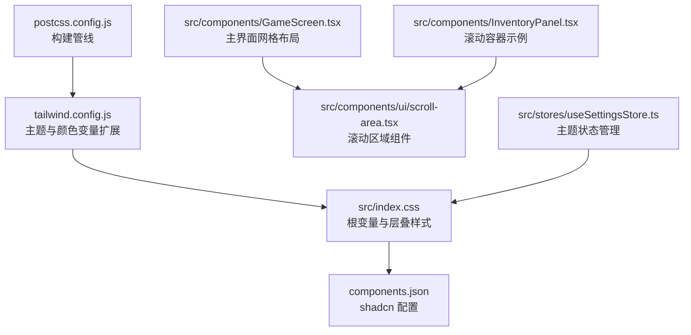
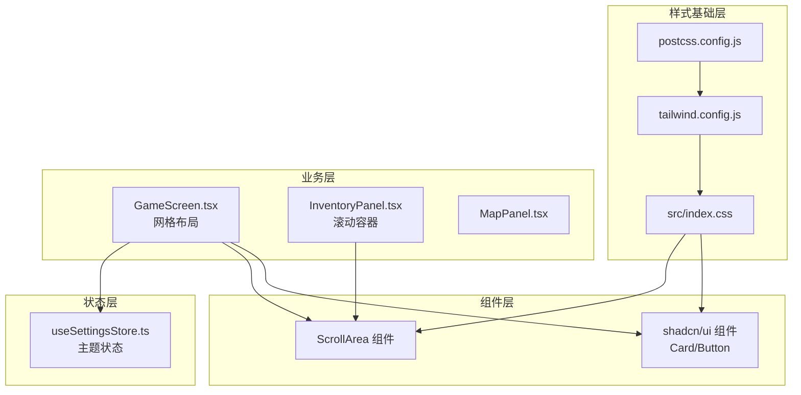
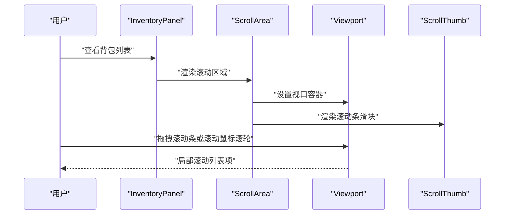
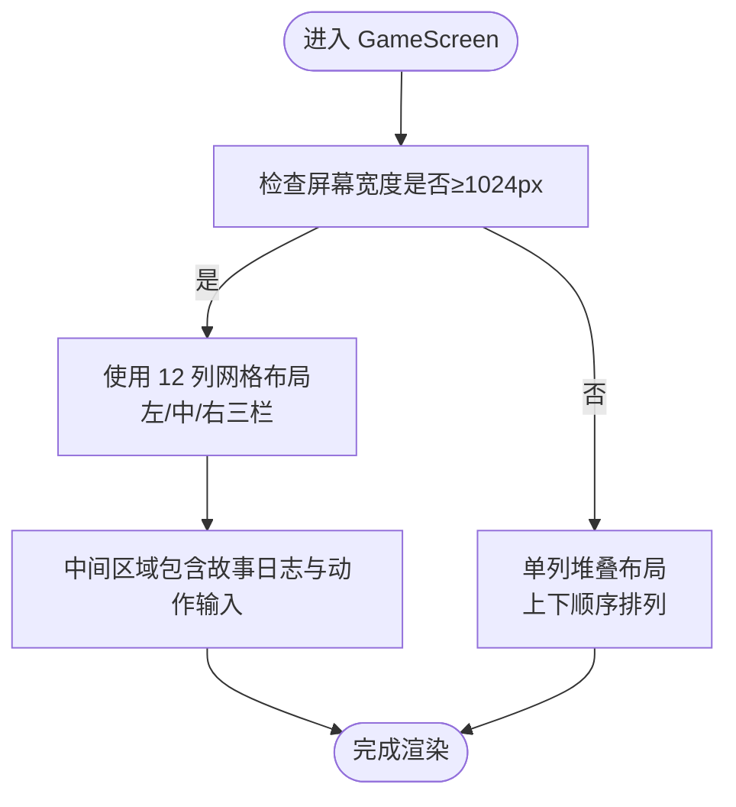
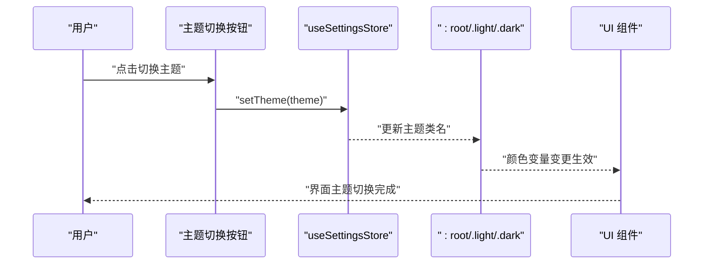
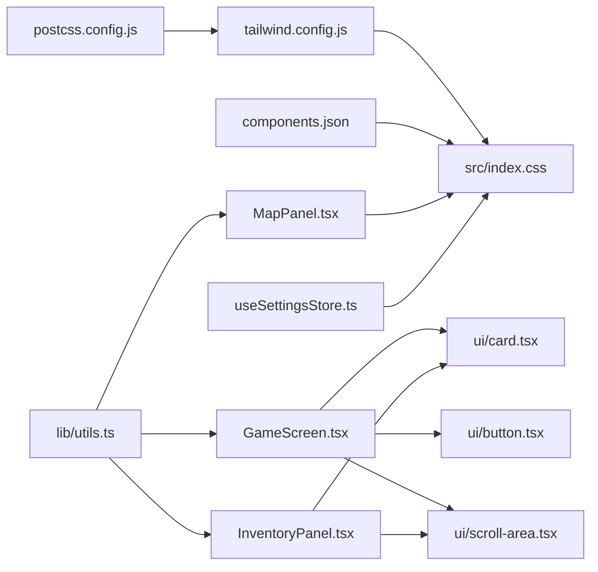

# 响应式设计系统

<cite>
**本文引用的文件**
- [tailwind.config.js](file://tailwind.config.js)
- [src/index.css](file://src/index.css)
- [components.json](file://components.json)
- [postcss.config.js](file://postcss.config.js)
- [src/components/GameScreen.tsx](file://src/components/GameScreen.tsx)
- [src/components/InventoryPanel.tsx](file://src/components/InventoryPanel.tsx)
- [src/components/MapPanel.tsx](file://src/components/MapPanel.tsx)
- [src/components/ui/scroll-area.tsx](file://src/components/ui/scroll-area.tsx)
- [src/components/ScrollArea.tsx](file://src/components/ScrollArea.tsx)
- [src/lib/utils.ts](file://src/lib/utils.ts)
- [src/stores/useSettingsStore.ts](file://src/stores/useSettingsStore.ts)
- [src/components/ui/card.tsx](file://src/components/ui/card.tsx)
- [src/components/ui/button.tsx](file://src/components/ui/button.tsx)
- [package.json](file://package.json)
</cite>

## 目录
1. [简介](#简介)
2. [项目结构](#项目结构)
3. [核心组件](#核心组件)
4. [架构总览](#架构总览)
5. [详细组件分析](#详细组件分析)
6. [依赖关系分析](#依赖关系分析)
7. [性能考量](#性能考量)
8. [故障排查指南](#故障排查指南)
9. [结论](#结论)
10. [附录](#附录)

## 简介
本文件系统化梳理修仙 Roguelike 项目的响应式设计体系，围绕 TailwindCSS 断点与变量、网格系统、弹性布局在游戏界面中的应用进行深入解析；同时覆盖移动端与桌面端适配策略、触摸交互优化、屏幕尺寸适配方案，并对滚动区域组件的实现、溢出处理与滚动条样式定制进行文档化。主题系统与颜色变量配置、暗黑模式实现亦在本文件中给出完整说明。最后提供响应式设计最佳实践、性能优化技巧与跨设备兼容性解决方案，为 UI 开发者提供一套可执行的响应式开发指南与设计系统规范。

## 项目结构
本项目采用基于 TailwindCSS 的原子化样式与 shadcn/ui 组件库风格，结合自定义主题变量与层叠样式，形成统一的设计语言与响应式体系。关键结构如下：
- Tailwind 配置集中于 tailwind.config.js，通过 CSS 变量桥接主题色值与组件语义色。
- 全局样式位于 src/index.css，定义深浅两套主题变量、自定义滚动条、装饰性背景与卡片等组件级样式。
- 组件层使用 shadcn 风格的 UI 组件（如 Card、Button、ScrollArea），并配合自定义工具类实现响应式布局。
- 响应式断点主要依赖 Tailwind 默认断点与自定义 lg（1024px）及以上的大屏布局策略。

图表来源
- [tailwind.config.js](file://tailwind.config.js#L1-L53)
- [src/index.css](file://src/index.css#L1-L217)
- [components.json](file://components.json#L1-L17)
- [postcss.config.js](file://postcss.config.js#L1-L7)
- [src/components/GameScreen.tsx](file://src/components/GameScreen.tsx#L1-L172)
- [src/components/ui/scroll-area.tsx](file://src/components/ui/scroll-area.tsx#L1-L47)
- [src/components/InventoryPanel.tsx](file://src/components/InventoryPanel.tsx#L1-L95)
- [src/stores/useSettingsStore.ts](file://src/stores/useSettingsStore.ts#L1-L46)

章节来源
- [tailwind.config.js](file://tailwind.config.js#L1-L53)
- [src/index.css](file://src/index.css#L1-L217)
- [components.json](file://components.json#L1-L17)
- [postcss.config.js](file://postcss.config.js#L1-L7)

## 核心组件
本节聚焦响应式设计的关键构件与其实现要点：

- Tailwind 主题与颜色变量
  - 通过 CSS 变量桥接主题色值，使组件语义色与全局主题一致，便于切换明暗模式。
  - 扩展圆角半径变量，统一组件边角风格。
  
- 全局样式与主题变量
  - 定义 :root 与 .light/.dark 两套主题变量，覆盖背景、前景、卡片、弹出层、强调色、输入框、环形光晕等。
  - 提供自定义 token（如 dim、ink-border、surface、surface-raised），用于细粒度色彩控制。
  - 自定义滚动条样式与隐藏类，统一滚动体验。
  - 提供装饰性背景类（xian-bg）、水墨卡片（ink-card）、翡翠边框（jade-border）、渐变文字（jade-text、gold-text）等组件级样式。

- 组件层 UI 组件
  - Card、Button 等组件使用语义化颜色类，自动随主题变化。
  - ScrollArea 使用 Radix UI 实现原生滚动行为与自定义滚动条，支持垂直/水平方向。

- 响应式布局
  - 主界面采用网格布局，lg 及以上使用 12 列栅格，lg 以下回退为单列堆叠。
  - 使用 flex 与 min-h-0 配合，确保滚动区域在不同断点下正确收缩与溢出。

章节来源
- [tailwind.config.js](file://tailwind.config.js#L7-L50)
- [src/index.css](file://src/index.css#L5-L123)
- [src/components/ui/card.tsx](file://src/components/ui/card.tsx#L1-L80)
- [src/components/ui/button.tsx](file://src/components/ui/button.tsx#L1-L57)
- [src/components/ui/scroll-area.tsx](file://src/components/ui/scroll-area.tsx#L1-L47)

## 架构总览
下图展示响应式设计系统的整体架构：Tailwind 配置与全局样式作为基础层，UI 组件库提供语义化组件，业务组件负责布局与交互，状态管理驱动主题切换，PostCSS 与构建管线保证样式编译与输出。

图表来源
- [tailwind.config.js](file://tailwind.config.js#L1-L53)
- [src/index.css](file://src/index.css#L1-L217)
- [postcss.config.js](file://postcss.config.js#L1-L7)
- [src/components/ui/card.tsx](file://src/components/ui/card.tsx#L1-L80)
- [src/components/ui/button.tsx](file://src/components/ui/button.tsx#L1-L57)
- [src/components/ui/scroll-area.tsx](file://src/components/ui/scroll-area.tsx#L1-L47)
- [src/components/GameScreen.tsx](file://src/components/GameScreen.tsx#L1-L172)
- [src/components/InventoryPanel.tsx](file://src/components/InventoryPanel.tsx#L1-L95)
- [src/components/MapPanel.tsx](file://src/components/MapPanel.tsx#L1-L45)
- [src/stores/useSettingsStore.ts](file://src/stores/useSettingsStore.ts#L1-L46)

## 详细组件分析

### Tailwind 主题与颜色变量
- 设计要点
  - 使用 CSS 变量承载主题色，组件通过语义化颜色类引用，避免硬编码。
  - 在 :root、.light、.dark 中分别定义变量，实现一键切换。
  - 扩展圆角半径变量，配合组件圆角类实现统一视觉风格。
- 实施路径
  - 颜色变量定义与扩展：参见 [tailwind.config.js](file://tailwind.config.js#L9-L48)
  - 主题变量与滚动条样式：参见 [src/index.css](file://src/index.css#L7-L123)

章节来源
- [tailwind.config.js](file://tailwind.config.js#L7-L50)
- [src/index.css](file://src/index.css#L5-L123)

### 全局样式与主题系统
- 设计要点
  - :root 定义深色主题默认值，.light 定义浅色主题值，.dark 兼容第三方类名。
  - 提供自定义 token（dim、ink-border、surface、surface-raised）以支撑卡片、边框、表面等视觉元素。
  - 自定义滚动条宽度、轨道与滑块颜色，提供隐藏滚动条的工具类。
  - 组件级装饰样式：xian-bg、ink-card、jade-border、jade-text、gold-text、progress-jade、card-selected、btn-jade。
- 实施路径
  - 主题变量与装饰样式：参见 [src/index.css](file://src/index.css#L5-L217)

章节来源
- [src/index.css](file://src/index.css#L5-L217)

### 滚动区域组件实现与溢出处理
- 设计要点
  - 使用 Radix UI ScrollArea 实现原生滚动行为，支持垂直/水平滚动与角落。
  - 通过 CSS 变量与语义色类控制滚动条外观，保持与主题一致。
  - 在列表型内容中使用固定高度容器与滚动区域，确保内容溢出时仅局部滚动。
- 实施路径
  - UI 组件版本：参见 [src/components/ui/scroll-area.tsx](file://src/components/ui/scroll-area.tsx#L1-L47)
  - 业务组件使用示例：参见 [src/components/InventoryPanel.tsx](file://src/components/InventoryPanel.tsx#L63-L89)

图表来源
- [src/components/InventoryPanel.tsx](file://src/components/InventoryPanel.tsx#L63-L89)
- [src/components/ui/scroll-area.tsx](file://src/components/ui/scroll-area.tsx#L1-L47)

章节来源
- [src/components/ui/scroll-area.tsx](file://src/components/ui/scroll-area.tsx#L1-L47)
- [src/components/ScrollArea.tsx](file://src/components/ScrollArea.tsx#L1-L48)
- [src/components/InventoryPanel.tsx](file://src/components/InventoryPanel.tsx#L1-L95)

### 响应式网格布局与弹性布局
- 设计要点
  - 主界面采用网格布局，lg 及以上使用 12 列栅格，lg 以下回退为单列堆叠。
  - 使用 flex 与 min-h-0 配合，确保中间区域在不同断点下正确收缩与溢出。
  - 通过 gap 控制列间距，保证内容在小屏上不拥挤。
- 实施路径
  - 主界面网格与断点：参见 [src/components/GameScreen.tsx](file://src/components/GameScreen.tsx#L107-L153)

图表来源
- [src/components/GameScreen.tsx](file://src/components/GameScreen.tsx#L107-L153)

章节来源
- [src/components/GameScreen.tsx](file://src/components/GameScreen.tsx#L107-L153)

### 触摸交互优化与滚动条样式定制
- 设计要点
  - 滚动条宽度与轨道透明化，滑块使用低饱和度主色，悬停增强透明度。
  - 提供隐藏滚动条的工具类，适用于纯图标或无滚动需求的容器。
  - 滚动区域组件使用 touch-none 与 select-none，避免误触与文本选择干扰。
- 实施路径
  - 滚动条样式与隐藏类：参见 [src/index.css](file://src/index.css#L104-L123)
  - 滚动区域组件样式：参见 [src/components/ui/scroll-area.tsx](file://src/components/ui/scroll-area.tsx#L32-L42)

章节来源
- [src/index.css](file://src/index.css#L104-L123)
- [src/components/ui/scroll-area.tsx](file://src/components/ui/scroll-area.tsx#L32-L42)

### 主题系统与暗黑模式实现
- 设计要点
  - 使用 Zustand 管理主题状态，持久化到本地存储。
  - 通过切换 :root 与 .light/.dark 类名实现主题切换。
  - UI 组件与业务组件均使用语义化颜色类，自动适配主题。
- 实施路径
  - 主题状态管理：参见 [src/stores/useSettingsStore.ts](file://src/stores/useSettingsStore.ts#L24-L45)
  - 主题变量与切换按钮：参见 [src/components/GameScreen.tsx](file://src/components/GameScreen.tsx#L47-L99)

图表来源
- [src/stores/useSettingsStore.ts](file://src/stores/useSettingsStore.ts#L24-L45)
- [src/components/GameScreen.tsx](file://src/components/GameScreen.tsx#L47-L99)

章节来源
- [src/stores/useSettingsStore.ts](file://src/stores/useSettingsStore.ts#L1-L46)
- [src/components/GameScreen.tsx](file://src/components/GameScreen.tsx#L47-L99)

### 组件级样式与工具类
- 设计要点
  - Card、Button 等组件使用语义化颜色类，自动随主题变化。
  - ink-card、jade-border、jade-text、gold-text 等工具类提供装饰性样式。
  - btn-jade 提供主按钮的渐变与阴影效果，hover 时提升与位移动画。
- 实施路径
  - 组件样式：参见 [src/components/ui/card.tsx](file://src/components/ui/card.tsx#L1-L80)
  - 按钮样式：参见 [src/components/ui/button.tsx](file://src/components/ui/button.tsx#L1-L57)
  - 装饰性工具类：参见 [src/index.css](file://src/index.css#L125-L217)

章节来源
- [src/components/ui/card.tsx](file://src/components/ui/card.tsx#L1-L80)
- [src/components/ui/button.tsx](file://src/components/ui/button.tsx#L1-L57)
- [src/index.css](file://src/index.css#L125-L217)

## 依赖关系分析
- Tailwind 配置与构建
  - tailwind.config.js 与 components.json 协同，启用 CSS 变量与 TSX 支持。
  - postcss.config.js 通过 tailwindcss 与 autoprefixer 完成样式编译。
- 组件依赖
  - GameScreen 依赖 UI 组件与状态管理，使用语义化颜色类与网格布局。
  - InventoryPanel 依赖 ScrollArea 与 Card，实现滚动列表与卡片容器。
  - MapPanel 依赖基础样式类，提供区域信息展示。
- 工具函数
  - cn 工具函数合并与去重类名，减少样式冲突。

图表来源
- [tailwind.config.js](file://tailwind.config.js#L1-L53)
- [components.json](file://components.json#L1-L17)
- [postcss.config.js](file://postcss.config.js#L1-L7)
- [src/components/GameScreen.tsx](file://src/components/GameScreen.tsx#L1-L172)
- [src/components/ui/card.tsx](file://src/components/ui/card.tsx#L1-L80)
- [src/components/ui/button.tsx](file://src/components/ui/button.tsx#L1-L57)
- [src/components/ui/scroll-area.tsx](file://src/components/ui/scroll-area.tsx#L1-L47)
- [src/components/InventoryPanel.tsx](file://src/components/InventoryPanel.tsx#L1-L95)
- [src/components/MapPanel.tsx](file://src/components/MapPanel.tsx#L1-L45)
- [src/stores/useSettingsStore.ts](file://src/stores/useSettingsStore.ts#L1-L46)
- [src/lib/utils.ts](file://src/lib/utils.ts#L1-L7)

章节来源
- [tailwind.config.js](file://tailwind.config.js#L1-L53)
- [components.json](file://components.json#L1-L17)
- [postcss.config.js](file://postcss.config.js#L1-L7)
- [src/lib/utils.ts](file://src/lib/utils.ts#L1-L7)

## 性能考量
- 样式体积控制
  - 使用语义化颜色类与 CSS 变量，避免重复定义颜色与阴影，降低 CSS 体积。
  - 合理使用工具类，避免过度嵌套与复杂选择器。
- 渲染性能
  - 滚动区域使用固定高度容器与局部滚动，减少重排范围。
  - 使用 framer-motion 的动画需注意层级与合成属性，避免不必要的强制同步布局。
- 主题切换
  - 通过类名切换而非内联样式，利用浏览器缓存与重用机制，提升切换流畅度。
- 构建优化
  - PostCSS 与 TailwindCSS 结合，确保仅产出实际使用的样式类，减少冗余。

## 故障排查指南
- 滚动条样式未生效
  - 检查是否正确引入全局样式与工具类，确认 CSS 变量是否被覆盖。
  - 章节来源
    - [src/index.css](file://src/index.css#L104-L123)
- 暗黑/日间模式切换无效
  - 确认主题状态已持久化，检查 :root 与 .light/.dark 类名是否正确切换。
  - 章节来源
    - [src/stores/useSettingsStore.ts](file://src/stores/useSettingsStore.ts#L24-L45)
    - [src/components/GameScreen.tsx](file://src/components/GameScreen.tsx#L47-L99)
- 移动端滚动卡顿
  - 检查滚动容器是否设置固定高度与 min-h-0，避免内容撑开导致重排。
  - 章节来源
    - [src/components/InventoryPanel.tsx](file://src/components/InventoryPanel.tsx#L63-L89)
- 颜色不随主题变化
  - 确保组件使用语义化颜色类（如 text-foreground、bg-background），而非硬编码颜色。
  - 章节来源
    - [tailwind.config.js](file://tailwind.config.js#L9-L48)
    - [src/index.css](file://src/index.css#L98-L102)

## 结论
本项目通过 TailwindCSS 的 CSS 变量与语义化颜色类、shadcn/ui 组件库与自定义装饰样式，构建了统一且可扩展的响应式设计系统。借助网格布局与弹性布局策略，实现了从移动端到桌面端的无缝适配；通过 Radix UI 滚动区域与自定义滚动条样式，提供了良好的滚动体验；通过 Zustand 管理主题状态，实现了明暗模式的一键切换。建议在后续迭代中持续优化动画性能、细化断点策略，并完善移动端手势交互与无障碍访问。

## 附录
- 最佳实践清单
  - 使用语义化颜色类与 CSS 变量，避免硬编码颜色。
  - 在列表型内容中固定容器高度并使用滚动区域组件。
  - 在 lg 以下断点回退为单列堆叠，保证阅读与交互体验。
  - 使用 touch-none 与 select-none 优化触摸交互体验。
  - 通过类名切换主题，避免内联样式的频繁重绘。
- 性能优化建议
  - 合理拆分组件，减少不必要的重渲染。
  - 使用 IntersectionObserver 或虚拟滚动处理超长列表。
  - 避免在动画过程中触发强制同步布局。
- 兼容性建议
  - 在需要时提供降级样式，确保旧版浏览器可用。
  - 对于滚动条样式，优先使用现代浏览器特性，提供最小可用体验。