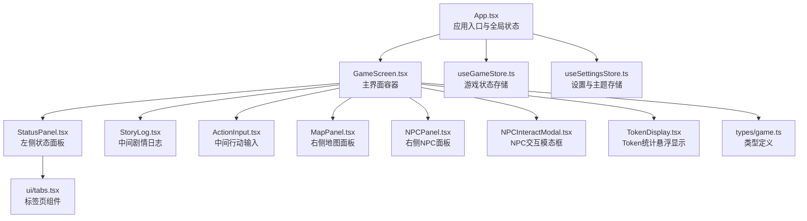
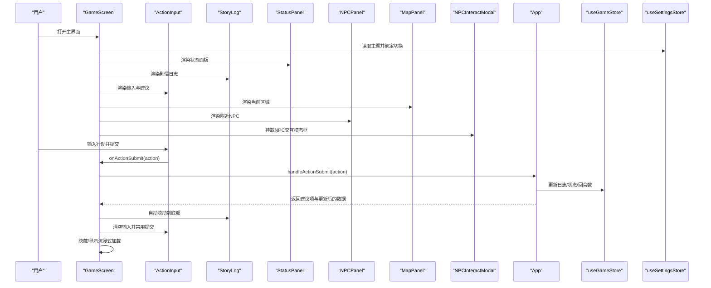
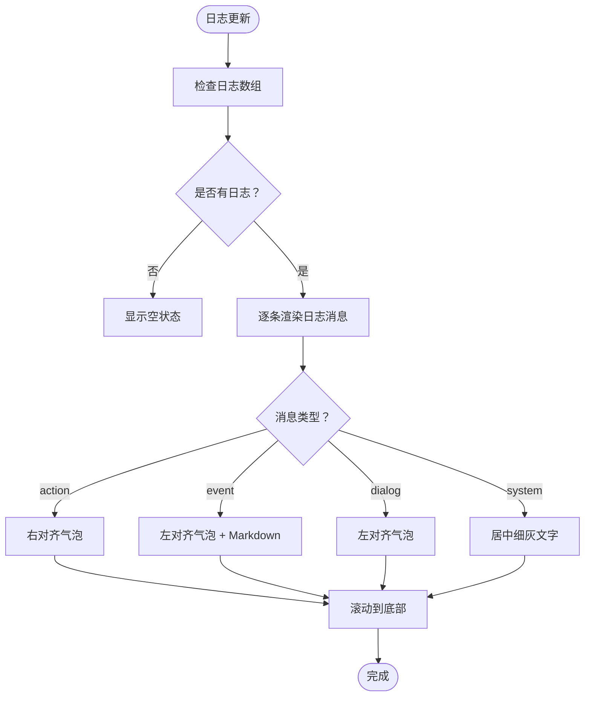
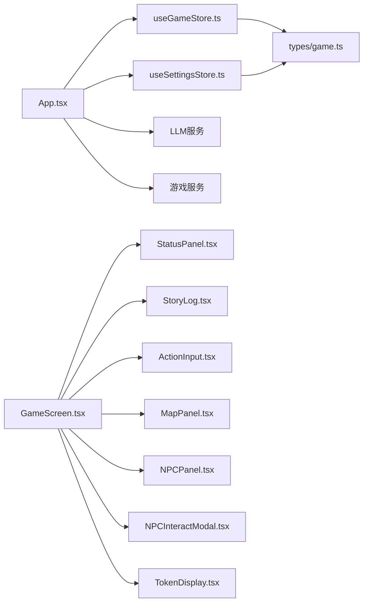

# 主游戏屏幕

<cite>
**本文引用的文件列表**
- [GameScreen.tsx](file://src/components/GameScreen.tsx)
- [StatusPanel.tsx](file://src/components/StatusPanel.tsx)
- [StoryLog.tsx](file://src/components/StoryLog.tsx)
- [ActionInput.tsx](file://src/components/ActionInput.tsx)
- [MapPanel.tsx](file://src/components/MapPanel.tsx)
- [NPCPanel.tsx](file://src/components/NPCPanel.tsx)
- [NPCInteractModal.tsx](file://src/components/NPCInteractModal.tsx)
- [TokenDisplay.tsx](file://src/components/TokenDisplay.tsx)
- [App.tsx](file://src/App.tsx)
- [useGameStore.ts](file://src/stores/useGameStore.ts)
- [useSettingsStore.ts](file://src/stores/useSettingsStore.ts)
- [game.ts](file://src/types/game.ts)
- [tabs.tsx](file://src/components/ui/tabs.tsx)
</cite>

## 目录
1. [简介](#简介)
2. [项目结构](#项目结构)
3. [核心组件](#核心组件)
4. [架构总览](#架构总览)
5. [详细组件分析](#详细组件分析)
6. [依赖关系分析](#依赖关系分析)
7. [性能考量](#性能考量)
8. [故障排查指南](#故障排查指南)
9. [结论](#结论)
10. [附录](#附录)

## 简介
本文件面向 UI 开发者，系统性解析主游戏屏幕 GameScreen 的三栏布局设计与实现细节，覆盖：
- 左侧状态面板：角色数据展示、移动端简化与桌面端完整面板、标签页组织与动画过渡
- 中间剧情日志与行动输入：滚动与渲染机制、智能提示系统、键盘快捷键与加载态
- 右侧地图与 NPC 面板：区域信息展示、附近人物列表、交互模态框与动画
- 响应式适配：桌面端与移动端的差异化布局与交互
- 主题切换与沉浸式加载：顶部主题切换、Token 统计悬浮显示、沉浸式加载提示
- 组件间通信：props 接口设计、事件处理模式、状态管理与服务层协作
- 性能优化策略：虚拟滚动、动画节流、条件渲染与懒加载

## 项目结构
GameScreen 所在目录位于 src/components 下，围绕其构建了多个子组件与类型定义、状态存储与应用入口，形成清晰的分层架构。



图表来源
- [GameScreen.tsx](file://src/components/GameScreen.tsx#L1-L172)
- [StatusPanel.tsx](file://src/components/StatusPanel.tsx#L1-L503)
- [StoryLog.tsx](file://src/components/StoryLog.tsx#L1-L172)
- [ActionInput.tsx](file://src/components/ActionInput.tsx#L1-L146)
- [MapPanel.tsx](file://src/components/MapPanel.tsx#L1-L45)
- [NPCPanel.tsx](file://src/components/NPCPanel.tsx#L1-L99)
- [NPCInteractModal.tsx](file://src/components/NPCInteractModal.tsx#L1-L223)
- [TokenDisplay.tsx](file://src/components/TokenDisplay.tsx#L1-L172)
- [App.tsx](file://src/App.tsx#L1-L588)
- [useGameStore.ts](file://src/stores/useGameStore.ts#L1-L226)
- [useSettingsStore.ts](file://src/stores/useSettingsStore.ts#L1-L46)
- [game.ts](file://src/types/game.ts#L1-L319)
- [tabs.tsx](file://src/components/ui/tabs.tsx#L1-L54)

章节来源
- [GameScreen.tsx](file://src/components/GameScreen.tsx#L1-L172)
- [App.tsx](file://src/App.tsx#L1-L588)

## 核心组件
- GameScreen：三栏布局容器，负责响应式网格、动画过渡、主题切换、沉浸式加载与模态框挂载
- StatusPanel：角色状态面板，桌面端完整标签页，移动端弹窗展开；包含修为、寿元、气血、真气等核心指标与属性、背包、功法、关系等标签页
- StoryLog：剧情日志容器，自动滚动至底部、按消息类型渲染不同气泡样式、支持 Markdown
- ActionInput：行动输入与智能提示，支持 Enter 发送、Shift+Enter 换行、建议项一键点击
- MapPanel：当前区域信息展示，占位符为未来地图系统预留
- NPCPanel：附近 NPC 列表，支持加载态、点击选择、动画入场
- NPCInteractModal：NPC 交互模态框，支持多种交互选项、动态更新对话与属性
- TokenDisplay：Token 使用统计悬浮显示，支持展开/收起与重置

章节来源
- [GameScreen.tsx](file://src/components/GameScreen.tsx#L1-L172)
- [StatusPanel.tsx](file://src/components/StatusPanel.tsx#L1-L503)
- [StoryLog.tsx](file://src/components/StoryLog.tsx#L1-L172)
- [ActionInput.tsx](file://src/components/ActionInput.tsx#L1-L146)
- [MapPanel.tsx](file://src/components/MapPanel.tsx#L1-L45)
- [NPCPanel.tsx](file://src/components/NPCPanel.tsx#L1-L99)
- [NPCInteractModal.tsx](file://src/components/NPCInteractModal.tsx#L1-L223)
- [TokenDisplay.tsx](file://src/components/TokenDisplay.tsx#L1-L172)

## 架构总览
GameScreen 作为主界面容器，通过 props 接口接收来自 App 的玩家数据、世界数据、日志、加载状态、建议项与回调函数，并将子组件组合成三栏布局。App 负责与服务层交互生成剧情、更新状态、管理自动存档与主题同步。



图表来源
- [GameScreen.tsx](file://src/components/GameScreen.tsx#L32-L171)
- [ActionInput.tsx](file://src/components/ActionInput.tsx#L14-L146)
- [StoryLog.tsx](file://src/components/StoryLog.tsx#L10-L51)
- [App.tsx](file://src/App.tsx#L240-L468)
- [useGameStore.ts](file://src/stores/useGameStore.ts#L84-L226)
- [useSettingsStore.ts](file://src/stores/useSettingsStore.ts#L24-L46)

## 详细组件分析

### GameScreen 三栏布局与响应式适配
- 布局结构：采用基于 Tailwind 的网格布局，左侧 3 列、中间 6 列、右侧 3 列，在小屏设备上降级为单列堆叠
- 动画过渡：使用 Framer Motion 对三个区域分别添加进入动画，延迟错峰，增强视觉层次
- 主题切换：顶部右侧提供明暗主题切换按钮，联动设置存储并同步到 html 根元素类名
- 沉浸式加载：在剧情推演期间显示沉浸式加载提示，避免用户误触
- Token 统计：右下角悬浮显示 Token 使用统计，支持展开查看详细与重置

章节来源
- [GameScreen.tsx](file://src/components/GameScreen.tsx#L54-L171)
- [App.tsx](file://src/App.tsx#L22-L28)
- [TokenDisplay.tsx](file://src/components/TokenDisplay.tsx#L10-L172)

### 左侧状态面板（StatusPanel）
- 数据容错：对缺失字段进行安全兜底，防止热更新后出现 NaN
- 桌面端完整面板：含头像、姓名、境界、背景、修为与寿元进度条、四标签页（属性、背包、功法、关系）
- 移动端简化面板：核心信息行 + 展开弹窗，横排进度条与快捷标签
- 进度条动画：使用 Framer Motion 在进入时按比例动画填充
- 标签页组件：基于 Radix UI Tabs，自定义样式与交互
- 关系面板：按好感度等级与数值绘制进度条与颜色

```mermaid
classDiagram
class StatusPanel {
+props : StatusPanelProps
+render() : JSX.Element
}
class FullStatusContent {
+props : { player : Player }
+render() : JSX.Element
}
class StatsTab {
+props : { player : Player }
+render() : JSX.Element
}
class InventoryTab {
+props : { inventory : Item[] }
+render() : JSX.Element
}
class SkillsTab {
+props : { skills : Skill[] }
+render() : JSX.Element
}
class RelationshipsTab {
+props : { relationships : Record<string, Relationship> }
+render() : JSX.Element
}
class StatBar {
+props : { label, value, max, display, colorClass, warning }
+render() : JSX.Element
}
StatusPanel --> FullStatusContent : "桌面端渲染"
FullStatusContent --> StatsTab : "标签页"
FullStatusContent --> InventoryTab : "标签页"
FullStatusContent --> SkillsTab : "标签页"
FullStatusContent --> RelationshipsTab : "标签页"
StatsTab --> StatBar : "使用"
```

图表来源
- [StatusPanel.tsx](file://src/components/StatusPanel.tsx#L14-L206)
- [tabs.tsx](file://src/components/ui/tabs.tsx#L1-L54)

章节来源
- [StatusPanel.tsx](file://src/components/StatusPanel.tsx#L1-L503)
- [tabs.tsx](file://src/components/ui/tabs.tsx#L1-L54)

### 中间剧情日志（StoryLog）与行动输入（ActionInput）
- StoryLog：
  - 自动滚动：监听日志数组变化，使用 requestAnimationFrame 等待 DOM 更新后滚动到底部
  - 消息类型：区分玩家行动、AI剧情、对话与系统消息，分别渲染不同气泡样式与对齐方式
  - Markdown 支持：使用 ReactMarkdown 渲染剧情文本，自定义段落、强调、引用、列表等样式
- ActionInput：
  - 智能提示：根据 suggestions 渲染建议项，桌面端换行、移动端横向滚动
  - 键盘快捷键：Enter 发送、Shift+Enter 换行
  - 加载态：禁用输入与发送按钮，显示旋转指示器
  - 动画：建议项与输入框使用 Framer Motion 动画入场与交互反馈



图表来源
- [StoryLog.tsx](file://src/components/StoryLog.tsx#L10-L51)

章节来源
- [StoryLog.tsx](file://src/components/StoryLog.tsx#L1-L172)
- [ActionInput.tsx](file://src/components/ActionInput.tsx#L1-L146)

### 右侧地图与 NPC 面板（MapPanel 与 NPCPanel）
- MapPanel：展示当前区域名称与描述，占位符为未来地图系统预留
- NPCPanel：
  - 加载态：显示骨架屏占位
  - 空态：提示“此地暂无其他修士”
  - 列表：逐项渲染 NPC，点击触发 onSelectNPC 回调
  - 动画：逐项入场动画，带延迟错峰

章节来源
- [MapPanel.tsx](file://src/components/MapPanel.tsx#L1-L45)
- [NPCPanel.tsx](file://src/components/NPCPanel.tsx#L1-L99)

### NPC 交互模态框（NPCInteractModal）
- 模态框：背景遮罩与居中容器，使用 Framer Motion 控制进入/退出
- 头部：NPC 头像、名称、境界与身份
- 好感度条：根据数值正负使用不同颜色
- 对话区域：首次显示 NPC 描述与性格，交互后显示对话内容
- 互动选项：动态生成交互按钮，支持禁用与原因提示
- 属性展示：当属性被探查后，显示攻击、防御、速度三项

章节来源
- [NPCInteractModal.tsx](file://src/components/NPCInteractModal.tsx#L1-L223)

### 主题切换与沉浸式加载
- 主题切换：通过设置存储切换 light/dark，同步到 html 根元素类名
- 沉浸式加载：在剧情推演期间显示加载提示，避免用户误触
- Token 统计：右下角悬浮显示，支持展开查看最近一次、本次会话与累计使用量

章节来源
- [App.tsx](file://src/App.tsx#L22-L28)
- [GameScreen.tsx](file://src/components/GameScreen.tsx#L93-L100)
- [TokenDisplay.tsx](file://src/components/TokenDisplay.tsx#L10-L172)

## 依赖关系分析
- 组件耦合：
  - GameScreen 作为父容器，向下传递 props，不直接持有业务逻辑
  - 子组件之间低耦合，通过 props 与回调通信
- 状态管理：
  - useGameStore：集中管理玩家、世界、日志、事件、记忆、回合数、NPC 交互状态等
  - useSettingsStore：集中管理主题、LLM 配置、自动存档开关等
- 类型系统：
  - game.ts 定义 Player、NPC、World、GameLog、关系与交互结果等核心类型
- 服务层：
  - App 负责创建 LLM 与游戏服务实例，处理剧情生成、状态更新、自动存档与 NPC 交互



图表来源
- [App.tsx](file://src/App.tsx#L1-L588)
- [useGameStore.ts](file://src/stores/useGameStore.ts#L1-L226)
- [useSettingsStore.ts](file://src/stores/useSettingsStore.ts#L1-L46)
- [game.ts](file://src/types/game.ts#L1-L319)
- [GameScreen.tsx](file://src/components/GameScreen.tsx#L1-L172)

章节来源
- [App.tsx](file://src/App.tsx#L1-L588)
- [useGameStore.ts](file://src/stores/useGameStore.ts#L1-L226)
- [useSettingsStore.ts](file://src/stores/useSettingsStore.ts#L1-L46)
- [game.ts](file://src/types/game.ts#L1-L319)

## 性能考量
- 动画与滚动：
  - StoryLog 使用 requestAnimationFrame 等待 DOM 更新后再滚动，避免抖动
  - StatusPanel 与 NPCPanel 使用逐项动画，配合延迟错峰，减少同时动画带来的卡顿
- 条件渲染与懒加载：
  - NPCPanel 在加载态显示骨架屏，空态显示占位文案，避免不必要的计算
  - TokenDisplay 未使用过模型时隐藏，减少 DOM 节点
- 状态持久化：
  - useGameStore 与 useSettingsStore 使用持久化存储，减少重复初始化成本
- 建议项渲染：
  - ActionInput 的建议项使用 AnimatePresence 控制进入/退出，避免频繁重排
- 建议项渲染：
  - ActionInput 的建议项使用 AnimatePresence 控制进入/退出，避免频繁重排

[本节为通用性能指导，不直接分析具体文件，故无章节来源]

## 故障排查指南
- 日志不自动滚动：
  - 检查 StoryLog 是否正确监听 logs 数组变化并使用 requestAnimationFrame
  - 确认容器具有可滚动高度且未被外层样式限制
- 主题切换无效：
  - 检查 App 是否在挂载时将主题类名同步到 html 根元素
  - 确认 useSettingsStore 的 setTheme 方法被调用
- NPC 交互无响应：
  - 检查 App 的 handleSelectNPC 与 handleNPCInteract 是否正确传入 GameScreen
  - 确认 NPCInteractModal 的 isOpen 与 onInteract 回调正常工作
- Token 统计不显示：
  - 确认 useTokenStore 是否存在使用记录，否则 TokenDisplay 会隐藏
- 建议项点击无效：
  - 检查 ActionInput 的 isLoading 状态与按钮禁用逻辑
  - 确认回调 onSubmit 正确传递给 GameScreen

章节来源
- [StoryLog.tsx](file://src/components/StoryLog.tsx#L13-L20)
- [App.tsx](file://src/App.tsx#L22-L28)
- [NPCInteractModal.tsx](file://src/components/NPCInteractModal.tsx#L37-L54)
- [TokenDisplay.tsx](file://src/components/TokenDisplay.tsx#L30-L32)
- [ActionInput.tsx](file://src/components/ActionInput.tsx#L17-L28)

## 结论
GameScreen 以清晰的三栏布局与完善的响应式适配为核心，结合 Framer Motion 的细腻动画与完善的 props 通信机制，实现了流畅的主界面体验。通过集中状态管理与类型系统，确保了组件间解耦与可维护性。建议在后续迭代中逐步完善地图系统与 NPC 交互的深度，持续优化动画性能与内存占用。

[本节为总结性内容，不直接分析具体文件，故无章节来源]

## 附录

### Props 接口设计与事件处理模式
- GameScreenProps
  - 输入：player、world、logs、isLoading、suggestions、onActionSubmit、onReturnHome、nearbyNPCs、selectedNPC、isNPCInteracting、onSelectNPC、onCloseNPCModal、onNPCInteract
  - 输出：无，仅作为容器接收数据与回调
- ActionInputProps
  - 输入：onSubmit、isLoading、suggestions
  - 输出：handleSubmit 触发 onActionSubmit
- StoryLogProps
  - 输入：logs
  - 输出：无，仅渲染
- StatusPanelProps
  - 输入：player
  - 输出：无，仅渲染
- MapPanelProps
  - 输入：currentLocation、locationDescription
  - 输出：无，仅渲染
- NPCPanelProps
  - 输入：npcs、onSelectNPC、isLoading
  - 输出：onClick 触发 onSelectNPC
- NPCInteractModalProps
  - 输入：npc、isOpen、onClose、onInteract
  - 输出：点击交互项触发 onInteract，离开时触发 onClose

章节来源
- [GameScreen.tsx](file://src/components/GameScreen.tsx#L15-L30)
- [ActionInput.tsx](file://src/components/ActionInput.tsx#L8-L12)
- [StoryLog.tsx](file://src/components/StoryLog.tsx#L6-L8)
- [StatusPanel.tsx](file://src/components/StatusPanel.tsx#L8-L10)
- [MapPanel.tsx](file://src/components/MapPanel.tsx#L3-L6)
- [NPCPanel.tsx](file://src/components/NPCPanel.tsx#L5-L9)
- [NPCInteractModal.tsx](file://src/components/NPCInteractModal.tsx#L7-L12)

### 布局定制化选项与主题切换
- 布局定制化：
  - 通过 Tailwind Grid 的列数与间距调整三栏宽度
  - 移动端使用 lg 断点降级为单列，保持可读性
- 主题切换：
  - 通过 useSettingsStore.setTheme 切换主题，App 将主题类名同步到 html 根元素
  - 支持 light/dark 两种主题，UI 组件根据主题变量渲染

章节来源
- [GameScreen.tsx](file://src/components/GameScreen.tsx#L107-L153)
- [App.tsx](file://src/App.tsx#L22-L28)
- [useSettingsStore.ts](file://src/stores/useSettingsStore.ts#L24-L46)

### 组件间通信机制
- 父子通信：GameScreen 通过 props 向子组件传递数据与回调
- 事件处理：子组件通过回调向上通知父组件，如 onSelectNPC、onActionSubmit、onNPCInteract
- 状态共享：useGameStore 与 useSettingsStore 提供跨组件的状态共享能力
- 服务层协作：App 创建 LLM 与游戏服务实例，处理剧情生成与状态更新

章节来源
- [GameScreen.tsx](file://src/components/GameScreen.tsx#L32-L171)
- [App.tsx](file://src/App.tsx#L67-L72)
- [useGameStore.ts](file://src/stores/useGameStore.ts#L84-L226)
- [useSettingsStore.ts](file://src/stores/useSettingsStore.ts#L24-L46)