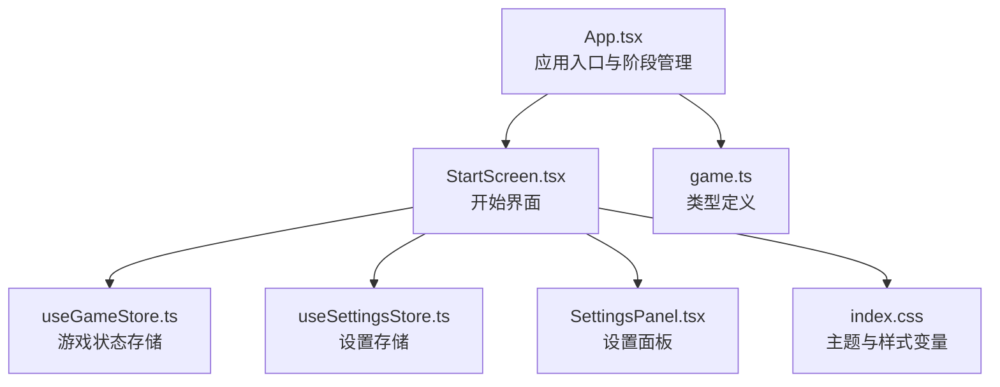
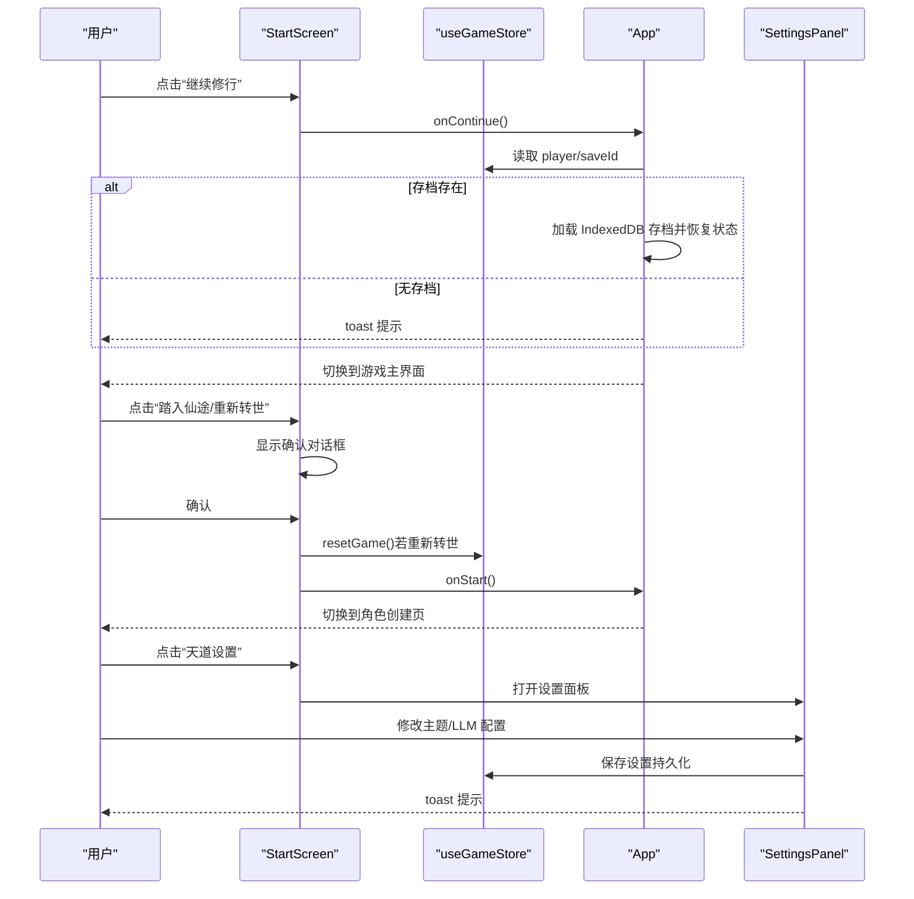
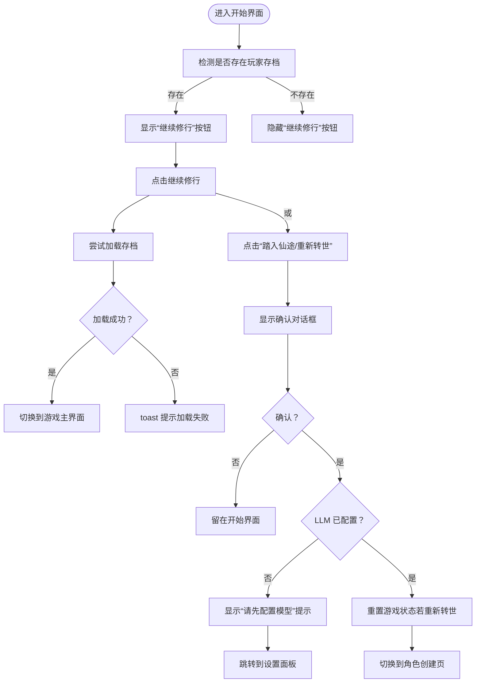
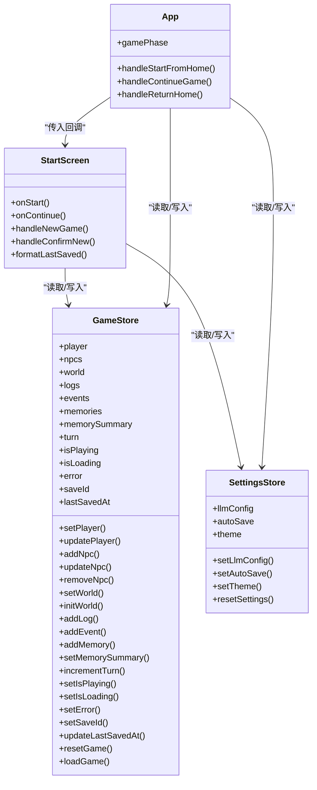
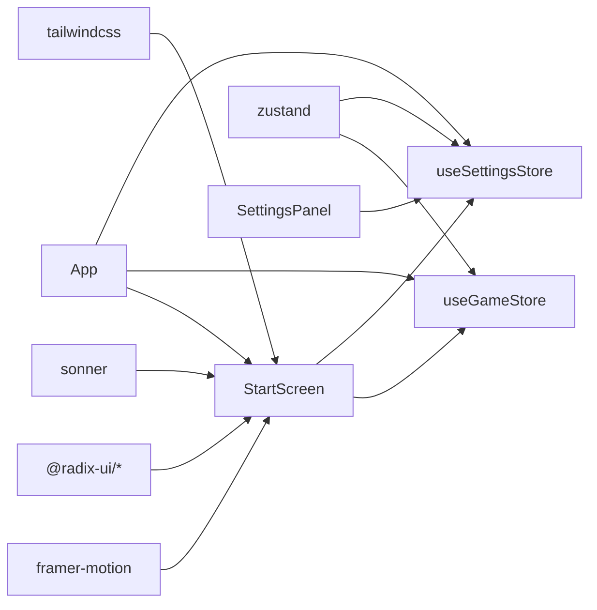

# 开始界面

<cite>
**本文引用的文件列表**
- [StartScreen.tsx](file://src/components/StartScreen.tsx)
- [App.tsx](file://src/App.tsx)
- [useGameStore.ts](file://src/stores/useGameStore.ts)
- [useSettingsStore.ts](file://src/stores/useSettingsStore.ts)
- [SettingsPanel.tsx](file://src/components/SettingsPanel.tsx)
- [index.css](file://src/index.css)
- [tailwind.config.js](file://tailwind.config.js)
- [game.ts](file://src/types/game.ts)
- [ImmersionLoading.tsx](file://src/components/ImmersionLoading.tsx)
- [package.json](file://package.json)
</cite>

## 目录
1. [简介](#简介)
2. [项目结构](#项目结构)
3. [核心组件](#核心组件)
4. [架构总览](#架构总览)
5. [详细组件分析](#详细组件分析)
6. [依赖关系分析](#依赖关系分析)
7. [性能考量](#性能考量)
8. [故障排查指南](#故障排查指南)
9. [结论](#结论)
10. [附录](#附录)

## 简介
本文件为“开始界面”的深度技术文档，面向 UI 开发者与产品团队，系统阐述 StartScreen 的设计理念、用户交互流程、状态管理机制与视觉/动画实现。文档覆盖新游戏开始、继续游戏、设置选项等核心功能的实现细节，并提供界面定制化、主题切换、无障碍访问建议及用户体验优化指南。

## 项目结构
开始界面位于组件层，通过应用入口进行渲染与状态驱动：
- 应用入口负责游戏阶段管理与导航，将 StartScreen 作为起始页渲染
- 开始界面内部使用 Zustand 状态存储与设置存储，结合 Framer Motion 实现流畅动画
- 视觉风格由 Tailwind CSS 与自定义 CSS 变量统一控制，支持日/夜主题切换

图表来源
- [App.tsx](file://src/App.tsx#L16-L585)
- [StartScreen.tsx](file://src/components/StartScreen.tsx#L1-L319)
- [useGameStore.ts](file://src/stores/useGameStore.ts#L1-L226)
- [useSettingsStore.ts](file://src/stores/useSettingsStore.ts#L1-L46)
- [SettingsPanel.tsx](file://src/components/SettingsPanel.tsx#L1-L160)
- [index.css](file://src/index.css#L1-L217)
- [game.ts](file://src/types/game.ts#L1-L319)

章节来源
- [App.tsx](file://src/App.tsx#L16-L585)
- [StartScreen.tsx](file://src/components/StartScreen.tsx#L1-L319)

## 核心组件
- StartScreen：开始界面主体，包含标题、存档信息卡片、按钮区、设置弹窗与两个提示对话框（确认新游戏、未配置模型）
- SettingsPanel：设置面板，提供主题切换、LLM 配置与连接测试
- useGameStore：游戏状态持久化存储，提供重置、加载、保存 ID 等能力
- useSettingsStore：设置存储，提供主题、LLM 配置与自动存档开关
- index.css：主题变量与组件样式类，支撑日/夜模式与视觉风格

章节来源
- [StartScreen.tsx](file://src/components/StartScreen.tsx#L1-L319)
- [SettingsPanel.tsx](file://src/components/SettingsPanel.tsx#L1-L160)
- [useGameStore.ts](file://src/stores/useGameStore.ts#L1-L226)
- [useSettingsStore.ts](file://src/stores/useSettingsStore.ts#L1-L46)
- [index.css](file://src/index.css#L1-L217)

## 架构总览
开始界面采用“组件-状态-导航”三层协作：
- 组件层：StartScreen 负责 UI 呈现与交互；SettingsPanel 负责设置项编辑与校验
- 状态层：useGameStore 管理玩家、世界、日志、存档 ID、最后保存时间等；useSettingsStore 管理主题与 LLM 配置
- 导航层：App.tsx 根据游戏阶段在开始页、角色创建页、游戏主界面之间切换

图表来源
- [StartScreen.tsx](file://src/components/StartScreen.tsx#L16-L319)
- [App.tsx](file://src/App.tsx#L124-L171)
- [useGameStore.ts](file://src/stores/useGameStore.ts#L187-L189)
- [SettingsPanel.tsx](file://src/components/SettingsPanel.tsx#L15-L160)

## 详细组件分析

### StartScreen 设计理念与交互流程
- 设计理念
  - 以“修仙”主题为核心，通过粒子背景、渐变文字、翡翠边框等视觉元素营造沉浸氛围
  - 采用分层动画：标题、副标题、卡片、按钮分别在不同时间点入场，形成节奏感
  - 支持主题切换，右上角按钮即时切换日/夜模式，根节点同步添加/移除 class
- 用户交互流程
  - 继续游戏：当存在玩家存档时显示按钮，点击后尝试从 IndexedDB 加载存档并进入游戏
  - 新游戏/重新转世：弹出确认对话框；若未配置 LLM，则弹出“请先配置模型”提示并引导前往设置
  - 设置：打开设置面板，可切换主题、配置 LLM、测试连接、重置设置

图表来源
- [StartScreen.tsx](file://src/components/StartScreen.tsx#L16-L319)
- [App.tsx](file://src/App.tsx#L124-L171)

章节来源
- [StartScreen.tsx](file://src/components/StartScreen.tsx#L16-L319)
- [App.tsx](file://src/App.tsx#L124-L171)

### 状态管理机制
- 玩家与存档状态
  - useGameStore 提供 setPlayer、updatePlayer、resetGame、loadGame、setSaveId、updateLastSavedAt 等方法
  - App 在继续游戏时根据 saveId 从 IndexedDB 加载完整存档并恢复状态
- 设置状态
  - useSettingsStore 提供 setTheme、setLlmConfig、resetSettings 等方法
  - App 将主题同步到 documentElement 的 class，实现全局主题切换
- 数据容错
  - StartScreen 对玩家字段进行安全默认值处理，避免空值导致渲染异常

图表来源
- [useGameStore.ts](file://src/stores/useGameStore.ts#L13-L55)
- [useSettingsStore.ts](file://src/stores/useSettingsStore.ts#L5-L10)
- [StartScreen.tsx](file://src/components/StartScreen.tsx#L16-L319)
- [App.tsx](file://src/App.tsx#L16-L585)

章节来源
- [useGameStore.ts](file://src/stores/useGameStore.ts#L1-L226)
- [useSettingsStore.ts](file://src/stores/useSettingsStore.ts#L1-L46)
- [StartScreen.tsx](file://src/components/StartScreen.tsx#L16-L319)
- [App.tsx](file://src/App.tsx#L16-L585)

### 视觉设计元素与动画效果
- 背景与装饰
  - 背景粒子：6 个随机位置与尺寸的径向渐变圆环，使用 Framer Motion 实现缩放与透明度循环动画
  - 竖线装饰：左右两侧垂直渐变线，增强纵深感
- 文字与卡片
  - 标题采用“九霄界”，渐变文字与阴影增强立体感
  - 存档卡片使用“水墨卡片”样式与“翡翠边框”，配合模糊背景与过渡动画
- 按钮与交互
  - 主按钮“btn-jade”使用渐变背景与阴影，hover 时提升与位移
  - 按钮组采用分层入场动画，延迟不同以形成节奏
- 主题切换
  - 右上角太阳/月亮按钮即时切换主题，根节点 class 同步变更，影响所有 CSS 变量

章节来源
- [StartScreen.tsx](file://src/components/StartScreen.tsx#L56-L108)
- [index.css](file://src/index.css#L125-L216)
- [tailwind.config.js](file://tailwind.config.js#L1-L53)

### 响应式布局适配
- 容器约束：最大宽度与居中布局，确保在小屏设备上不拥挤
- 字体与间距：使用相对单位与语义化字体大小，保证在不同 DPR 下的可读性
- 动画与交互：移动端同样支持 hover/tap 缩放反馈，但需注意触摸设备的交互体验

章节来源
- [StartScreen.tsx](file://src/components/StartScreen.tsx#L90-L95)

### 用户选择处理、状态验证与导航逻辑
- 继续游戏
  - 若存在 saveId，尝试从 IndexedDB 加载存档并恢复状态；否则提示失败
  - 成功后切换到游戏主界面并 toast 提示
- 新游戏/重新转世
  - 弹出确认对话框；若重新转世则调用 resetGame 清空状态
  - 若 LLM 未配置，弹出“请先配置模型”提示并引导前往设置
  - 确认后切换到角色创建页
- 设置
  - 打开设置面板，支持主题切换、LLM 配置与连接测试
  - 测试通过后更新状态并提示成功

章节来源
- [StartScreen.tsx](file://src/components/StartScreen.tsx#L33-L44)
- [App.tsx](file://src/App.tsx#L124-L171)
- [SettingsPanel.tsx](file://src/components/SettingsPanel.tsx#L25-L55)

### 界面定制化选项与主题切换
- 主题变量
  - 通过 CSS 变量统一管理背景、前景、主色、边框等，支持日/夜两套方案
  - Tailwind 使用 hsl(var(--xxx)) 语法，确保主题切换时颜色一致
- 主题切换
  - StartScreen 右上角按钮切换主题；App 将主题同步到 documentElement 的 class
  - SettingsPanel 提供独立的主题选择按钮，便于快速切换
- 自定义样式类
  - 提供“水墨卡片”、“翡翠边框”、“渐变文字”等通用样式类，便于扩展

章节来源
- [index.css](file://src/index.css#L5-L92)
- [tailwind.config.js](file://tailwind.config.js#L7-L49)
- [StartScreen.tsx](file://src/components/StartScreen.tsx#L96-L108)
- [SettingsPanel.tsx](file://src/components/SettingsPanel.tsx#L63-L90)

### 无障碍访问功能
- 交互提示
  - 主题切换按钮提供 title 属性，明确当前状态与操作
  - 按钮具备 hover/focus 状态，便于键盘导航与屏幕阅读器识别
- 内容可读性
  - 使用语义化字体大小与行高，保证在不同设备上的可读性
  - 渐变文字与背景对比度符合基础可读性要求（日/夜模式下均适用）

章节来源
- [StartScreen.tsx](file://src/components/StartScreen.tsx#L104-L105)

## 依赖关系分析
- 外部依赖
  - Framer Motion：提供页面与组件级动画，如入场、缩放、透明度循环
  - Radix UI：对话框、标签页等基础 UI 组件
  - Sonner：全局通知 toast
  - Tailwind CSS：原子化样式与主题变量
- 内部依赖
  - StartScreen 依赖 useGameStore 与 useSettingsStore
  - App 依赖 StartScreen 并在不同阶段间导航
  - SettingsPanel 依赖 useSettingsStore 并与 App 协作

图表来源
- [package.json](file://package.json#L15-L36)
- [StartScreen.tsx](file://src/components/StartScreen.tsx#L1-L10)
- [App.tsx](file://src/App.tsx#L1-L14)
- [useGameStore.ts](file://src/stores/useGameStore.ts#L1-L2)
- [useSettingsStore.ts](file://src/stores/useSettingsStore.ts#L1-L2)
- [SettingsPanel.tsx](file://src/components/SettingsPanel.tsx#L1-L9)

章节来源
- [package.json](file://package.json#L15-L36)

## 性能考量
- 动画性能
  - 使用 Framer Motion 的 animate/transition 控制动画时长与缓动，避免过度复杂动画造成卡顿
  - 背景粒子动画使用 repeat 与 ease，建议在低端设备上适当降低数量或频率
- 状态持久化
  - 游戏状态与设置均持久化到 localStorage，减少重复初始化成本
  - 自动存档在游戏阶段启用，避免频繁 IO
- 渲染优化
  - 使用 AnimatePresence 管理对话框与卡片的进出，避免不必要的 DOM 操作
  - 分层动画与延迟入场，减少首屏渲染压力

章节来源
- [StartScreen.tsx](file://src/components/StartScreen.tsx#L59-L88)
- [useGameStore.ts](file://src/stores/useGameStore.ts#L207-L224)
- [useSettingsStore.ts](file://src/stores/useSettingsStore.ts#L24-L44)

## 故障排查指南
- 继续游戏失败
  - 检查是否存在 saveId 且 IndexedDB 中存在对应存档
  - 查看控制台错误日志，确认加载流程是否抛出异常
- 无法开始新游戏
  - 确认 LLM 配置是否完整（baseURL、apiKey、model）
  - 若提示“请先配置模型”，点击前往设置并完成配置
- 主题切换无效
  - 确认 documentElement 的 class 是否正确添加/移除
  - 检查 index.css 中主题变量是否生效
- 动画异常
  - 检查 Framer Motion 版本与 React 版本兼容性
  - 减少动画数量或调整时长，观察性能改善情况

章节来源
- [App.tsx](file://src/App.tsx#L131-L161)
- [StartScreen.tsx](file://src/components/StartScreen.tsx#L37-L44)
- [index.css](file://src/index.css#L5-L92)

## 结论
StartScreen 通过精心设计的视觉与动画语言，结合完善的 Zustand 状态管理与 App 导航控制，实现了从“开始界面”到“角色创建”再到“游戏主界面”的顺畅过渡。其主题切换、设置集成与容错处理为用户提供了稳定且沉浸的体验。开发者可在现有基础上进一步扩展设置项、优化动画性能与增强无障碍能力。

## 附录
- 类型定义参考：游戏状态、NPC、玩家、关系、记忆等类型定义
- 加载动画参考：沉浸式加载组件，可借鉴其动画策略与交互反馈

章节来源
- [game.ts](file://src/types/game.ts#L110-L203)
- [ImmersionLoading.tsx](file://src/components/ImmersionLoading.tsx#L97-L328)