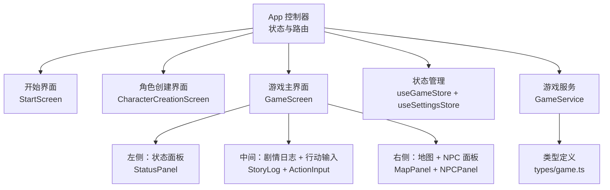
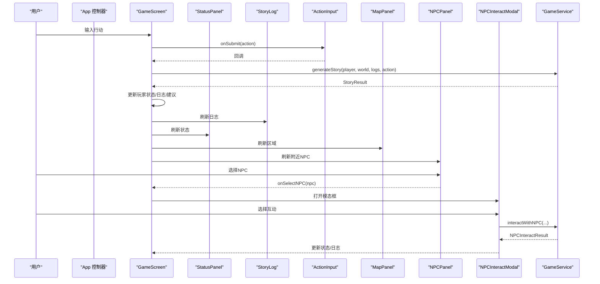
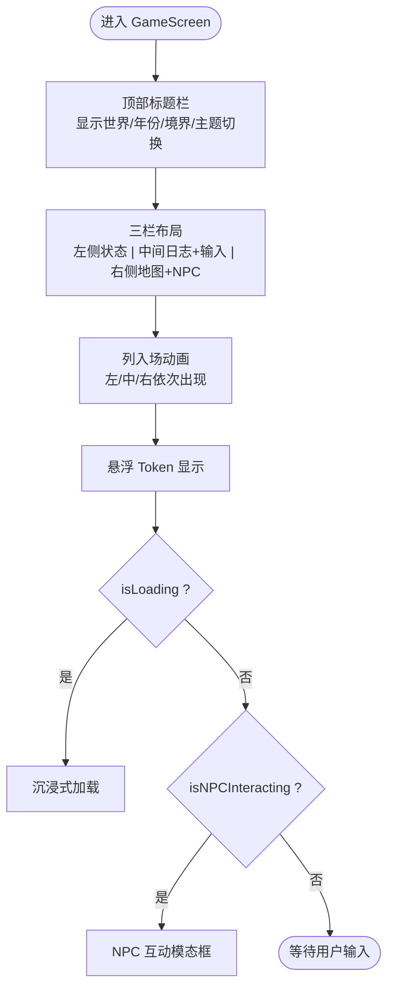
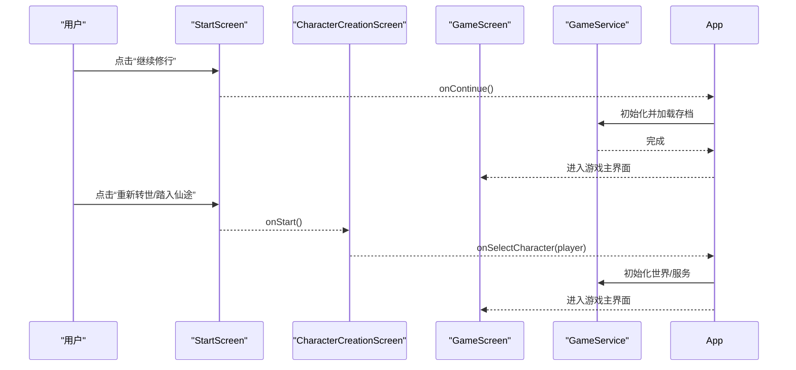
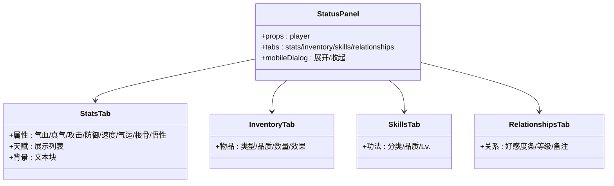
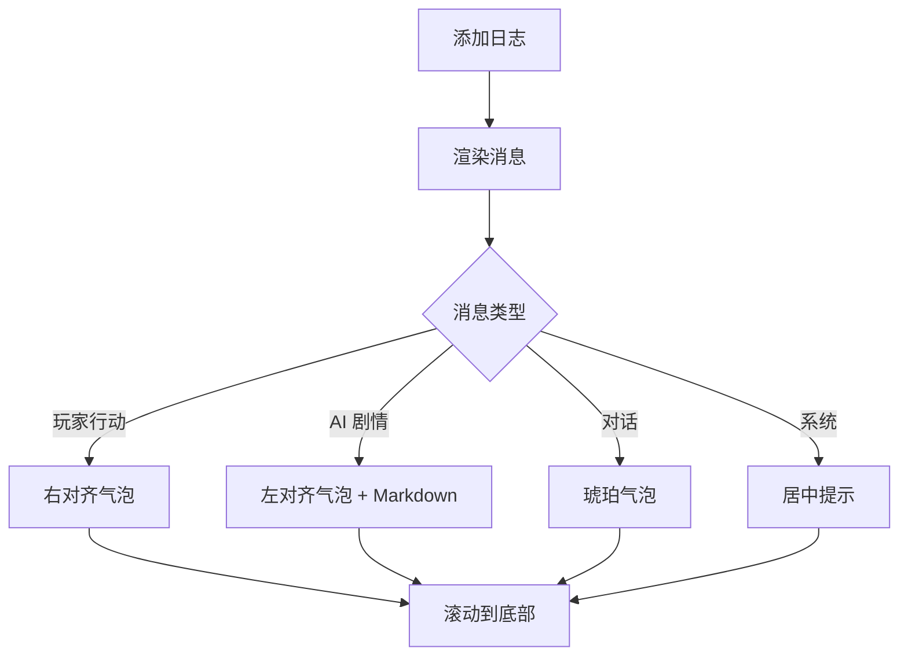
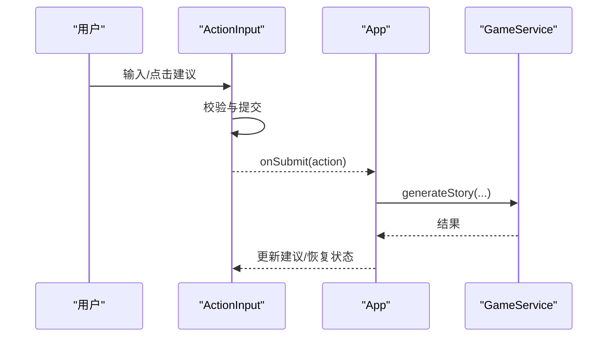
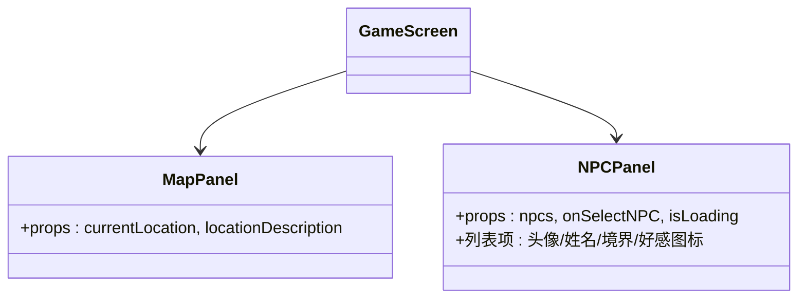
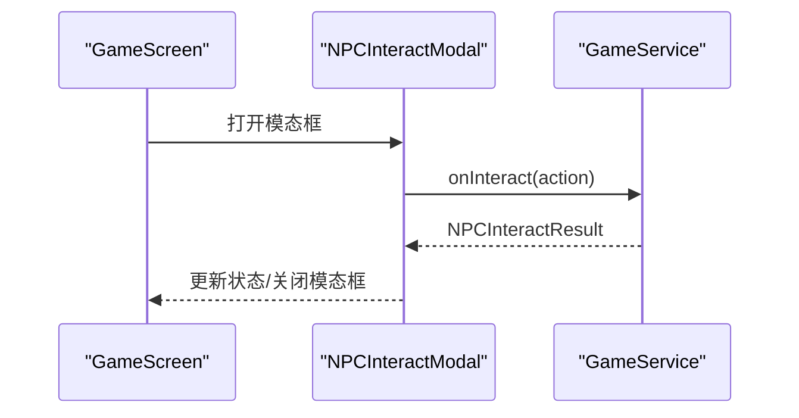
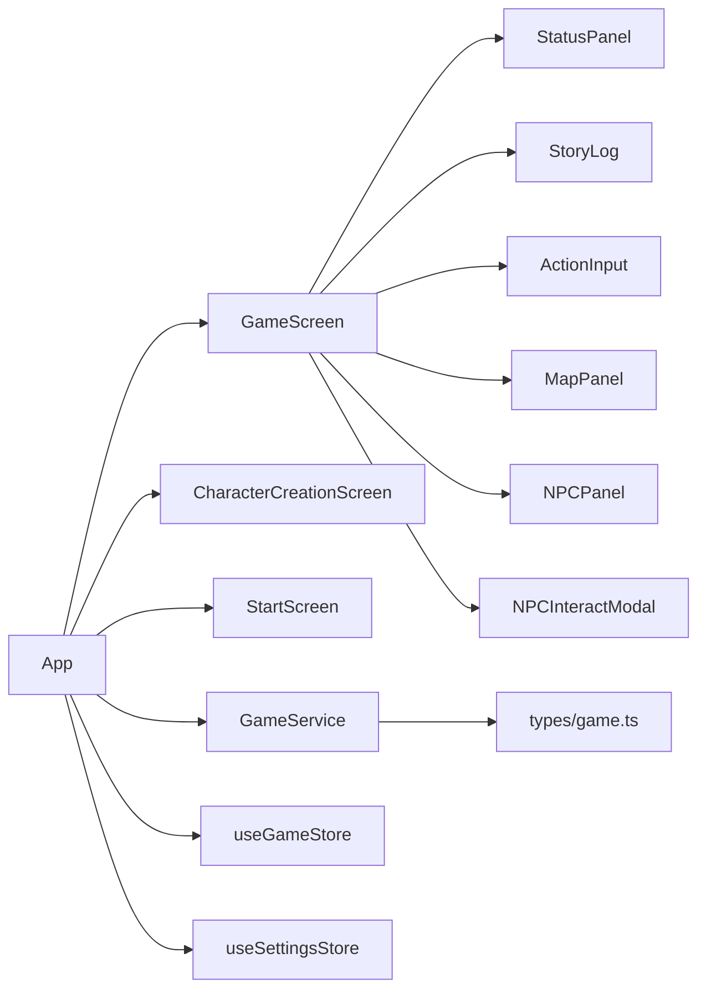

# 核心游戏界面

<cite>
**本文引用的文件**
- [src/App.tsx](file://src/App.tsx)
- [src/components/GameScreen.tsx](file://src/components/GameScreen.tsx)
- [src/components/StartScreen.tsx](file://src/components/StartScreen.tsx)
- [src/components/CharacterCreationScreen.tsx](file://src/components/CharacterCreationScreen.tsx)
- [src/components/StatusPanel.tsx](file://src/components/StatusPanel.tsx)
- [src/components/StoryLog.tsx](file://src/components/StoryLog.tsx)
- [src/components/ActionInput.tsx](file://src/components/ActionInput.tsx)
- [src/components/MapPanel.tsx](file://src/components/MapPanel.tsx)
- [src/components/NPCPanel.tsx](file://src/components/NPCPanel.tsx)
- [src/components/NPCInteractModal.tsx](file://src/components/NPCInteractModal.tsx)
- [src/stores/useGameStore.ts](file://src/stores/useGameStore.ts)
- [src/stores/useSettingsStore.ts](file://src/stores/useSettingsStore.ts)
- [src/services/gameService.ts](file://src/services/gameService.ts)
- [src/types/game.ts](file://src/types/game.ts)
</cite>

## 目录
1. [简介](#简介)
2. [项目结构](#项目结构)
3. [核心组件](#核心组件)
4. [架构总览](#架构总览)
5. [详细组件分析](#详细组件分析)
6. [依赖分析](#依赖分析)
7. [性能考虑](#性能考虑)
8. [故障排查指南](#故障排查指南)
9. [结论](#结论)
10. [附录](#附录)

## 简介
本文件面向 UI 开发者，系统化梳理“修仙 Roguelike”核心游戏界面的设计与实现，重点覆盖：
- GameScreen 的三栏布局（左侧状态面板、中间剧情日志与行动输入、右侧地图与 NPC 面板）及其响应式适配
- 开始界面与角色创建界面的设计理念、交互流程与状态管理
- 组件间通信机制、props 接口设计与事件处理模式
- 界面定制化选项、主题切换实现与动画效果配置
- 面向 UI 开发者的集成与扩展指南

## 项目结构
本项目采用按功能模块组织的前端架构，核心界面由 App 控制器分阶段渲染：StartScreen → CharacterCreationScreen → GameScreen。状态通过 Zustand store 管理，服务层通过 GameService 将 UI 与 LLM/存储解耦。

图表来源
- [src/App.tsx](file://src/App.tsx#L16-L585)
- [src/components/GameScreen.tsx](file://src/components/GameScreen.tsx#L32-L171)
- [src/components/StartScreen.tsx](file://src/components/StartScreen.tsx#L16-L318)
- [src/components/CharacterCreationScreen.tsx](file://src/components/CharacterCreationScreen.tsx#L43-L438)
- [src/stores/useGameStore.ts](file://src/stores/useGameStore.ts#L84-L225)
- [src/stores/useSettingsStore.ts](file://src/stores/useSettingsStore.ts#L24-L45)
- [src/services/gameService.ts](file://src/services/gameService.ts#L50-L541)
- [src/types/game.ts](file://src/types/game.ts#L110-L251)

章节来源
- [src/App.tsx](file://src/App.tsx#L16-L585)

## 核心组件
- GameScreen：三栏布局容器，承载全局标题、主题切换、Token 显示、沉浸式加载与 NPC 互动模态框，负责将 props 下发给子组件。
- StartScreen：开始界面，提供“继续修行/重新转世/前往设置”等入口，内置主题切换与存档信息展示。
- CharacterCreationScreen：角色创建三步走（命格初定/性格出身/初始天赋），含滚动与动画过渡。
- StatusPanel：角色状态面板，桌面端完整四标签页，移动端弹窗精简视图。
- StoryLog：剧情日志列表，支持自动滚动与多种消息类型样式。
- ActionInput：行动输入与建议按钮，支持快捷建议、Enter 发送、加载态指示。
- MapPanel：当前区域信息占位，预留地图扩展。
- NPCPanel：附近 NPC 列表，支持加载态与点击选择。
- NPCInteractModal：NPC 互动模态框，支持多类互动选项与动态更新。

章节来源
- [src/components/GameScreen.tsx](file://src/components/GameScreen.tsx#L32-L171)
- [src/components/StartScreen.tsx](file://src/components/StartScreen.tsx#L16-L318)
- [src/components/CharacterCreationScreen.tsx](file://src/components/CharacterCreationScreen.tsx#L43-L438)
- [src/components/StatusPanel.tsx](file://src/components/StatusPanel.tsx#L14-L118)
- [src/components/StoryLog.tsx](file://src/components/StoryLog.tsx#L10-L51)
- [src/components/ActionInput.tsx](file://src/components/ActionInput.tsx#L14-L145)
- [src/components/MapPanel.tsx](file://src/components/MapPanel.tsx#L8-L44)
- [src/components/NPCPanel.tsx](file://src/components/NPCPanel.tsx#L11-L98)
- [src/components/NPCInteractModal.tsx](file://src/components/NPCInteractModal.tsx#L24-L222)

## 架构总览
下图展示从 App 到 GameScreen 的数据流与交互链路，包括状态管理、服务调用与 UI 更新。

图表来源
- [src/App.tsx](file://src/App.tsx#L240-L468)
- [src/components/GameScreen.tsx](file://src/components/GameScreen.tsx#L32-L171)
- [src/services/gameService.ts](file://src/services/gameService.ts#L283-L391)
- [src/services/gameService.ts](file://src/services/gameService.ts#L415-L469)

章节来源
- [src/App.tsx](file://src/App.tsx#L240-L548)

## 详细组件分析

### GameScreen 三栏布局与响应式适配
- 布局网格：使用 CSS Grid 在桌面端将页面分为 12 列，左侧 3 列、中间 6 列、右侧 3 列；在小屏设备降级为单列堆叠。
- 动画入场：三列分别延迟进入，增强视觉层次与节奏感。
- 顶部标题与主题切换：显示当前世界与年份，右侧显示境界徽章与主题切换按钮。
- 令牌显示与沉浸式加载：右下角悬浮显示 Token 统计；当 isLoading=true 时显示沉浸式加载。
- NPC 互动模态框：在全屏遮罩下居中显示，支持离开与多种互动选项。

图表来源
- [src/components/GameScreen.tsx](file://src/components/GameScreen.tsx#L55-L171)

章节来源
- [src/components/GameScreen.tsx](file://src/components/GameScreen.tsx#L32-L171)

### 开始界面与角色创建界面
- 开始界面（StartScreen）
  - 展示存档信息卡片（若存在），包含头像、境界、年龄与最后存档时间。
  - 提供“继续修行/重新转世/前往设置”三大入口，设置内含主题切换与 LLM 配置。
  - 存档缺失时按钮样式与文案自适应。
- 角色创建界面（CharacterCreationScreen）
  - 三步流程：命格初定（姓名/属性面板）、性格出身（6 项可选）、初始天赋（6 项可选，最多 2 个）。
  - 每步均有“下一步/上一步/重新推演/完成”等交互，配合加载态与 Toast 提示。
  - 步骤指示器与动画过渡提升体验。

图表来源
- [src/components/StartScreen.tsx](file://src/components/StartScreen.tsx#L16-L318)
- [src/components/CharacterCreationScreen.tsx](file://src/components/CharacterCreationScreen.tsx#L43-L438)
- [src/App.tsx](file://src/App.tsx#L124-L237)

章节来源
- [src/components/StartScreen.tsx](file://src/components/StartScreen.tsx#L16-L318)
- [src/components/CharacterCreationScreen.tsx](file://src/components/CharacterCreationScreen.tsx#L43-L438)
- [src/App.tsx](file://src/App.tsx#L124-L237)

### 状态面板（StatusPanel）
- 桌面端：四标签页（属性/背包/功法/关系），进度条与数值展示清晰。
- 移动端：弹窗形式，核心进度与快捷标签优先显示，支持展开查看完整内容。
- 数据容错：对缺失字段进行安全兜底，避免 NaN 导致渲染异常。
- 动画与交互：进度条与列表项使用 Framer Motion 动画，提升反馈感。

图表来源
- [src/components/StatusPanel.tsx](file://src/components/StatusPanel.tsx#L14-L205)

章节来源
- [src/components/StatusPanel.tsx](file://src/components/StatusPanel.tsx#L14-L503)

### 剧情日志（StoryLog）
- 自动滚动：新增日志后使用 requestAnimationFrame 确保 DOM 更新后再滚动到底部。
- 消息类型：玩家行动（右对齐气泡）、AI 剧情（左对齐气泡 + Markdown 渲染）、对话（琥珀气泡）、系统消息（居中提示）。
- 时间戳：每条消息附带本地时间格式化输出。

图表来源
- [src/components/StoryLog.tsx](file://src/components/StoryLog.tsx#L10-L51)
- [src/components/StoryLog.tsx](file://src/components/StoryLog.tsx#L53-L164)

章节来源
- [src/components/StoryLog.tsx](file://src/components/StoryLog.tsx#L10-L172)

### 行动输入（ActionInput）
- 建议按钮：根据服务端返回的 suggestedActions 渲染，桌面端换行、移动端横向滚动。
- 键盘快捷键：Enter 发送、Shift+Enter 换行。
- 加载态：发送期间禁用输入与按钮，显示旋转加载指示。

图表来源
- [src/components/ActionInput.tsx](file://src/components/ActionInput.tsx#L14-L145)
- [src/App.tsx](file://src/App.tsx#L240-L468)

章节来源
- [src/components/ActionInput.tsx](file://src/components/ActionInput.tsx#L14-L145)
- [src/App.tsx](file://src/App.tsx#L240-L468)

### 地图面板（MapPanel）与 NPC 面板（NPCPanel）
- 地图面板：当前区域标题、位置图标与描述，占位符提示地图系统开发中。
- NPC 面板：加载态显示骨架屏；空态提示“暂无其他修士”；正常态展示 NPC 列表，点击触发父级 onSelectNPC。

图表来源
- [src/components/MapPanel.tsx](file://src/components/MapPanel.tsx#L8-L44)
- [src/components/NPCPanel.tsx](file://src/components/NPCPanel.tsx#L11-L98)

章节来源
- [src/components/MapPanel.tsx](file://src/components/MapPanel.tsx#L8-L44)
- [src/components/NPCPanel.tsx](file://src/components/NPCPanel.tsx#L11-L98)

### NPC 互动模态框（NPCInteractModal）
- 模态框：背景遮罩 + 居中卡片 + 好感度条 + 对话区域 + 互动选项网格。
- 交互流程：首次打开显示 NPC 描述与性格；发起互动后根据返回结果更新对话与可用选项；支持离开。
- 动画：入场/退出使用 Framer Motion，选项逐项淡入。

图表来源
- [src/components/NPCInteractModal.tsx](file://src/components/NPCInteractModal.tsx#L24-L222)
- [src/services/gameService.ts](file://src/services/gameService.ts#L415-L469)

章节来源
- [src/components/NPCInteractModal.tsx](file://src/components/NPCInteractModal.tsx#L24-L222)
- [src/services/gameService.ts](file://src/services/gameService.ts#L415-L469)

## 依赖分析
- 组件耦合
  - GameScreen 作为容器，向下分发 props，向上接收回调，保持良好单向数据流。
  - NPCPanel 与 NPCInteractModal 通过 GameScreen 的回调建立联系，避免跨层级通信。
- 状态管理
  - useGameStore：集中管理玩家、世界、日志、事件、记忆、turn、NPC 交互状态等。
  - useSettingsStore：集中管理主题、LLM 配置与自动存档开关。
- 服务层
  - GameService：封装 LLM 调用、记忆检索、存档读写与结果解析，屏蔽 UI 与外部依赖。
- 类型系统
  - types/game.ts：统一定义 Player/NPC/World/Item/Skill/Relationship 等类型与工具函数（如好感度映射）。

图表来源
- [src/App.tsx](file://src/App.tsx#L16-L585)
- [src/components/GameScreen.tsx](file://src/components/GameScreen.tsx#L32-L171)
- [src/stores/useGameStore.ts](file://src/stores/useGameStore.ts#L84-L225)
- [src/stores/useSettingsStore.ts](file://src/stores/useSettingsStore.ts#L24-L45)
- [src/services/gameService.ts](file://src/services/gameService.ts#L50-L541)
- [src/types/game.ts](file://src/types/game.ts#L110-L251)

章节来源
- [src/stores/useGameStore.ts](file://src/stores/useGameStore.ts#L84-L225)
- [src/stores/useSettingsStore.ts](file://src/stores/useSettingsStore.ts#L24-L45)
- [src/services/gameService.ts](file://src/services/gameService.ts#L50-L541)
- [src/types/game.ts](file://src/types/game.ts#L110-L251)

## 性能考虑
- 渲染优化
  - 使用 AnimatePresence 与 motion 组件时，尽量减少不必要的重排与重绘，避免在高频更新场景中对大量节点做复杂动画。
  - StoryLog 使用 requestAnimationFrame 滚动，避免同步 DOM 查询造成卡顿。
- 状态与存储
  - useGameStore 使用持久化存储，避免频繁序列化大对象；建议对日志与记忆数组做分页或裁剪策略。
  - 自动存档间隔 30 秒，避免过于频繁的 I/O。
- 服务调用
  - GameService 对 LLM 调用进行 token 记录，便于监控成本；建议在 UI 层对重复请求做去抖/节流。
- 主题与样式
  - 主题切换通过在 <html> 上添加 class 实现，避免在组件内反复计算样式。

[本节为通用指导，无需特定文件引用]

## 故障排查指南
- 主题切换无效
  - 检查 useSettingsStore 的 theme 状态是否正确更新，以及 App 是否在 effect 中将类名同步到 <html>。
- NPC 无法打开互动
  - 确认 GameScreen 的 onSelectNPC 与 setNPCInteracting 流程是否正确执行，且 onNPCInteract 回调可正常返回结果。
- 行动无响应
  - 检查 ActionInput 的 isLoading 状态与 onSubmit 回调是否被正确传递至 App.handleActionSubmit。
- 日志不滚动
  - 确认 StoryLog 的 ref 与 useEffect 是否在 logs 变化后执行，requestAnimationFrame 是否被正确调度。
- 角色创建卡住
  - 检查 CharacterCreationScreen 的步骤推进逻辑与 GameService 的异步调用是否抛错并被 Toast 捕获。

章节来源
- [src/App.tsx](file://src/App.tsx#L240-L548)
- [src/components/StoryLog.tsx](file://src/components/StoryLog.tsx#L13-L20)
- [src/components/ActionInput.tsx](file://src/components/ActionInput.tsx#L17-L28)
- [src/components/NPCInteractModal.tsx](file://src/components/NPCInteractModal.tsx#L37-L54)

## 结论
本界面以 GameScreen 为核心，通过清晰的三栏布局与响应式适配，结合状态面板、剧情日志、行动输入、地图与 NPC 面板，构建了沉浸式的修仙体验。配合 Zustand 状态管理与 GameService 服务层，实现了 UI 与业务逻辑的良好解耦。建议在后续迭代中：
- 扩展地图系统与区域导航
- 丰富 NPC 互动选项与关系系统
- 优化日志与记忆的分页与检索
- 引入更精细的主题变量与暗色模式色彩体系

[本节为总结，无需特定文件引用]

## 附录

### Props 接口与事件处理清单
- GameScreen
  - props: player, world, logs, isLoading, suggestions, onActionSubmit, onReturnHome, nearbyNPCs, selectedNPC, isNPCInteracting, onSelectNPC, onCloseNPCModal, onNPCInteract
  - 事件：返回主页、提交行动、选择 NPC、关闭模态框、NPC 互动
- ActionInput
  - props: onSubmit, isLoading, suggestions
  - 事件：键盘 Enter 发送、点击建议按钮
- NPCPanel
  - props: npcs, onSelectNPC, isLoading
  - 事件：点击 NPC 列表项
- NPCInteractModal
  - props: npc, isOpen, onClose, onInteract
  - 事件：选择互动选项、关闭模态框

章节来源
- [src/components/GameScreen.tsx](file://src/components/GameScreen.tsx#L15-L30)
- [src/components/ActionInput.tsx](file://src/components/ActionInput.tsx#L8-L12)
- [src/components/NPCPanel.tsx](file://src/components/NPCPanel.tsx#L5-L9)
- [src/components/NPCInteractModal.tsx](file://src/components/NPCInteractModal.tsx#L7-L12)

### 主题切换与定制化
- 主题状态：useSettingsStore.theme 控制 light/dark
- 同步方式：App.effect 将类名应用到 <html>
- 定制化建议：引入 Tailwind 主题变量，按需覆盖颜色与阴影；为按钮、卡片、边框等组件提供统一的变体类名。

章节来源
- [src/stores/useSettingsStore.ts](file://src/stores/useSettingsStore.ts#L24-L45)
- [src/App.tsx](file://src/App.tsx#L22-L28)

### 动画与交互细节
- Framer Motion：入场动画、进度条动画、列表项动画、模态框动画
- 加载态：旋转指示器、骨架屏、沉浸式加载
- 无障碍：键盘快捷键、禁用态、提示文案

章节来源
- [src/components/StatusPanel.tsx](file://src/components/StatusPanel.tsx#L226-L275)
- [src/components/ActionInput.tsx](file://src/components/ActionInput.tsx#L113-L124)
- [src/components/CharacterCreationScreen.tsx](file://src/components/CharacterCreationScreen.tsx#L435-L437)