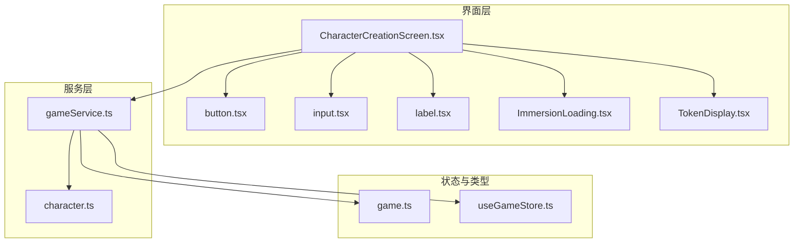
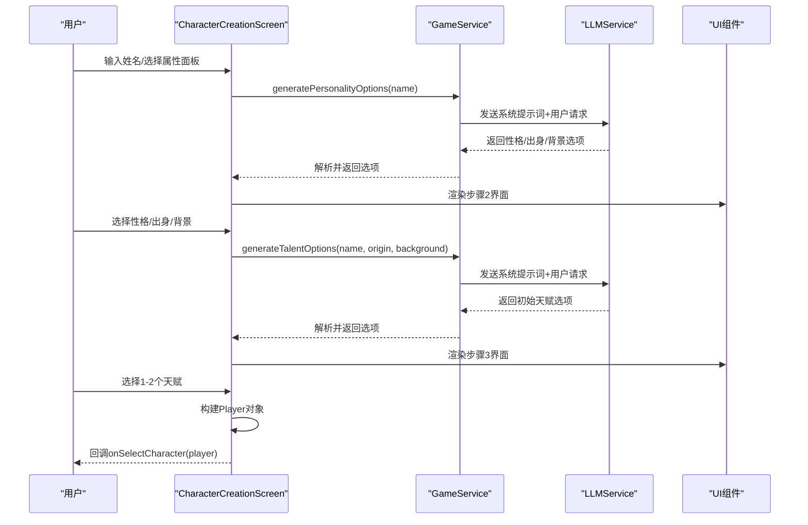
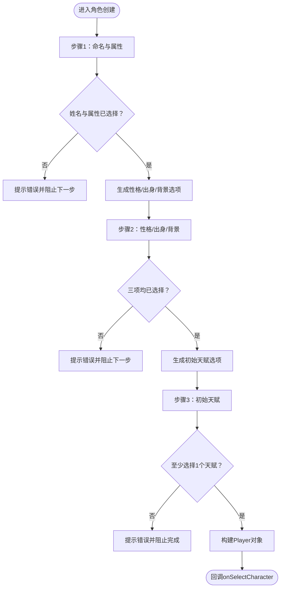
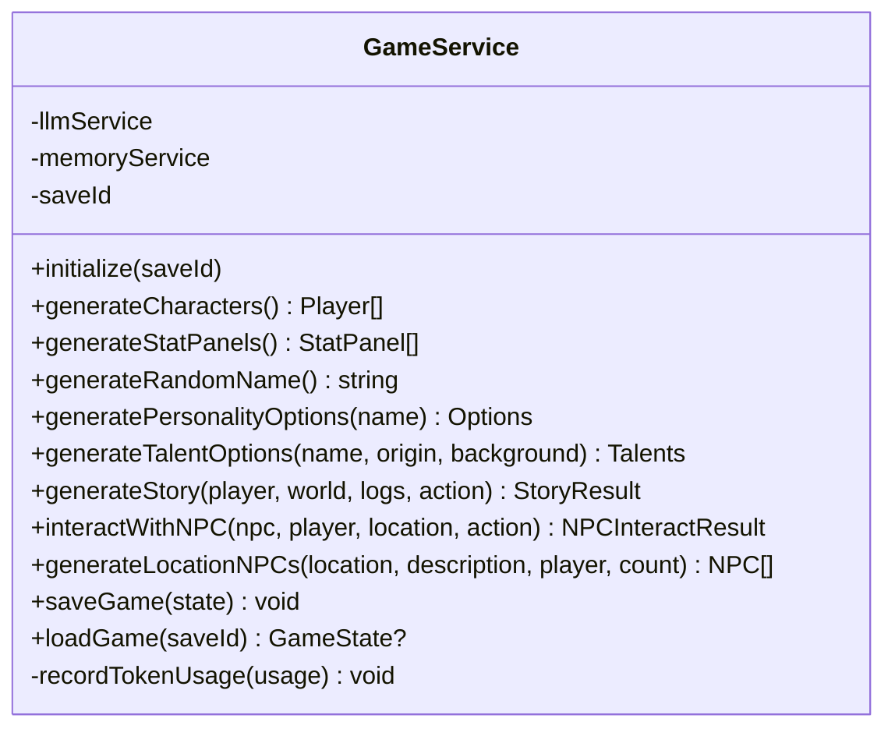
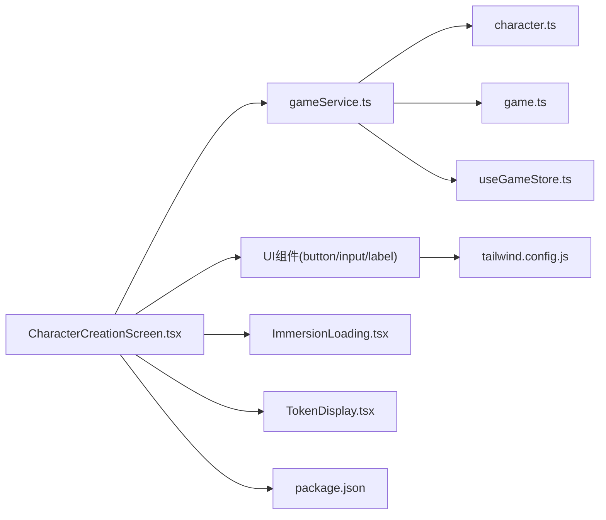

# 角色创建界面

<cite>
**本文引用的文件列表**
- [CharacterCreationScreen.tsx](file://src/components/CharacterCreationScreen.tsx)
- [gameService.ts](file://src/services/gameService.ts)
- [character.ts](file://src/prompts/character.ts)
- [game.ts](file://src/types/game.ts)
- [useGameStore.ts](file://src/stores/useGameStore.ts)
- [ImmersionLoading.tsx](file://src/components/ImmersionLoading.tsx)
- [TokenDisplay.tsx](file://src/components/TokenDisplay.tsx)
- [button.tsx](file://src/components/ui/button.tsx)
- [input.tsx](file://src/components/ui/input.tsx)
- [label.tsx](file://src/components/ui/label.tsx)
- [utils.ts](file://src/lib/utils.ts)
- [tailwind.config.js](file://tailwind.config.js)
- [package.json](file://package.json)
</cite>

## 目录
1. [简介](#简介)
2. [项目结构](#项目结构)
3. [核心组件](#核心组件)
4. [架构总览](#架构总览)
5. [详细组件分析](#详细组件分析)
6. [依赖关系分析](#依赖关系分析)
7. [性能考量](#性能考量)
8. [故障排查指南](#故障排查指南)
9. [结论](#结论)
10. [附录](#附录)

## 简介
本文件面向 UI 开发者与产品设计师，系统性解析“角色创建界面”的实现与交互设计，覆盖角色属性设置、外观选择、背景故事生成、表单验证与错误处理、数据收集与传递到游戏系统等全流程。文档同时提供界面定制化、多语言支持与响应式适配建议，帮助团队高效完成角色创建体验的开发与优化。

## 项目结构
角色创建界面位于 src/components/CharacterCreationScreen.tsx，配合服务层 src/services/gameService.ts、提示词模板 src/prompts/character.ts、类型定义 src/types/game.ts、全局状态管理 src/stores/useGameStore.ts，以及沉浸式加载与 Token 统计等 UI 组件共同构成完整的角色创建流程。

图表来源
- [CharacterCreationScreen.tsx](file://src/components/CharacterCreationScreen.tsx#L1-L482)
- [gameService.ts](file://src/services/gameService.ts#L1-L541)
- [character.ts](file://src/prompts/character.ts#L1-L97)
- [game.ts](file://src/types/game.ts#L110-L139)
- [useGameStore.ts](file://src/stores/useGameStore.ts#L13-L55)
- [ImmersionLoading.tsx](file://src/components/ImmersionLoading.tsx#L1-L329)
- [TokenDisplay.tsx](file://src/components/TokenDisplay.tsx#L1-L172)
- [button.tsx](file://src/components/ui/button.tsx#L1-L57)
- [input.tsx](file://src/components/ui/input.tsx#L1-L23)
- [label.tsx](file://src/components/ui/label.tsx#L1-L25)

章节来源
- [CharacterCreationScreen.tsx](file://src/components/CharacterCreationScreen.tsx#L1-L482)
- [gameService.ts](file://src/services/gameService.ts#L1-L541)
- [character.ts](file://src/prompts/character.ts#L1-L97)
- [game.ts](file://src/types/game.ts#L110-L139)
- [useGameStore.ts](file://src/stores/useGameStore.ts#L13-L55)
- [ImmersionLoading.tsx](file://src/components/ImmersionLoading.tsx#L1-L329)
- [TokenDisplay.tsx](file://src/components/TokenDisplay.tsx#L1-L172)
- [button.tsx](file://src/components/ui/button.tsx#L1-L57)
- [input.tsx](file://src/components/ui/input.tsx#L1-L23)
- [label.tsx](file://src/components/ui/label.tsx#L1-L25)
- [tailwind.config.js](file://tailwind.config.js#L1-L53)
- [package.json](file://package.json#L1-L55)

## 核心组件
- 角色创建屏幕：负责三步式流程（命名与属性、性格/出身/背景、初始天赋），提供沉浸式加载与 Token 统计展示。
- 游戏服务：封装 LLM 调用、属性面板生成、随机姓名生成、角色选项生成与最终角色构建。
- 类型系统：统一 Player、NPC、Item、Skill 等核心类型，保证数据一致性。
- 状态管理：通过 Zustand 管理玩家、世界、日志、事件、记忆等状态，并持久化存储。
- UI 组件：Button/Input/Label 等基础组件，以及沉浸式加载与 Token 显示组件。

章节来源
- [CharacterCreationScreen.tsx](file://src/components/CharacterCreationScreen.tsx#L29-L47)
- [gameService.ts](file://src/services/gameService.ts#L50-L119)
- [game.ts](file://src/types/game.ts#L110-L139)
- [useGameStore.ts](file://src/stores/useGameStore.ts#L84-L225)
- [ImmersionLoading.tsx](file://src/components/ImmersionLoading.tsx#L63-L111)
- [TokenDisplay.tsx](file://src/components/TokenDisplay.tsx#L10-L32)

## 架构总览
角色创建从界面层发起，经由游戏服务调用 LLM 生成候选选项，再回到界面层渲染与交互，最终将角色数据传递给游戏系统并进入主游戏。

图表来源
- [CharacterCreationScreen.tsx](file://src/components/CharacterCreationScreen.tsx#L74-L128)
- [gameService.ts](file://src/services/gameService.ts#L204-L281)
- [character.ts](file://src/prompts/character.ts#L60-L96)

## 详细组件分析

### 角色创建屏幕（CharacterCreationScreen）
- 流程与步骤
  - 步骤1：命名与基础属性选择。支持随机姓名与属性面板重投，提供基础属性可视化卡片。
  - 步骤2：性格/出身/背景三选。每项均为互斥选择，支持重新推演。
  - 步骤3：初始天赋选择。最多选择2个，支持重新推演。
- 数据收集与校验
  - 步骤1：姓名非空校验；必须选择一组属性面板。
  - 步骤2：必须选择性格、出身、背景三项。
  - 步骤3：至少选择1个天赋。
- 错误处理与提示
  - 使用通知组件进行错误提示（如“请填写修士名号”、“请至少选择1个天赋”等）。
  - 加载态通过沉浸式加载组件展示，避免用户误操作。
- 数据构建与传递
  - 将所选数据组装为 Player 对象，调用 onSelectCharacter 回调，进入游戏主界面。
- 交互设计
  - 使用 Framer Motion 实现步骤切换与卡片点击反馈。
  - 步骤指示器清晰标识当前步骤与已完成步骤。
  - 卡片选中态通过视觉强调，提升可发现性。

图表来源
- [CharacterCreationScreen.tsx](file://src/components/CharacterCreationScreen.tsx#L74-L161)

章节来源
- [CharacterCreationScreen.tsx](file://src/components/CharacterCreationScreen.tsx#L43-L439)

### 游戏服务（GameService）
- 角色生成
  - 通过系统提示词与用户提示词组合，调用 LLM 生成角色集合，确保字段完整性与默认值。
- 属性面板生成
  - 提供多种职业模板（体修、剑修、道修等），随机扰动生成三组属性面板。
- 随机姓名生成
  - 基于常见复姓与单字名组合，生成符合修仙风格的姓名。
- 角色选项生成
  - generatePersonalityOptions：生成性格、出身、背景三类选项。
  - generateTalentOptions：基于姓名、出身、背景生成初始天赋选项。
- Token 使用统计
  - 记录每次 LLM 调用的 prompt_tokens、completion_tokens、total_tokens，并写入状态。

图表来源
- [gameService.ts](file://src/services/gameService.ts#L50-L541)

章节来源
- [gameService.ts](file://src/services/gameService.ts#L75-L281)

### 提示词与系统约束（character.ts）
- 系统提示词：定义修仙世界设定、境界体系、角色生成要求与寿元参考。
- 用户提示词：约束生成角色数量、多样性与 JSON 结构，确保字段扁平化与可解析性。
- 作用：为 LLM 生成角色、性格、出身、背景与天赋提供明确指令。

章节来源
- [character.ts](file://src/prompts/character.ts#L1-L97)

### 类型系统（game.ts）
- Player：角色核心数据结构，包含基础属性、修为状态、寿命、天赋、物品、技能、关系等。
- NPC：NPC 数据结构，含属性、关系、记忆标签等。
- Item/Skill：物品与技能类型枚举与质量等级。
- GameState：游戏整体状态，包括玩家、NPC、世界、日志、事件、记忆、回合数等。

章节来源
- [game.ts](file://src/types/game.ts#L110-L251)

### 状态管理（useGameStore.ts）
- 管理玩家、NPC、世界、日志、事件、记忆、回合数、是否正在游戏、加载状态、错误信息、存档 ID 等。
- 提供 setPlayer/updatePlayer/addNpc 等方法，支持局部更新与持久化存储。
- 与 GameService 协作，将角色创建后的 Player 注入全局状态。

章节来源
- [useGameStore.ts](file://src/stores/useGameStore.ts#L84-L225)

### UI 组件与样式
- Button/Input/Label：基础 UI 组件，遵循 Tailwind 变体系统，支持尺寸与变体扩展。
- ImmersionLoading：沉浸式加载，支持多种类型的消息轮播与进度条动画。
- TokenDisplay：悬浮式 Token 统计，支持展开/收起与清空统计。

章节来源
- [button.tsx](file://src/components/ui/button.tsx#L1-L57)
- [input.tsx](file://src/components/ui/input.tsx#L1-L23)
- [label.tsx](file://src/components/ui/label.tsx#L1-L25)
- [ImmersionLoading.tsx](file://src/components/ImmersionLoading.tsx#L63-L111)
- [TokenDisplay.tsx](file://src/components/TokenDisplay.tsx#L10-L32)
- [utils.ts](file://src/lib/utils.ts#L4-L6)
- [tailwind.config.js](file://tailwind.config.js#L8-L48)

## 依赖关系分析
- 组件耦合
  - CharacterCreationScreen 依赖 GameService 与 UI 组件，耦合集中在数据获取与渲染。
  - GameService 依赖 LLMService、MemoryService、数据库与类型定义，职责清晰。
- 外部依赖
  - Framer Motion：动画与过渡效果。
  - Radix UI：语义化基础组件。
  - Tailwind CSS：原子化样式与主题变量。
  - Sonner：通知提示。
  - Zustand：轻量状态管理。

图表来源
- [CharacterCreationScreen.tsx](file://src/components/CharacterCreationScreen.tsx#L1-L12)
- [gameService.ts](file://src/services/gameService.ts#L1-L10)
- [character.ts](file://src/prompts/character.ts#L1-L9)
- [game.ts](file://src/types/game.ts#L1-L10)
- [useGameStore.ts](file://src/stores/useGameStore.ts#L1-L11)
- [ImmersionLoading.tsx](file://src/components/ImmersionLoading.tsx#L1-L9)
- [TokenDisplay.tsx](file://src/components/TokenDisplay.tsx#L1-L8)
- [button.tsx](file://src/components/ui/button.tsx#L1-L5)
- [input.tsx](file://src/components/ui/input.tsx#L1-L5)
- [label.tsx](file://src/components/ui/label.tsx#L1-L5)
- [tailwind.config.js](file://tailwind.config.js#L1-L53)
- [package.json](file://package.json#L15-L36)

章节来源
- [package.json](file://package.json#L15-L36)
- [tailwind.config.js](file://tailwind.config.js#L1-L53)

## 性能考量
- LLM 调用成本控制
  - 使用 Token 统计组件监控使用量，避免频繁调用导致成本上升。
  - 在步骤间提供“重新推演”能力，减少一次性大量请求。
- 动画与渲染
  - 使用 Framer Motion 的 AnimatePresence 与 key 切换，避免不必要的重渲染。
  - 卡片网格采用响应式布局，减少移动端卡顿。
- 状态持久化
  - 使用 Zustand 的持久化中间件，减少重复计算与网络请求。

## 故障排查指南
- 常见问题
  - “天机推演受阻，请重试”：通常由 LLM 服务异常或网络波动引起。检查 LLM 配置与网络连接。
  - “请填写修士名号/请至少选择1个天赋”：前端校验失败，检查输入与选择状态。
  - 加载动画未消失：确认异步流程完成与 setIsLoading 状态同步。
- 排查步骤
  - 打开 Token 统计面板，确认最近一次调用是否成功。
  - 查看控制台是否有网络错误或 CORS 问题。
  - 检查 onSelectCharacter 回调是否正确接收 Player 对象。
- 优化建议
  - 在网络不稳定场景下增加重试与降级策略。
  - 对高频调用的接口进行节流或缓存。

章节来源
- [CharacterCreationScreen.tsx](file://src/components/CharacterCreationScreen.tsx#L74-L128)
- [TokenDisplay.tsx](file://src/components/TokenDisplay.tsx#L10-L32)

## 结论
角色创建界面通过清晰的三步流程、完善的校验与错误提示、沉浸式加载与 Token 统计，为用户提供了流畅且富有修仙氛围的角色生成体验。结合类型系统与状态管理，确保数据一致性与可维护性。建议在后续迭代中进一步增强多语言支持与响应式适配，持续优化 LLM 调用成本与性能表现。

## 附录

### 表单组件交互设计要点
- 步骤指示器：已完成步骤高亮，当前步骤强调，未来步骤禁用。
- 卡片选择：悬停缩放、点击反馈、选中态视觉强化。
- 按钮状态：禁用态与加载态明确区分，避免误操作。
- 错误提示：使用通知组件即时反馈，避免静默失败。

章节来源
- [CharacterCreationScreen.tsx](file://src/components/CharacterCreationScreen.tsx#L165-L439)
- [button.tsx](file://src/components/ui/button.tsx#L7-L34)
- [input.tsx](file://src/components/ui/input.tsx#L5-L18)
- [label.tsx](file://src/components/ui/label.tsx#L7-L19)

### 多语言支持建议
- 文案提取：将步骤标题、按钮文案、提示信息统一抽取为本地化键值。
- 语言包：按语言拆分 JSON，动态切换语言。
- RTL 支持：为阿拉伯语等语言预留布局方向调整。

[本节为通用建议，无需特定文件来源]

### 响应式设计适配
- 断点策略：移动端优先，逐步增强到平板与桌面端。
- 网格布局：卡片网格在小屏下自动换列，保持可读性。
- 字体与间距：使用相对单位与语义化字体大小，确保在不同设备上一致可读。

章节来源
- [tailwind.config.js](file://tailwind.config.js#L8-L48)
- [CharacterCreationScreen.tsx](file://src/components/CharacterCreationScreen.tsx#L258-L287)