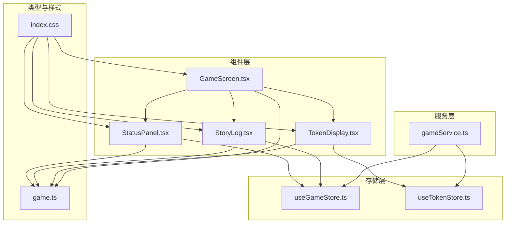
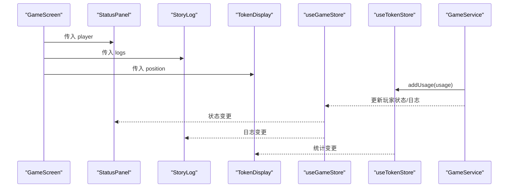
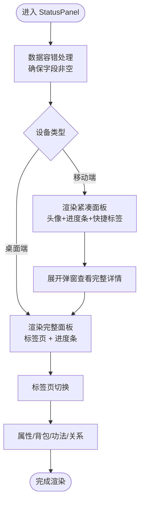
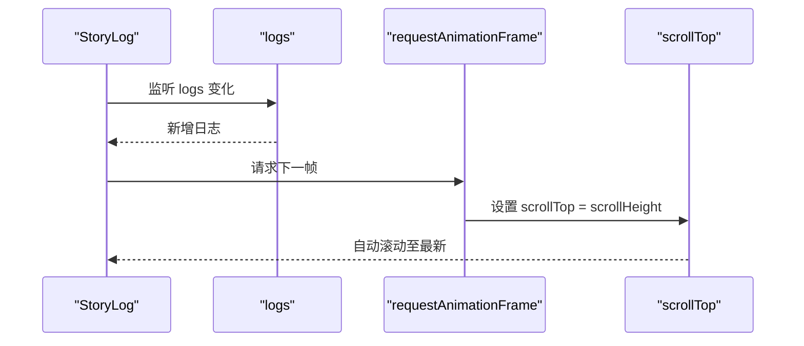
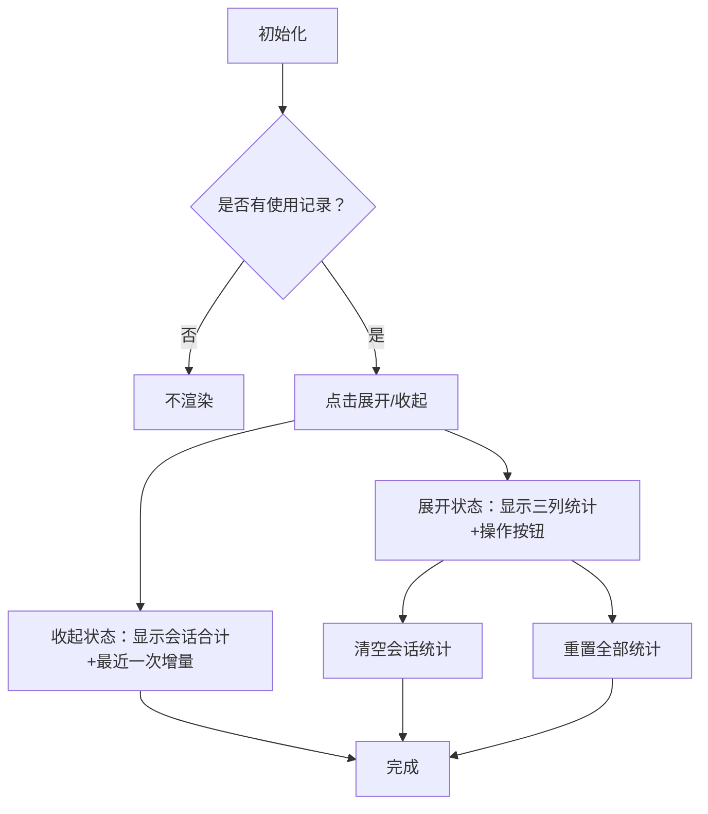
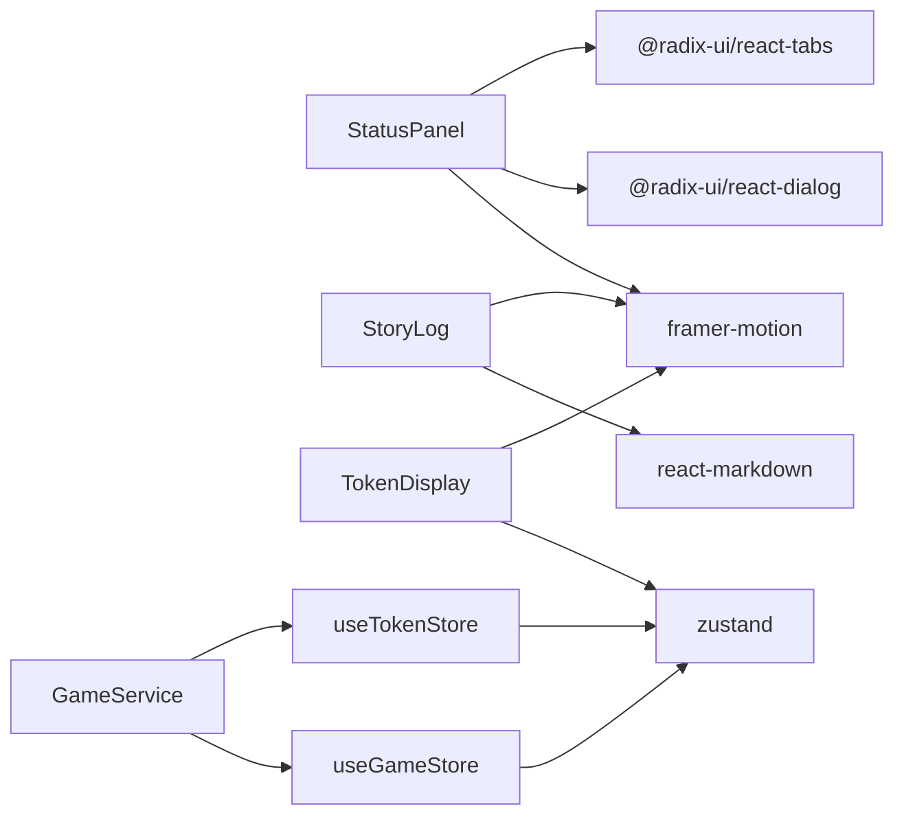

# 状态与剧情面板

<cite>
**本文引用的文件**
- [StatusPanel.tsx](file://src/components/StatusPanel.tsx)
- [StoryLog.tsx](file://src/components/StoryLog.tsx)
- [TokenDisplay.tsx](file://src/components/TokenDisplay.tsx)
- [GameScreen.tsx](file://src/components/GameScreen.tsx)
- [useGameStore.ts](file://src/stores/useGameStore.ts)
- [useTokenStore.ts](file://src/stores/useTokenStore.ts)
- [gameService.ts](file://src/services/gameService.ts)
- [game.ts](file://src/types/game.ts)
- [index.css](file://src/index.css)
- [tabs.tsx](file://src/components/ui/tabs.tsx)
- [dialog.tsx](file://src/components/ui/dialog.tsx)
- [App.tsx](file://src/App.tsx)
- [package.json](file://package.json)
</cite>

## 目录
1. [简介](#简介)
2. [项目结构](#项目结构)
3. [核心组件](#核心组件)
4. [架构总览](#架构总览)
5. [组件详解](#组件详解)
6. [依赖关系分析](#依赖关系分析)
7. [性能考量](#性能考量)
8. [故障排查指南](#故障排查指南)
9. [结论](#结论)
10. [附录](#附录)

## 简介
本文件面向 UI 开发者，系统化梳理“状态与剧情面板”的设计与实现，包括：
- 状态面板：角色信息、修为境界、属性与背包/功法/关系等分栏展示
- 剧情日志：动态内容渲染、滚动机制、历史记录管理
- Token 显示：计费统计与使用情况展示
- 数据绑定与实时更新、性能优化策略、响应式设计与主题适配、动画效果与交互增强

## 项目结构
围绕状态与剧情面板的关键文件组织如下：
- 组件层：状态面板、剧情日志、Token 显示、游戏主界面
- 存储层：游戏状态与 Token 统计的 Zustand store
- 服务层：LLM 服务与记忆服务，负责剧情生成与 Token 记录
- 类型层：统一的游戏数据结构定义
- 样式层：主题变量、卡片与渐变等通用样式

图表来源
- [GameScreen.tsx](file://src/components/GameScreen.tsx#L106-L171)
- [StatusPanel.tsx](file://src/components/StatusPanel.tsx#L14-L119)
- [StoryLog.tsx](file://src/components/StoryLog.tsx#L10-L51)
- [TokenDisplay.tsx](file://src/components/TokenDisplay.tsx#L10-L171)
- [useGameStore.ts](file://src/stores/useGameStore.ts#L84-L225)
- [useTokenStore.ts](file://src/stores/useTokenStore.ts#L31-L72)
- [gameService.ts](file://src/services/gameService.ts#L50-L72)
- [game.ts](file://src/types/game.ts#L110-L233)
- [index.css](file://src/index.css#L94-L216)

章节来源
- [GameScreen.tsx](file://src/components/GameScreen.tsx#L106-L171)
- [StatusPanel.tsx](file://src/components/StatusPanel.tsx#L14-L119)
- [StoryLog.tsx](file://src/components/StoryLog.tsx#L10-L51)
- [TokenDisplay.tsx](file://src/components/TokenDisplay.tsx#L10-L171)
- [useGameStore.ts](file://src/stores/useGameStore.ts#L84-L225)
- [useTokenStore.ts](file://src/stores/useTokenStore.ts#L31-L72)
- [gameService.ts](file://src/services/gameService.ts#L50-L72)
- [game.ts](file://src/types/game.ts#L110-L233)
- [index.css](file://src/index.css#L94-L216)

## 核心组件
- 状态面板（StatusPanel）
  - 展示角色头像、姓名、境界、背景、修为与寿元进度
  - 分栏：属性、背包、功法、关系
  - 移动端采用弹窗展开，桌面端完整展示
- 剧情日志（StoryLog）
  - 动态渲染玩家行动、AI 剧情、对话与系统消息
  - 自动滚动至最新日志
- Token 显示（TokenDisplay）
  - 展示最近一次、本次会话、累计 Token 使用
  - 支持展开/收起、清空会话统计、重置全部统计

章节来源
- [StatusPanel.tsx](file://src/components/StatusPanel.tsx#L14-L206)
- [StoryLog.tsx](file://src/components/StoryLog.tsx#L10-L171)
- [TokenDisplay.tsx](file://src/components/TokenDisplay.tsx#L10-L171)

## 架构总览
状态与剧情面板通过 Zustand store 实现数据驱动，LLM 服务在生成剧情时记录 Token 使用，最终由 UI 组件实时呈现。

图表来源
- [GameScreen.tsx](file://src/components/GameScreen.tsx#L106-L171)
- [StatusPanel.tsx](file://src/components/StatusPanel.tsx#L14-L119)
- [StoryLog.tsx](file://src/components/StoryLog.tsx#L10-L51)
- [TokenDisplay.tsx](file://src/components/TokenDisplay.tsx#L10-L171)
- [useGameStore.ts](file://src/stores/useGameStore.ts#L84-L225)
- [useTokenStore.ts](file://src/stores/useTokenStore.ts#L31-L72)
- [gameService.ts](file://src/services/gameService.ts#L64-L72)

## 组件详解

### 状态面板（StatusPanel）
- 数据绑定与容错
  - 对缺失字段进行默认值兜底，避免 NaN 导致渲染异常
  - 修为与寿元百分比计算，移动端紧凑进度条与桌面端完整进度条
- 结构与交互
  - 桌面端：完整卡片 + 标签页（属性/背包/功法/关系）
  - 移动端：头像+基本信息 + 两个横向进度条 + 快捷属性标签
  - 弹窗展开完整详情
- 动画与视觉
  - Framer Motion 进度条入场动画
  - 主题色进度条与“翡翠”渐变
- 响应式与主题
  - 桌面端 lg+ 完整面板，移动端隐藏完整面板
  - 通过 CSS 变量与 ink-card/jade-text 等类实现主题适配

图表来源
- [StatusPanel.tsx](file://src/components/StatusPanel.tsx#L14-L119)
- [StatusPanel.tsx](file://src/components/StatusPanel.tsx#L121-L206)
- [StatusPanel.tsx](file://src/components/StatusPanel.tsx#L208-L276)
- [StatusPanel.tsx](file://src/components/StatusPanel.tsx#L278-L493)
- [tabs.tsx](file://src/components/ui/tabs.tsx#L6-L53)
- [dialog.tsx](file://src/components/ui/dialog.tsx#L30-L51)

章节来源
- [StatusPanel.tsx](file://src/components/StatusPanel.tsx#L14-L119)
- [StatusPanel.tsx](file://src/components/StatusPanel.tsx#L121-L206)
- [StatusPanel.tsx](file://src/components/StatusPanel.tsx#L208-L276)
- [StatusPanel.tsx](file://src/components/StatusPanel.tsx#L278-L493)
- [tabs.tsx](file://src/components/ui/tabs.tsx#L6-L53)
- [dialog.tsx](file://src/components/ui/dialog.tsx#L30-L51)

### 剧情日志（StoryLog）
- 渲染类型
  - 玩家行动（右对齐气泡，靛蓝）
  - AI 剧情（左对齐气泡，翡翠 + Markdown）
  - NPC 对话（左对齐气泡，琥珀）
  - 系统消息（居中，灰色）
- 滚动机制
  - 使用 ref 与 requestAnimationFrame 在 logs 变化后滚动到底部
- 历史记录管理
  - 通过 useGameStore 的 logs 数组维护，新增日志即渲染

图表来源
- [StoryLog.tsx](file://src/components/StoryLog.tsx#L10-L51)
- [StoryLog.tsx](file://src/components/StoryLog.tsx#L53-L171)
- [useGameStore.ts](file://src/stores/useGameStore.ts#L144-L154)

章节来源
- [StoryLog.tsx](file://src/components/StoryLog.tsx#L10-L51)
- [StoryLog.tsx](file://src/components/StoryLog.tsx#L53-L171)
- [useGameStore.ts](file://src/stores/useGameStore.ts#L144-L154)

### Token 显示（TokenDisplay）
- 数据来源
  - 通过 useTokenStore 获取最近一次、本次会话、累计统计
  - GameService 在 LLM 调用后调用 addUsage 记录
- 展示与交互
  - 收起：悬浮按钮，显示会话合计与最近一次增量
  - 展开：卡片面板，包含三列统计与操作按钮
  - 支持清空会话统计与重置全部统计
- 位置与样式
  - 支持四角定位，固定定位，backdrop-blur 背景
  - 数字格式化（K/M）

图表来源
- [TokenDisplay.tsx](file://src/components/TokenDisplay.tsx#L10-L171)
- [useTokenStore.ts](file://src/stores/useTokenStore.ts#L31-L72)
- [gameService.ts](file://src/services/gameService.ts#L64-L72)

章节来源
- [TokenDisplay.tsx](file://src/components/TokenDisplay.tsx#L10-L171)
- [useTokenStore.ts](file://src/stores/useTokenStore.ts#L31-L72)
- [gameService.ts](file://src/services/gameService.ts#L64-L72)

### 数据绑定与实时更新机制
- 状态面板与剧情日志
  - 通过 useGameStore 的 player 与 logs 推送更新
  - 组件内部使用局部状态（如标签页切换）与外部全局状态结合
- Token 显示
  - 通过 useTokenStore 的状态变化驱动 UI 更新
- 主题与布局
  - App 将主题同步到 html class，GameScreen 控制布局网格与响应式断点

章节来源
- [GameScreen.tsx](file://src/components/GameScreen.tsx#L106-L171)
- [useGameStore.ts](file://src/stores/useGameStore.ts#L84-L225)
- [useTokenStore.ts](file://src/stores/useTokenStore.ts#L31-L72)
- [App.tsx](file://src/App.tsx#L22-L28)

## 依赖关系分析
- 组件依赖
  - StatusPanel 依赖 Tabs、Dialog、Framer Motion、图标库
  - StoryLog 依赖 Framer Motion、React Markdown
  - TokenDisplay 依赖 Framer Motion、Zustand store
- 状态依赖
  - useGameStore 管理玩家、世界、日志、事件、记忆等
  - useTokenStore 管理 Token 使用统计
- 服务依赖
  - GameService 调用 LLM 服务并记录 Token 使用
- 样式依赖
  - index.css 定义主题变量、卡片样式、渐变与动画

图表来源
- [package.json](file://package.json#L15-L36)
- [StatusPanel.tsx](file://src/components/StatusPanel.tsx#L1-L10)
- [StoryLog.tsx](file://src/components/StoryLog.tsx#L1-L5)
- [TokenDisplay.tsx](file://src/components/TokenDisplay.tsx#L1-L5)
- [useGameStore.ts](file://src/stores/useGameStore.ts#L1-L11)
- [useTokenStore.ts](file://src/stores/useTokenStore.ts#L1-L8)
- [gameService.ts](file://src/services/gameService.ts#L1-L10)

章节来源
- [package.json](file://package.json#L15-L36)
- [StatusPanel.tsx](file://src/components/StatusPanel.tsx#L1-L10)
- [StoryLog.tsx](file://src/components/StoryLog.tsx#L1-L5)
- [TokenDisplay.tsx](file://src/components/TokenDisplay.tsx#L1-L5)
- [useGameStore.ts](file://src/stores/useGameStore.ts#L1-L11)
- [useTokenStore.ts](file://src/stores/useTokenStore.ts#L1-L8)
- [gameService.ts](file://src/services/gameService.ts#L1-L10)

## 性能考量
- 渲染优化
  - 状态面板：移动端紧凑视图减少 DOM；进度条使用 Framer Motion 的初始/动画过渡
  - 剧情日志：使用 AnimatePresence 与 requestAnimationFrame 控制滚动，避免闪烁
  - Token 显示：展开/收起使用 AnimatePresence，减少不必要的重渲染
- 数据流优化
  - useGameStore 与 useTokenStore 使用持久化中间件，减少重复计算
  - GameService 在 LLM 调用后统一记录 Token，避免分散更新
- 样式与主题
  - CSS 变量集中管理主题色，减少样式切换成本
  - ink-card/backdrop-blur 在移动端保持性能与视觉平衡

章节来源
- [StatusPanel.tsx](file://src/components/StatusPanel.tsx#L226-L276)
- [StoryLog.tsx](file://src/components/StoryLog.tsx#L13-L20)
- [TokenDisplay.tsx](file://src/components/TokenDisplay.tsx#L36-L44)
- [useGameStore.ts](file://src/stores/useGameStore.ts#L207-L224)
- [useTokenStore.ts](file://src/stores/useTokenStore.ts#L64-L71)
- [index.css](file://src/index.css#L94-L216)

## 故障排查指南
- 状态面板显示异常
  - 检查 player 字段是否为空，确认容错逻辑是否生效
  - 确认标签页与弹窗状态是否正确
- 剧情日志未滚动
  - 确认 logs 是否更新，检查 requestAnimationFrame 是否执行
  - 检查滚动容器高度与 overflow-y 设置
- Token 统计不更新
  - 确认 GameService 是否调用 recordTokenUsage
  - 检查 useTokenStore 的持久化是否正常
- 主题切换无效
  - 确认 App 是否将主题写入 html class
  - 检查 CSS 变量与类名是否匹配

章节来源
- [StatusPanel.tsx](file://src/components/StatusPanel.tsx#L17-L34)
- [StoryLog.tsx](file://src/components/StoryLog.tsx#L13-L20)
- [gameService.ts](file://src/services/gameService.ts#L64-L72)
- [useTokenStore.ts](file://src/stores/useTokenStore.ts#L31-L72)
- [App.tsx](file://src/App.tsx#L22-L28)
- [index.css](file://src/index.css#L94-L216)

## 结论
状态与剧情面板通过清晰的组件边界、稳定的 Zustand 数据流与完善的样式体系，实现了修仙主题下的信息可视化与交互体验。Token 显示作为计费透明化的补充，进一步提升了开发与运营效率。建议在扩展新功能时遵循现有数据流与样式约定，确保一致的性能与体验。

## 附录
- 主题与样式
  - 主题变量：背景、前景、卡片、输入、边框、强调色等
  - 通用类：ink-card、jade-text、gold-text、progress-jade
- 组件定制化建议
  - 通过 CSS 变量与类名覆盖实现主题适配
  - 使用 AnimatePresence 与 motion 组件增强动画一致性
  - 保持数据容错与默认值策略，避免 NaN 导致的渲染问题

章节来源
- [index.css](file://src/index.css#L5-L91)
- [index.css](file://src/index.css#L125-L216)