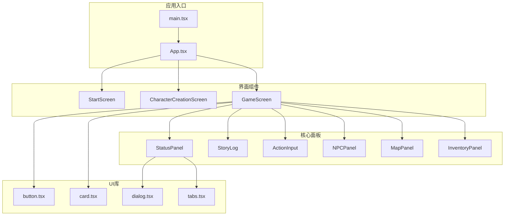
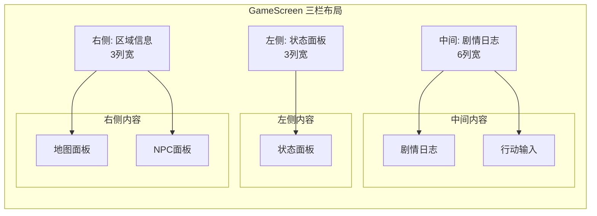
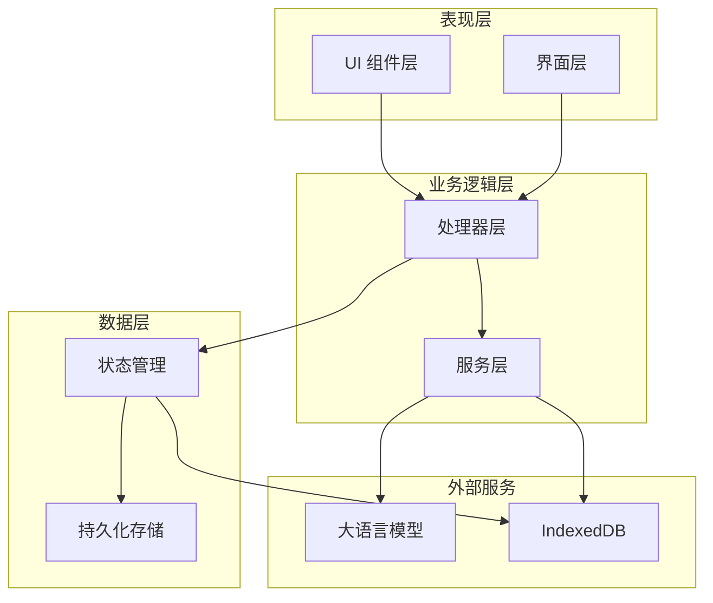
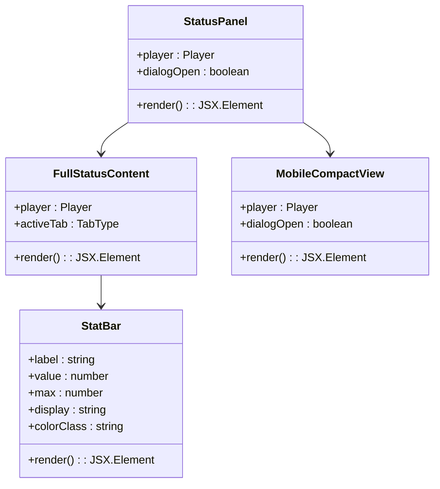
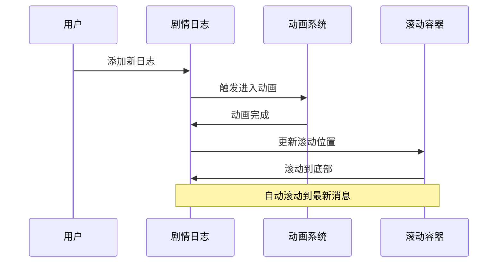
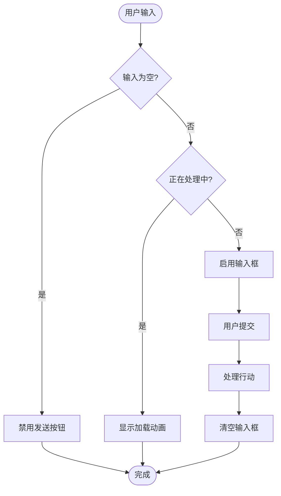
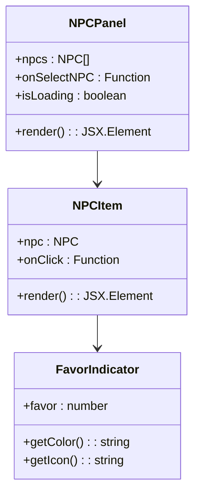
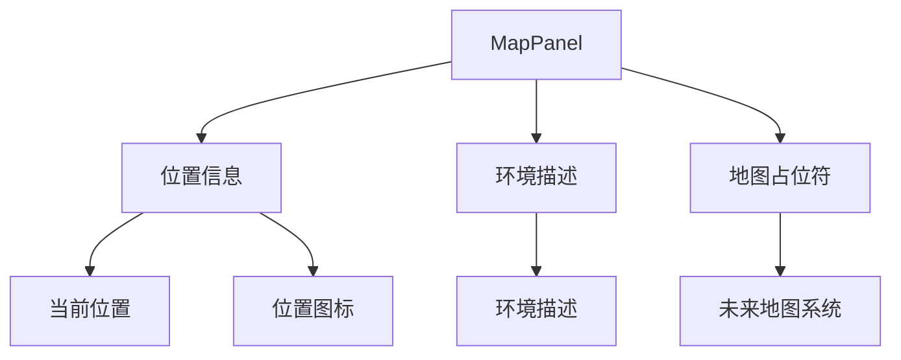
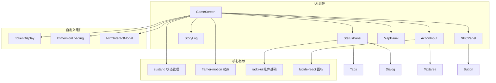

# 用户界面系统

<cite>
**本文档引用的文件**
- [App.tsx](file://src/App.tsx)
- [main.tsx](file://src/main.tsx)
- [GameScreen.tsx](file://src/components/GameScreen.tsx)
- [CharacterCreationScreen.tsx](file://src/components/CharacterCreationScreen.tsx)
- [StatusPanel.tsx](file://src/components/StatusPanel.tsx)
- [StoryLog.tsx](file://src/components/StoryLog.tsx)
- [ActionInput.tsx](file://src/components/ActionInput.tsx)
- [NPCPanel.tsx](file://src/components/NPCPanel.tsx)
- [MapPanel.tsx](file://src/components/MapPanel.tsx)
- [InventoryPanel.tsx](file://src/components/InventoryPanel.tsx)
- [button.tsx](file://src/components/ui/button.tsx)
- [card.tsx](file://src/components/ui/card.tsx)
- [dialog.tsx](file://src/components/ui/dialog.tsx)
- [tabs.tsx](file://src/components/ui/tabs.tsx)
- [useGameStore.ts](file://src/stores/useGameStore.ts)
</cite>

## 目录
1. [简介](#简介)
2. [项目结构](#项目结构)
3. [核心组件](#核心组件)
4. [架构概览](#架构概览)
5. [详细组件分析](#详细组件分析)
6. [依赖关系分析](#依赖关系分析)
7. [性能考虑](#性能考虑)
8. [故障排除指南](#故障排除指南)
9. [结论](#结论)
10. [附录](#附录)

## 简介

修仙 Roguelike 游戏的用户界面系统采用基于 React 的组件化设计，构建了一个沉浸式的修仙体验。该系统以 shadcn/ui 组件库为核心，结合 TailwindCSS 实现响应式设计，为玩家提供完整的修仙之旅交互界面。

系统主要包含三个核心游戏阶段：主页启动界面、角色创建界面和游戏主界面。每个界面都经过精心设计，确保在不同设备上都能提供优质的用户体验。

## 项目结构

项目采用模块化的组件组织方式，所有 UI 组件位于 `src/components` 目录下，核心组件包括：



**图表来源**
- [main.tsx](file://src/main.tsx#L1-L11)
- [App.tsx](file://src/App.tsx#L1-L588)
- [GameScreen.tsx](file://src/components/GameScreen.tsx#L1-L172)

**章节来源**
- [main.tsx](file://src/main.tsx#L1-L11)
- [App.tsx](file://src/App.tsx#L1-L588)

## 核心组件

### 游戏屏幕 GameScreen

GameScreen 是整个游戏的核心界面，采用三栏布局设计，实现了高度的响应式适配：



**图表来源**
- [GameScreen.tsx](file://src/components/GameScreen.tsx#L107-L153)

### 角色创建界面

角色创建界面采用多步骤向导设计，包含三个主要步骤：

1. **命格初定** - 选择基础属性面板
2. **性格出身** - 选择性格、出生地和背景
3. **初始天赋** - 选择初始天赋（最多2个）

每个步骤都有完整的验证和错误处理机制。

**章节来源**
- [CharacterCreationScreen.tsx](file://src/components/CharacterCreationScreen.tsx#L1-L482)

## 架构概览

系统采用分层架构设计，清晰分离了业务逻辑、UI 组件和数据存储：



**图表来源**
- [App.tsx](file://src/App.tsx#L68-L72)
- [useGameStore.ts](file://src/stores/useGameStore.ts#L84-L100)

**章节来源**
- [App.tsx](file://src/App.tsx#L1-L588)
- [useGameStore.ts](file://src/stores/useGameStore.ts#L1-L226)

## 详细组件分析

### 状态面板 StatusPanel

状态面板是角色信息展示的核心组件，采用了桌面端完整版本和移动端简化版本的双模式设计：



**图表来源**
- [StatusPanel.tsx](file://src/components/StatusPanel.tsx#L14-L119)
- [StatusPanel.tsx](file://src/components/StatusPanel.tsx#L122-L205)

#### 标签页系统

状态面板内置了四个标签页，每个标签页负责不同的信息展示：

| 标签页 | 内容类型 | 功能描述 |
|--------|----------|----------|
| 属性 | 基础属性 | 显示气血、真气、攻击、防御等核心属性 |
| 背包 | 物品管理 | 展示角色拥有的各种物品 |
| 功法 | 技能系统 | 显示已学会的修仙功法 |
| 关系 | 社交系统 | 展示与其他NPC的关系状态 |

**章节来源**
- [StatusPanel.tsx](file://src/components/StatusPanel.tsx#L171-L203)

### 剧情日志 StoryLog

剧情日志组件实现了智能滚动和多种消息类型的差异化展示：



**图表来源**
- [StoryLog.tsx](file://src/components/StoryLog.tsx#L13-L20)
- [StoryLog.tsx](file://src/components/StoryLog.tsx#L41-L46)

#### 消息类型系统

| 消息类型 | 颜色主题 | 对齐方式 | 功能用途 |
|----------|----------|----------|----------|
| 行动 | 靛蓝色 | 右对齐 | 玩家主动输入的行动 |
| 剧情 | 翡翠色 | 左对齐 | AI生成的剧情内容 |
| 对话 | 琥珀色 | 左对齐 | NPC对话内容 |
| 系统 | 灰色 | 居中 | 系统提示和通知 |

**章节来源**
- [StoryLog.tsx](file://src/components/StoryLog.tsx#L53-L164)

### 行动输入 ActionInput

行动输入组件提供了智能的建议系统和流畅的交互体验：



**图表来源**
- [ActionInput.tsx](file://src/components/ActionInput.tsx#L17-L28)
- [ActionInput.tsx](file://src/components/ActionInput.tsx#L33-L91)

#### 建议系统

行动输入组件集成了智能建议功能，根据当前游戏状态提供相关的行动建议：

- **桌面端**：建议项以网格形式垂直排列
- **移动端**：建议项以水平滚动列表形式展示
- **动态更新**：建议内容会根据游戏进程实时更新

**章节来源**
- [ActionInput.tsx](file://src/components/ActionInput.tsx#L14-L146)

### NPC 面板 NPCPanel

NPC 面板展示了当前区域内的所有可交互角色：



**图表来源**
- [NPCPanel.tsx](file://src/components/NPCPanel.tsx#L11-L99)

#### 状态管理

NPC 面板支持三种不同的显示状态：

1. **加载状态**：显示占位符动画
2. **空状态**：提示当前无可用NPC
3. **正常状态**：展示所有可交互NPC

**章节来源**
- [NPCPanel.tsx](file://src/components/NPCPanel.tsx#L11-L99)

### 地图面板 MapPanel

地图面板目前提供基础的位置信息展示，为未来的完整地图系统预留接口：



**图表来源**
- [MapPanel.tsx](file://src/components/MapPanel.tsx#L8-L44)

**章节来源**
- [MapPanel.tsx](file://src/components/MapPanel.tsx#L1-L45)

## 依赖关系分析

系统采用模块化设计，各组件之间的依赖关系清晰明确：



**图表来源**
- [GameScreen.tsx](file://src/components/GameScreen.tsx#L1-L172)
- [StatusPanel.tsx](file://src/components/StatusPanel.tsx#L1-L503)

**章节来源**
- [GameScreen.tsx](file://src/components/GameScreen.tsx#L1-L172)
- [StatusPanel.tsx](file://src/components/StatusPanel.tsx#L1-L503)

## 性能考虑

### 动画优化

系统大量使用了 Framer Motion 进行动画处理，通过以下方式优化性能：

- **延迟加载**：不同面板采用不同的动画延迟，创造层次感但不阻塞渲染
- **条件动画**：仅在需要时触发动画，避免不必要的重绘
- **硬件加速**：利用 transform 和 opacity 属性实现 GPU 加速

### 状态管理优化

使用 Zustand 替代 Redux，提供了更好的性能和更简洁的 API：

- **原子化状态**：将状态分割为独立的 store，减少不必要的重渲染
- **选择器模式**：允许组件只订阅需要的状态变化
- **持久化存储**：自动处理本地存储，减少重复计算

### 响应式设计

系统采用 TailwindCSS 的响应式断点，确保在不同设备上的最佳体验：

- **移动优先**：默认针对小屏幕优化
- **弹性布局**：使用 CSS Grid 和 Flexbox 实现自适应布局
- **性能优先**：避免使用昂贵的 CSS 属性

## 故障排除指南

### 常见问题及解决方案

#### 组件渲染问题

**问题**：某些组件在切换时出现闪烁或渲染异常
**解决方案**：
1. 检查组件的 key 属性是否正确设置
2. 确保动画组件的初始状态正确
3. 验证 props 的传递是否完整

#### 状态同步问题

**问题**：UI 状态与实际状态不一致
**解决方案**：
1. 检查 Zustand store 的更新方法
2. 确认组件是否正确订阅了相关状态
3. 验证异步操作的错误处理

#### 性能问题

**问题**：页面滚动卡顿或动画不流畅
**解决方案**：
1. 检查是否有过多的 re-render
2. 优化大型列表的虚拟化
3. 减少不必要的状态更新

**章节来源**
- [useGameStore.ts](file://src/stores/useGameStore.ts#L84-L200)

## 结论

修仙 Roguelike 的用户界面系统展现了现代 React 开发的最佳实践。通过合理的组件拆分、清晰的架构设计和优秀的性能优化，为玩家提供了沉浸式的修仙体验。

系统的成功之处在于：

1. **模块化设计**：每个组件职责单一，易于维护和测试
2. **响应式架构**：完美适配不同设备和屏幕尺寸
3. **性能优化**：通过多种技术手段确保流畅的用户体验
4. **可扩展性**：为未来的功能扩展预留了充足的空间

## 附录

### 组件使用示例

#### 基本使用模式

```typescript
// 在父组件中使用 GameScreen
<GameScreen
  player={player}
  world={world}
  logs={logs}
  isLoading={isLoading}
  suggestions={actionSuggestions}
  onActionSubmit={handleActionSubmit}
  onReturnHome={handleReturnHome}
/>
```

#### 自定义样式

系统支持通过 TailwindCSS 类名进行样式定制：

```typescript
// 修改按钮样式
<Button className="custom-button-style">自定义按钮</Button>

// 修改卡片样式
<Card className="custom-card-style">自定义卡片</Card>
```

### 最佳实践

1. **组件设计**：保持单一职责原则，避免过度复杂的组件
2. **状态管理**：合理划分状态，避免全局状态污染
3. **性能优化**：使用 memoization 和懒加载技术
4. **错误处理**：为异步操作提供完善的错误处理机制
5. **可访问性**：确保组件对辅助技术友好