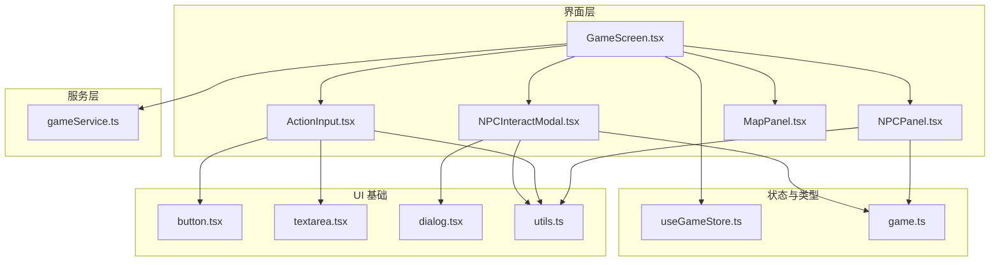
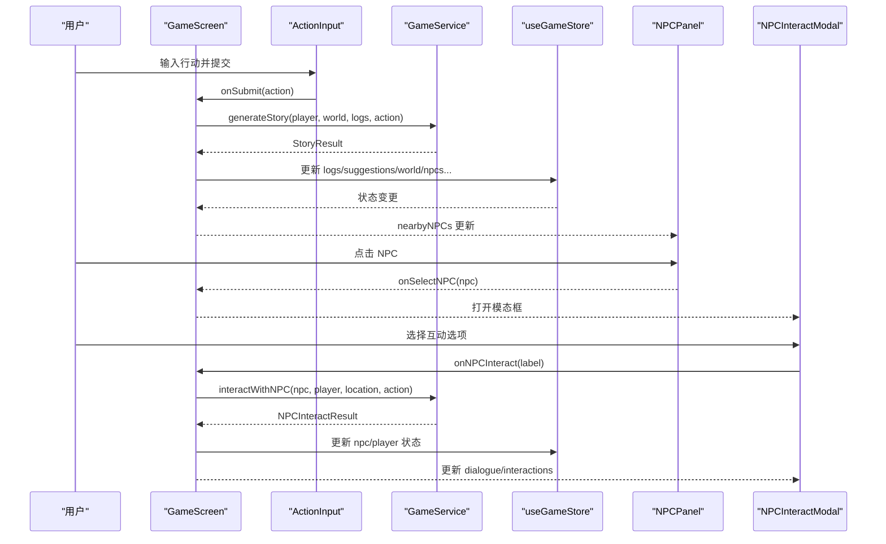
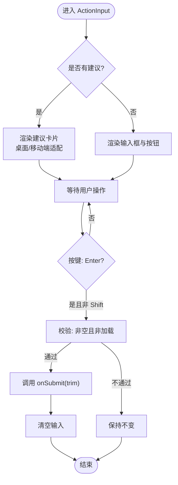
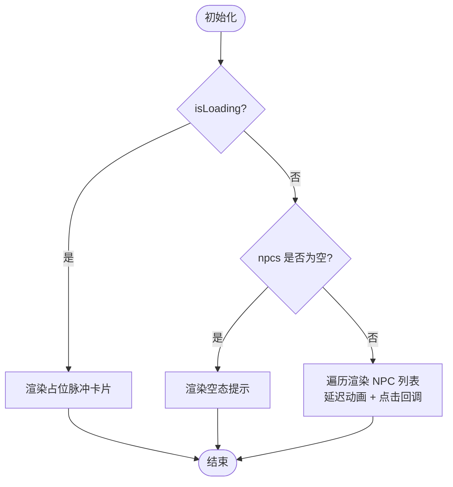
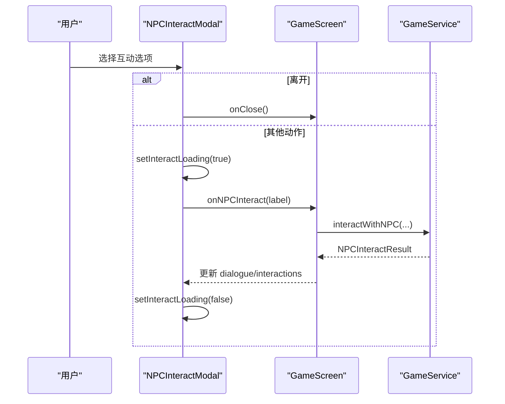
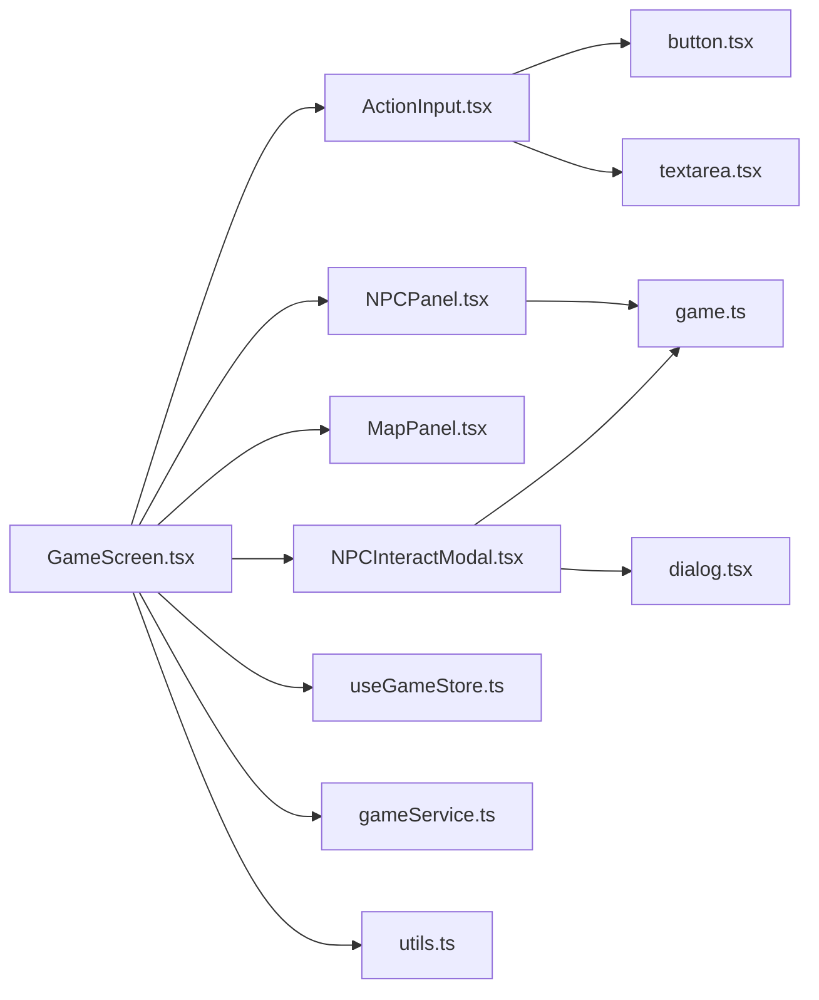

# 行动与 NPC 交互

<cite>
**本文引用的文件**
- [ActionInput.tsx](file://src/components/ActionInput.tsx)
- [NPCPanel.tsx](file://src/components/NPCPanel.tsx)
- [NPCInteractModal.tsx](file://src/components/NPCInteractModal.tsx)
- [MapPanel.tsx](file://src/components/MapPanel.tsx)
- [GameScreen.tsx](file://src/components/GameScreen.tsx)
- [useGameStore.ts](file://src/stores/useGameStore.ts)
- [game.ts](file://src/types/game.ts)
- [gameService.ts](file://src/services/gameService.ts)
- [dialog.tsx](file://src/components/ui/dialog.tsx)
- [button.tsx](file://src/components/ui/button.tsx)
- [textarea.tsx](file://src/components/ui/textarea.tsx)
- [utils.ts](file://src/lib/utils.ts)
</cite>

## 目录
1. [简介](#简介)
2. [项目结构](#项目结构)
3. [核心组件](#核心组件)
4. [架构总览](#架构总览)
5. [组件详解](#组件详解)
6. [依赖关系分析](#依赖关系分析)
7. [性能考量](#性能考量)
8. [故障排查指南](#故障排查指南)
9. [结论](#结论)
10. [附录](#附录)

## 简介
本文件面向 UI 开发者，系统性梳理“修仙 Roguelike”中“行动输入与 NPC 交互”的前端实现与使用指南。重点覆盖：
- ActionInput 的智能提示、输入验证、快捷指令支持
- NPCPanel 的 NPC 列表展示、选择交互、状态标识
- NPCInteractModal 的模态框设计、互动选项、结果反馈
- MapPanel 的位置信息展示与导航辅助
并提供交互状态管理、错误处理、用户体验优化策略，以及组件集成与扩展方案。

## 项目结构
围绕行动与 NPC 交互的关键文件组织如下：
- 组件层：ActionInput、NPCPanel、NPCInteractModal、MapPanel、GameScreen
- 类型与状态：game.ts（类型）、useGameStore.ts（Zustand 状态）、gameService.ts（业务服务）
- UI 基础：button、textarea、dialog 等通用 UI 组件
- 工具：utils.ts（类名合并）

图表来源
- [GameScreen.tsx](file://src/components/GameScreen.tsx#L1-L172)
- [ActionInput.tsx](file://src/components/ActionInput.tsx#L1-L146)
- [NPCPanel.tsx](file://src/components/NPCPanel.tsx#L1-L99)
- [NPCInteractModal.tsx](file://src/components/NPCInteractModal.tsx#L1-L223)
- [MapPanel.tsx](file://src/components/MapPanel.tsx#L1-L45)
- [useGameStore.ts](file://src/stores/useGameStore.ts#L1-L226)
- [game.ts](file://src/types/game.ts#L1-L319)
- [gameService.ts](file://src/services/gameService.ts#L1-L541)
- [button.tsx](file://src/components/ui/button.tsx#L1-L57)
- [textarea.tsx](file://src/components/ui/textarea.tsx#L1-L23)
- [dialog.tsx](file://src/components/ui/dialog.tsx#L1-L121)
- [utils.ts](file://src/lib/utils.ts#L1-L7)

章节来源
- [GameScreen.tsx](file://src/components/GameScreen.tsx#L1-L172)
- [useGameStore.ts](file://src/stores/useGameStore.ts#L1-L226)

## 核心组件
- ActionInput：提供输入框、发送按钮、智能提示卡片、快捷键提示与加载态反馈
- NPCPanel：展示附近 NPC 列表，支持点击选择、加载占位、好感度图标与等级
- NPCInteractModal：NPC 互动模态框，含头像/身份/描述、好感度条、对话区域、互动选项网格
- MapPanel：当前区域信息与占位地图块
- GameScreen：三栏布局承载上述组件，并注入状态与回调

章节来源
- [ActionInput.tsx](file://src/components/ActionInput.tsx#L1-L146)
- [NPCPanel.tsx](file://src/components/NPCPanel.tsx#L1-L99)
- [NPCInteractModal.tsx](file://src/components/NPCInteractModal.tsx#L1-L223)
- [MapPanel.tsx](file://src/components/MapPanel.tsx#L1-L45)
- [GameScreen.tsx](file://src/components/GameScreen.tsx#L1-L172)

## 架构总览
整体交互链路：用户在 ActionInput 输入行动 → GameScreen 触发 onActionSubmit → 通过 gameService 生成剧情结果 → useGameStore 更新状态 → GameScreen 重新渲染 → NPCPanel 展示附近 NPC → 用户选择 NPC 打开 NPCInteractModal → onNPCInteract 调用 gameService 进行 NPC 交互 → 更新对话与可用互动 → 关闭模态框。

图表来源
- [GameScreen.tsx](file://src/components/GameScreen.tsx#L126-L168)
- [ActionInput.tsx](file://src/components/ActionInput.tsx#L17-L21)
- [gameService.ts](file://src/services/gameService.ts#L284-L391)
- [useGameStore.ts](file://src/stores/useGameStore.ts#L84-L206)
- [NPCPanel.tsx](file://src/components/NPCPanel.tsx#L64-L93)
- [NPCInteractModal.tsx](file://src/components/NPCInteractModal.tsx#L37-L54)

## 组件详解

### ActionInput：智能提示、输入验证与快捷指令
- 智能提示
  - 通过 props.suggestions 动态渲染一组快捷建议按钮，桌面端换行、移动端横向滚动，配合动画入场
  - 建议项点击直接调用 onSubmit，受 isLoading 控制禁用
- 输入验证与快捷指令
  - Enter 提交（Shift+Enter 保留换行），空字符串或加载中禁用发送
  - 发送按钮在禁用时移除缩放动画，保持视觉一致性
- 加载态与底部提示
  - isLoading 时显示旋转加载指示与“请稍候”提示
  - 底部提示区分加载态与正常态，帮助用户理解交互时机

图表来源
- [ActionInput.tsx](file://src/components/ActionInput.tsx#L17-L28)
- [ActionInput.tsx](file://src/components/ActionInput.tsx#L95-L106)
- [ActionInput.tsx](file://src/components/ActionInput.tsx#L129-L142)

章节来源
- [ActionInput.tsx](file://src/components/ActionInput.tsx#L1-L146)

### NPCPanel：列表展示、选择交互与状态标识
- 列表渲染
  - 支持 loading 占位（脉冲动画矩形）与空态提示
  - 正常状态下按序号延迟动画渲染，点击触发 onSelectNPC 回调
- 状态标识
  - 使用 getFavorColor/getFavorIcon 将数值好感度映射为颜色与图标
  - 展示 NPC 名称、所属门派与副门派，emoji 作为头像占位
- 可访问性与体验
  - hover/active 状态统一过渡，移动端触摸反馈明确

图表来源
- [NPCPanel.tsx](file://src/components/NPCPanel.tsx#L11-L31)
- [NPCPanel.tsx](file://src/components/NPCPanel.tsx#L33-L48)
- [NPCPanel.tsx](file://src/components/NPCPanel.tsx#L64-L93)
- [game.ts](file://src/types/game.ts#L287-L319)

章节来源
- [NPCPanel.tsx](file://src/components/NPCPanel.tsx#L1-L99)
- [game.ts](file://src/types/game.ts#L173-L203)

### NPCInteractModal：模态框设计、互动选项与结果反馈
- 结构组成
  - 头部：NPC 头像/名称/身份/描述
  - 好感度条：数值与等级映射，动画过渡
  - 对话区域：首次打开显示描述与性格，交互后显示 NPC 回复
  - 互动选项：网格布局，支持启用/禁用、原因提示、图标映射
- 交互流程
  - handleInteract 支持“离开”快捷路径，其余动作通过 onInteract 异步获取结果
  - 成功后更新 dialogue、possibleInteractions、hasInteracted，失败捕获错误
- 动画与反馈
  - 背景遮罩与弹框居中，进入/退出动画
  - 加载态显示旋转指示器

图表来源
- [NPCInteractModal.tsx](file://src/components/NPCInteractModal.tsx#L37-L54)
- [NPCInteractModal.tsx](file://src/components/NPCInteractModal.tsx#L166-L215)
- [gameService.ts](file://src/services/gameService.ts#L416-L469)

章节来源
- [NPCInteractModal.tsx](file://src/components/NPCInteractModal.tsx#L1-L223)
- [gameService.ts](file://src/services/gameService.ts#L416-L469)

### MapPanel：位置信息展示与导航辅助
- 当前区域信息
  - 显示地点名称与可选描述，左侧使用定位图标
- 导航辅助
  - 占位区域标注“地图系统开发中”，为后续完整地图留接口
- 与 GameScreen 集成
  - 从 world.currentLocation 与 world.locationDescription 注入

章节来源
- [MapPanel.tsx](file://src/components/MapPanel.tsx#L1-L45)
- [GameScreen.tsx](file://src/components/GameScreen.tsx#L141-L144)

## 依赖关系分析
- 组件耦合
  - GameScreen 作为容器，聚合 ActionInput、NPCPanel、MapPanel、NPCInteractModal，并通过 props 传递状态与回调
  - NPCInteractModal 依赖 game.ts 的类型定义与 UI 基础组件
- 状态与数据流
  - useGameStore 维护 player、world、npcs、logs、turn、isPlaying、isLoading、selectedNPCId、isNPCInteracting 等
  - gameService 提供 generateStory 与 interactWithNPC，负责与 LLM 交互并写入记忆
- 外部依赖
  - Radix UI Dialog 用于模态框基础能力
  - Framer Motion 提供动画与过渡
  - Tailwind CSS + 自定义变量提供主题与样式

图表来源
- [GameScreen.tsx](file://src/components/GameScreen.tsx#L1-L172)
- [ActionInput.tsx](file://src/components/ActionInput.tsx#L1-L146)
- [NPCPanel.tsx](file://src/components/NPCPanel.tsx#L1-L99)
- [NPCInteractModal.tsx](file://src/components/NPCInteractModal.tsx#L1-L223)
- [MapPanel.tsx](file://src/components/MapPanel.tsx#L1-L45)
- [useGameStore.ts](file://src/stores/useGameStore.ts#L1-L226)
- [gameService.ts](file://src/services/gameService.ts#L1-L541)
- [game.ts](file://src/types/game.ts#L1-L319)
- [button.tsx](file://src/components/ui/button.tsx#L1-L57)
- [textarea.tsx](file://src/components/ui/textarea.tsx#L1-L23)
- [dialog.tsx](file://src/components/ui/dialog.tsx#L1-L121)
- [utils.ts](file://src/lib/utils.ts#L1-L7)

章节来源
- [useGameStore.ts](file://src/stores/useGameStore.ts#L1-L226)
- [gameService.ts](file://src/services/gameService.ts#L1-L541)
- [game.ts](file://src/types/game.ts#L1-L319)

## 性能考量
- 渲染优化
  - ActionInput 的建议项使用延迟动画，避免一次性大量节点渲染造成卡顿
  - NPCPanel 使用分页滚动条与固定高度，控制列表渲染范围
- 状态更新
  - useGameStore 仅持久化必要字段，减少序列化体积
  - 通过 setSelectedNPC 与 setNPCInteracting 精准切换交互态，避免全局重绘
- 动画与资源
  - 模态框与按钮使用轻量动画，避免复杂滤镜
  - 文本域与按钮组件采用最小化样式，减少重排
- I/O 与并发
  - NPC 交互与剧情生成均在异步流程中进行，避免阻塞 UI
  - 建议在上层增加节流/去抖，防止高频提交导致服务压力

[本节为通用指导，无需特定文件引用]

## 故障排查指南
- 输入无法提交
  - 检查 ActionInput 的 isLoading 与输入是否为空
  - 确认 onSubmit 回调是否正确传入 GameScreen
- NPC 列表空白或闪烁
  - 确认 nearbyNPCs 是否由 useGameStore.updateNearbyNPCs 正确更新
  - 检查 NPCPanel 的 isLoading 逻辑与空态渲染
- 互动无响应
  - 检查 onNPCInteract 是否返回 Promise<NPCInteractResult>
  - 确认 gameService.interactWithNPC 的调用与返回结构
- 模态框无法关闭
  - 确认 onClose 回调是否正确设置 isNPCInteracting 为 false
- 好感度显示异常
  - 检查 getFavorColor/getFavorLevel 的数值边界与映射逻辑

章节来源
- [ActionInput.tsx](file://src/components/ActionInput.tsx#L17-L21)
- [NPCPanel.tsx](file://src/components/NPCPanel.tsx#L11-L31)
- [NPCInteractModal.tsx](file://src/components/NPCInteractModal.tsx#L37-L54)
- [useGameStore.ts](file://src/stores/useGameStore.ts#L191-L205)
- [game.ts](file://src/types/game.ts#L287-L319)

## 结论
本交互系统以 GameScreen 为中心，通过 ActionInput、NPCPanel、MapPanel 与 NPCInteractModal 实现“输入—剧情—NPC—互动”的完整闭环。借助 useGameStore 与 gameService，系统实现了状态驱动与 LLM 驱动的混合交互模式。通过合理的动画、状态管理与错误兜底，既保证了流畅体验，也为后续扩展（如完整地图、更多互动类型）提供了清晰的接口与路径。

[本节为总结，无需特定文件引用]

## 附录

### 交互状态管理要点
- 选择 NPC：setSelectedNPC → GameScreen onSelectNPC → 打开 NPCInteractModal
- 交互中：setNPCInteracting=true → 模态框开启 → onNPCInteract 异步更新
- 交互结束：关闭模态框 → setNPCInteracting=false

章节来源
- [useGameStore.ts](file://src/stores/useGameStore.ts#L191-L194)
- [GameScreen.tsx](file://src/components/GameScreen.tsx#L163-L168)

### 组件集成与扩展建议
- 新增互动类型
  - 在 game.ts 的 NPCInteractionType 与 interactionIcons 中补充类型与图标
  - 在 NPCInteractModal 的网格渲染中自动支持新类型
- 自定义建议
  - 在 GameScreen 中根据上下文动态计算 suggestions 并传入 ActionInput
- 动画与主题
  - 通过 utils.cn 合并类名，统一主题色与边框色变量
- 可访问性
  - 为按钮添加 aria-label，确保键盘可达性与屏幕阅读器友好

章节来源
- [NPCInteractModal.tsx](file://src/components/NPCInteractModal.tsx#L14-L22)
- [NPCInteractModal.tsx](file://src/components/NPCInteractModal.tsx#L172-L194)
- [utils.ts](file://src/lib/utils.ts#L4-L6)