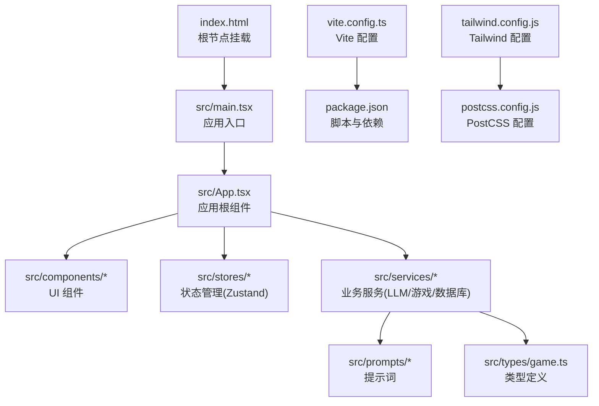
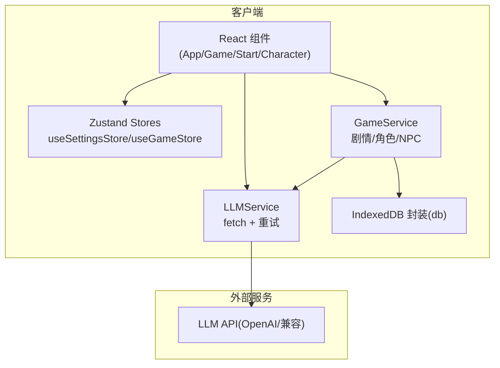
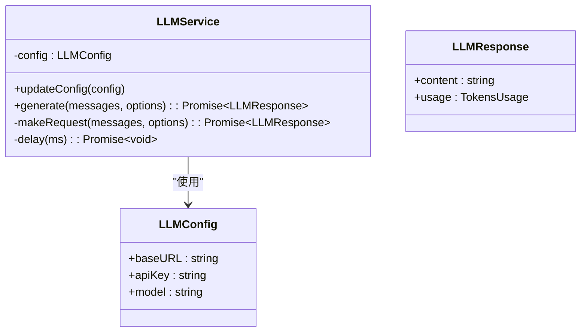
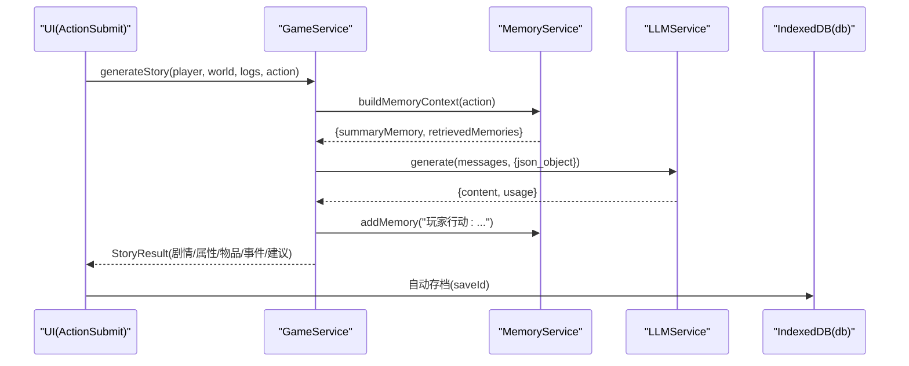
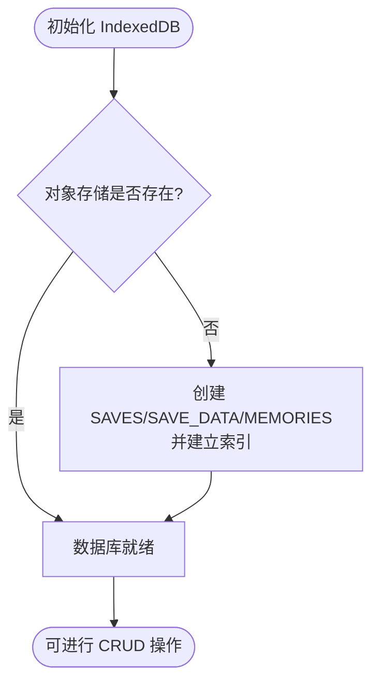
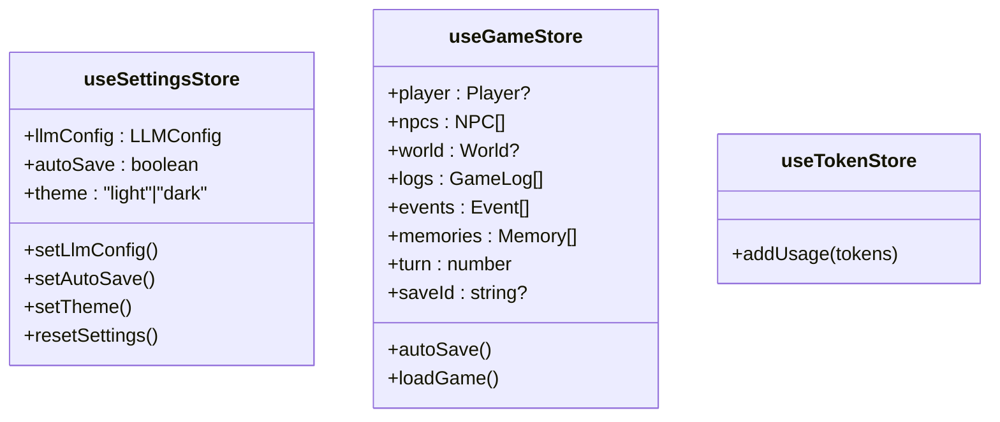
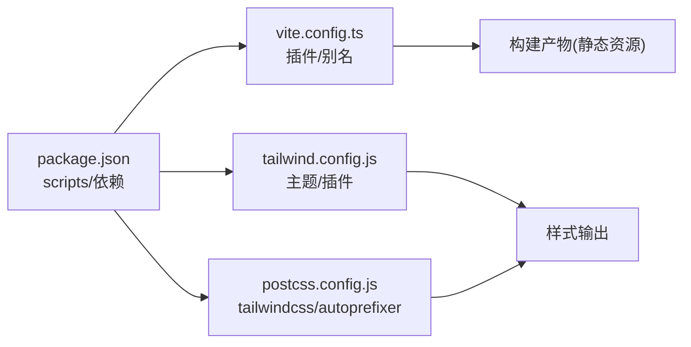

# 部署运维

<cite>
**本文引用的文件**
- [package.json](file://package.json)
- [vite.config.ts](file://vite.config.ts)
- [README.md](file://README.md)
- [tailwind.config.js](file://tailwind.config.js)
- [postcss.config.js](file://postcss.config.js)
- [index.html](file://index.html)
- [src/main.tsx](file://src/main.tsx)
- [src/App.tsx](file://src/App.tsx)
- [src/services/llmService.ts](file://src/services/llmService.ts)
- [src/services/gameService.ts](file://src/services/gameService.ts)
- [src/services/db.ts](file://src/services/db.ts)
- [src/stores/useSettingsStore.ts](file://src/stores/useSettingsStore.ts)
- [src/stores/useGameStore.ts](file://src/stores/useGameStore.ts)
- [src/tokens/useTokenStore.ts](file://src/stores/useTokenStore.ts)
- [src/types/game.ts](file://src/types/game.ts)
- [AGENTS.md](file://AGENTS.md)
</cite>

## 目录
1. [简介](#简介)
2. [项目结构](#项目结构)
3. [核心组件](#核心组件)
4. [架构总览](#架构总览)
5. [详细组件分析](#详细组件分析)
6. [依赖分析](#依赖分析)
7. [性能考虑](#性能考虑)
8. [故障排除指南](#故障排除指南)
9. [结论](#结论)
10. [附录](#附录)

## 简介
本项目是一个纯前端的修仙主题 Roguelike 游戏，完全由 LLM 实时驱动游戏内容生成。项目采用 Vite + React 18 + TypeScript 技术栈，使用 TailwindCSS + shadcn/ui 进行界面设计，Zustand 管理状态，浏览器本地存储（localStorage + IndexedDB）实现存档与记忆持久化。由于为纯前端应用，可直接部署到任意静态托管平台（如 Vercel、GitHub Pages、Netlify、Cloudflare Pages、AWS S3 等），无需额外后端。

## 项目结构
- 源代码位于 src 目录，包含组件、服务、类型、状态管理、提示词与工具函数。
- 构建工具使用 Vite，配置了别名 @ 指向 src。
- 样式使用 TailwindCSS，PostCSS 自动注入。
- 入口文件 index.html 仅包含挂载点与基础 meta 信息。

图表来源
- [index.html](file://index.html#L1-L14)
- [src/main.tsx](file://src/main.tsx#L1-L11)
- [src/App.tsx](file://src/App.tsx#L1-L588)
- [vite.config.ts](file://vite.config.ts#L1-L12)
- [package.json](file://package.json#L1-L55)
- [tailwind.config.js](file://tailwind.config.js#L1-L53)
- [postcss.config.js](file://postcss.config.js#L1-L7)

章节来源
- [README.md](file://README.md#L77-L97)
- [AGENTS.md](file://AGENTS.md#L225-L283)

## 核心组件
- 应用入口与根组件：负责主题切换、全局状态初始化、IndexedDB 初始化、LLM 服务与游戏服务创建、自动存档与错误提示。
- 状态管理：
  - useSettingsStore：管理 LLM 配置（baseURL、apiKey、model）、自动存档开关、主题等，持久化至 localStorage。
  - useGameStore：管理玩家、NPC、世界、日志、事件、记忆、回合数等游戏状态，持久化部分字段至 localStorage。
  - useTokenStore：记录 LLM 请求的 token 使用量，便于成本控制与监控。
- 服务层：
  - LLMService：封装 LLM API 调用，支持重试与指数退避、请求参数与响应解析。
  - GameService：整合 LLM 与记忆系统，生成角色、剧情、NPC 交互、区域 NPC 等。
  - db：IndexedDB 封装，提供存档、记忆的增删查改。
- 类型系统：集中定义玩家、NPC、世界、事件、记忆、LLM 配置等类型。

章节来源
- [src/App.tsx](file://src/App.tsx#L1-L588)
- [src/stores/useSettingsStore.ts](file://src/stores/useSettingsStore.ts#L1-L46)
- [src/stores/useGameStore.ts](file://src/stores/useGameStore.ts#L1-L226)
- [src/services/llmService.ts](file://src/services/llmService.ts#L1-L101)
- [src/services/gameService.ts](file://src/services/gameService.ts#L1-L541)
- [src/services/db.ts](file://src/services/db.ts#L1-L236)
- [src/types/game.ts](file://src/types/game.ts#L1-L319)

## 架构总览
应用为纯前端架构，构建产物为静态资源，部署到任意静态托管平台即可运行。运行时通过 LLMService 调用外部 LLM API，使用 GameService 组织提示词与上下文，结合记忆系统与 IndexedDB 实现存档与体验延续。

图表来源
- [src/App.tsx](file://src/App.tsx#L1-L588)
- [src/services/llmService.ts](file://src/services/llmService.ts#L1-L101)
- [src/services/gameService.ts](file://src/services/gameService.ts#L1-L541)
- [src/services/db.ts](file://src/services/db.ts#L1-L236)

## 详细组件分析

### LLMService 组件分析
- 功能要点
  - 统一封装 LLM 调用，支持温度、最大 token、响应格式等参数。
  - 内置重试机制（最多 3 次，指数退避），提升网络波动下的稳定性。
  - 统一解析响应，提取 content 与 usage，便于成本统计。
- 错误处理
  - 对非 OK 响应抛出错误，包含状态码与错误文本。
  - 多次重试失败后汇总最后一次错误原因。
- 性能与可靠性
  - 通过重试与退避降低瞬时失败率。
  - 建议在 CI/CD 中配置 LLM 密钥与模型参数，避免硬编码。

图表来源
- [src/services/llmService.ts](file://src/services/llmService.ts#L1-L101)
- [src/types/game.ts](file://src/types/game.ts#L253-L257)

章节来源
- [src/services/llmService.ts](file://src/services/llmService.ts#L1-L101)

### GameService 组件分析
- 功能要点
  - 角色生成：基于提示词生成多个候选角色，确保字段完整性。
  - 剧情生成：整合工作记忆、摘要记忆与检索记忆，构建上下文，生成事件与属性变化。
  - NPC 交互：根据玩家行为与 NPC 特性生成对话与状态变化。
  - 区域 NPC 生成：按地点特征生成符合情境的 NPC。
  - Token 记录：将 prompt/completion/total tokens 记录到 useTokenStore。
- 数据流
  - 输入：玩家、世界、日志、动作。
  - 处理：构建记忆上下文 → LLM 生成 → 结果解析 → 记录记忆 → 返回结果。
- 错误处理
  - 未初始化时抛错；LLM 生成异常时捕获并记录，保证 UI 流畅。

图表来源
- [src/services/gameService.ts](file://src/services/gameService.ts#L283-L391)
- [src/services/llmService.ts](file://src/services/llmService.ts#L29-L55)
- [src/services/db.ts](file://src/services/db.ts#L134-L150)

章节来源
- [src/services/gameService.ts](file://src/services/gameService.ts#L1-L541)

### IndexedDB 封装（db）组件分析
- 功能要点
  - 管理三类对象存储：SAVES、SAVE_DATA、MEMORIES。
  - 提供存档元数据、存档数据、记忆的增删查改与批量操作。
  - 删除存档时级联清理对应存档数据与记忆。
- 性能与可靠性
  - 通过索引（timestamp、importance）优化查询。
  - 在删除存档时同步清理，避免脏数据。

图表来源
- [src/services/db.ts](file://src/services/db.ts#L36-L72)

章节来源
- [src/services/db.ts](file://src/services/db.ts#L1-L236)

### 状态管理（Zustand）组件分析
- useSettingsStore
  - 默认 LLM 配置来源于 import.meta.env 环境变量，支持在构建时注入。
  - 持久化至 localStorage，确保用户偏好跨会话保留。
- useGameStore
  - 管理游戏核心状态，部分字段持久化至 localStorage。
  - 提供自动存档触发与恢复逻辑。
- useTokenStore
  - 记录 LLM 使用的 token 消耗，便于成本监控与告警。

图表来源
- [src/stores/useSettingsStore.ts](file://src/stores/useSettingsStore.ts#L1-L46)
- [src/stores/useGameStore.ts](file://src/stores/useGameStore.ts#L1-L226)
- [src/stores/useTokenStore.ts](file://src/stores/useTokenStore.ts)

章节来源
- [src/stores/useSettingsStore.ts](file://src/stores/useSettingsStore.ts#L1-L46)
- [src/stores/useGameStore.ts](file://src/stores/useGameStore.ts#L1-L226)

## 依赖分析
- 构建与打包
  - Vite 负责开发服务器与生产构建，支持 React 插件与路径别名。
  - TailwindCSS 与 PostCSS 用于样式处理。
- 运行时依赖
  - React、Zustand、shadcn/ui 组件库、TailwindCSS 工具类。
  - @xenova/transformers（浏览器端嵌入模型，用于记忆检索）。
- 开发与测试
  - Vitest 用于单元测试与覆盖率统计。

图表来源
- [package.json](file://package.json#L1-L55)
- [vite.config.ts](file://vite.config.ts#L1-L12)
- [tailwind.config.js](file://tailwind.config.js#L1-L53)
- [postcss.config.js](file://postcss.config.js#L1-L7)

章节来源
- [package.json](file://package.json#L1-L55)
- [AGENTS.md](file://AGENTS.md#L27-L51)

## 性能考虑
- 构建优化
  - 使用 Vite 的预构建与按需加载，减少首屏体积。
  - TailwindCSS 通过 content 白名单裁剪未使用样式。
- 运行时优化
  - LLM 调用重试与退避，降低失败率。
  - IndexedDB 分离存档与记忆，避免单表过大。
  - Zustand 持久化仅存储必要字段，减少 localStorage 压力。
- CDN 与缓存
  - 静态资源建议开启 CDN 与长期缓存策略，配合版本化文件名。
  - 对于 LLM API，建议在网关层做限流与熔断，避免突发流量压垮上游。

## 故障排除指南
- LLM API 调用失败
  - 现象：生成剧情/角色时报错，UI 显示“天道推演失败”。
  - 排查：检查 LLM 配置（baseURL、apiKey、model）是否正确；查看网络面板与重试日志。
  - 处理：在设置中更新密钥与模型；必要时切换到备用供应商。
- IndexedDB 初始化失败
  - 现象：无法加载/保存存档。
  - 排查：确认浏览器支持 IndexedDB；检查存储配额与权限。
  - 处理：引导用户清除过期缓存或更换浏览器。
- 自动存档未生效
  - 现象：刷新后进度丢失。
  - 排查：确认 useGameStore 的自动存档定时器是否启动；检查 saveId 是否存在。
  - 处理：手动触发存档；检查浏览器隐私模式限制。
- 样式异常
  - 现象：组件样式错位或缺失。
  - 排查：确认 TailwindCSS 配置与 content 路径；检查 PostCSS 注入。
  - 处理：重建项目；核对 Tailwind 版本与插件。

章节来源
- [src/services/llmService.ts](file://src/services/llmService.ts#L37-L55)
- [src/services/db.ts](file://src/services/db.ts#L36-L72)
- [src/stores/useGameStore.ts](file://src/stores/useGameStore.ts#L74-L122)
- [tailwind.config.js](file://tailwind.config.js#L1-L53)

## 结论
本项目为纯前端静态应用，具备良好的可移植性与可扩展性。通过合理的状态管理、本地存储与 LLM 集成，实现了沉浸式的修仙剧情体验。建议在生产部署中重视环境变量管理、CDN 与缓存策略、监控与告警体系，以保障用户体验与运营效率。

## 附录

### 生产环境构建流程
- 本地构建
  - 执行构建脚本生成 dist 静态资源。
- 环境变量注入
  - 在构建时通过环境变量注入 LLM 基础地址、API Key 与模型名称。
- 静态资源优化
  - 启用压缩与 Tree Shaking；TailwindCSS 按需裁剪。
- 部署产物
  - 将 dist 目录上传至所选托管平台。

章节来源
- [package.json](file://package.json#L6-L14)
- [AGENTS.md](file://AGENTS.md#L27-L39)

### 静态资源优化与 CDN 配置
- 建议
  - 开启 gzip 或 brotli 压缩。
  - 使用 CDN 缓存 HTML/CSS/JS，设置较长缓存周期。
  - 对图片与字体启用 WebP/AVIF 与懒加载。
  - 通过版本化文件名实现强缓存与失效策略。
- 安全
  - 配置 HTTPS 与 HSTS。
  - 设置 CSP 与 X-Frame-Options，防范 XSS 与点击劫持。

### 多种部署方案
- Vercel
  - 一键部署：使用仓库链接快速部署，自动拉取环境变量。
  - 自定义域名与 SSL：在平台配置绑定域名与证书。
- GitHub Pages
  - 使用 GitHub Actions 将构建产物推送至 gh-pages 分支。
  - 配置 CNAME 与基础路径（如使用子目录）。
- Netlify
  - 拖拽部署或连接仓库；设置环境变量与重定向规则。
- Cloudflare Pages
  - 连接仓库自动构建；支持边缘缓存与 Workers。
- AWS S3
  - 将构建产物上传至 S3，开启静态网站托管与 CloudFront CDN。
  - 配置 IAM 权限与 CORS；使用 Route 53 或 Alias 记录指向 CDN。

章节来源
- [README.md](file://README.md#L63-L76)

### 环境变量与 API 密钥管理
- 关键变量
  - VITE_LLM_BASE_URL：LLM API 基础地址（默认 OpenAI 兼容）。
  - VITE_LLM_API_KEY：API 密钥（务必使用只读最小权限凭据）。
  - VITE_LLM_MODEL：默认模型名称。
- 管理建议
  - 在 CI/CD 中加密注入，避免提交至仓库。
  - 为不同环境（测试/预发/生产）分别配置密钥与模型。
  - 定期轮换密钥，监控用量与异常峰值。

章节来源
- [src/stores/useSettingsStore.ts](file://src/stores/useSettingsStore.ts#L12-L16)

### 安全策略
- 传输安全
  - 强制 HTTPS；禁用混合内容。
- 存储安全
  - 本地存储仅存放必要配置；敏感数据不落盘。
  - IndexedDB 使用前检查容量与权限。
- API 安全
  - 限制请求频率与并发；对上游 API 做熔断与降级。
  - 对用户输入进行最小化处理，避免提示词注入。

### 性能监控、错误追踪与用户反馈
- 性能监控
  - 使用 useTokenStore 记录 token 使用量，结合成本阈值告警。
  - 前端埋点记录关键操作耗时（角色生成、剧情生成、NPC 交互）。
- 错误追踪
  - 捕获 LLM 调用异常与 IndexedDB 错误，上报至错误平台。
  - 保留最近若干条日志，便于问题复现。
- 用户反馈
  - 在 UI 中集成反馈入口，收集问题与建议。
  - 通过埋点统计用户行为，优化体验。

章节来源
- [src/services/gameService.ts](file://src/services/gameService.ts#L64-L72)
- [src/App.tsx](file://src/App.tsx#L455-L462)

### 自动化部署脚本与 CI/CD 流程
- 建议流程
  - 触发条件：push 到主分支或创建标签。
  - 步骤：安装依赖 → 类型检查 → 单测 → 构建 → 静态扫描 → 上传制品 → 部署到目标平台 → 回滚保护（可选）。
- 平台差异
  - Vercel：自动检测框架与环境变量。
  - GitHub Actions：使用官方构建与部署工作流。
  - Netlify/Cloudflare Pages：通过 CLI 或 API 触发构建。
  - AWS S3：使用 AWS CLI 或 SDK 上传并无效化 CDN 缓存。

### 版本发布策略
- 版本号：遵循语义化版本（主.次.补丁）。
- 发布节奏：热修复紧急发布，功能按周/月发布。
- 回滚策略：保留最近 N 个版本，支持一键回滚。

### 运维最佳实践
- 基础设施
  - 使用 CDN 与就近节点；配置健康检查与自动扩缩容。
- 日志与审计
  - 记录关键事件与错误；保留 30-90 天。
- 容量规划
  - 监控 LLM 调用量与成本；预留缓冲带。
  - IndexedDB 存储容量评估与清理策略。