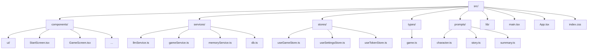
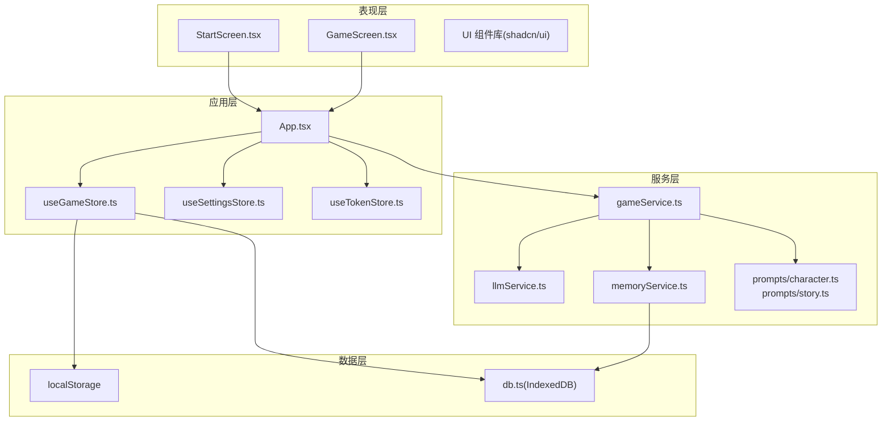
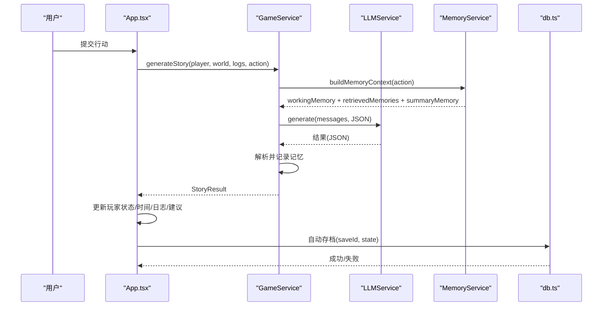
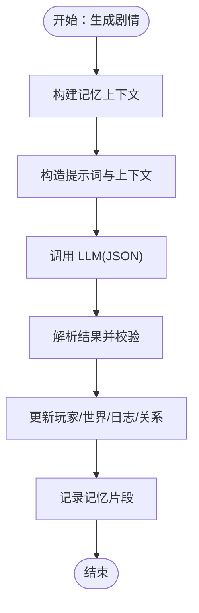
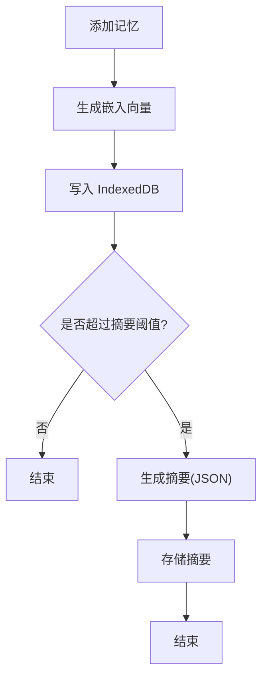
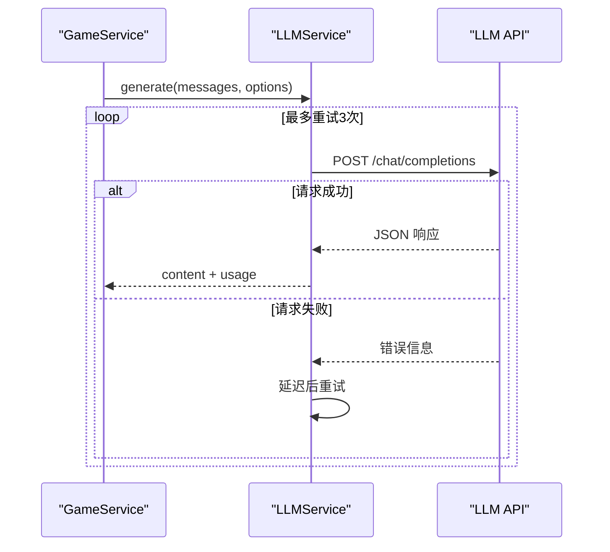
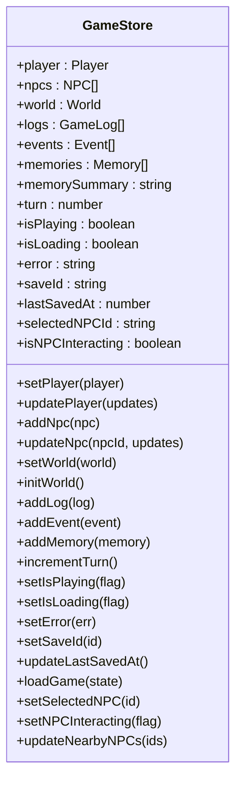
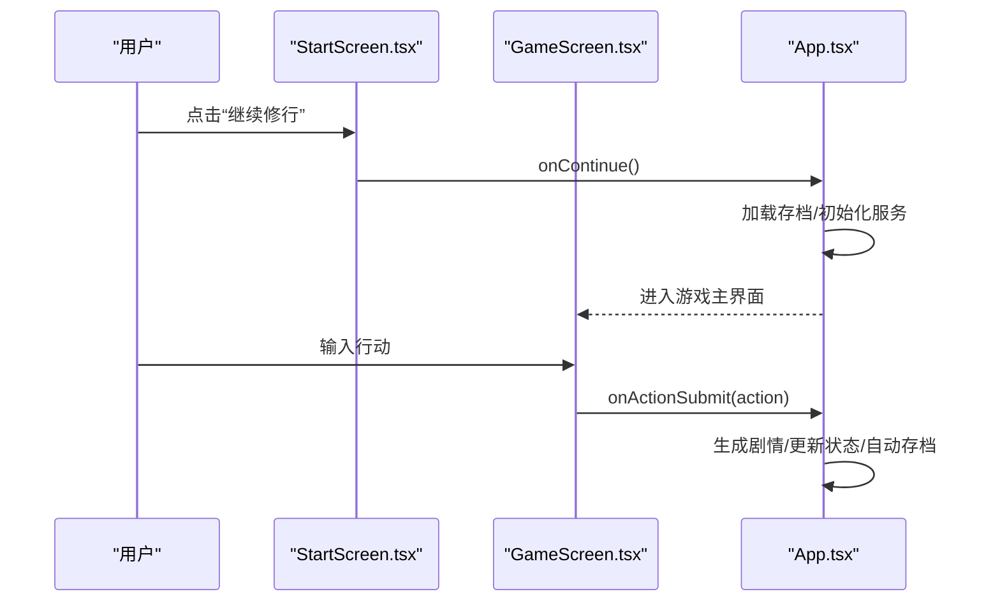
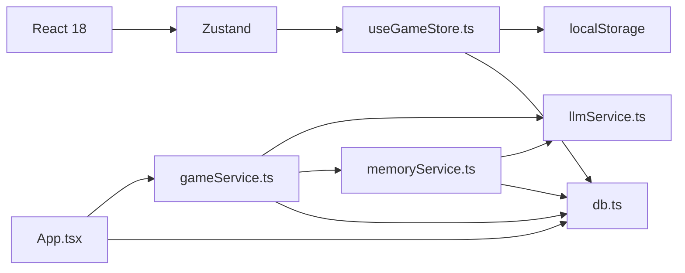

# 项目概述

<cite>
**本文档引用的文件**
- [README.md](file://README.md)
- [package.json](file://package.json)
- [src/App.tsx](file://src/App.tsx)
- [src/main.tsx](file://src/main.tsx)
- [src/tabs/game.ts](file://src/types/game.ts)
- [src/services/gameService.ts](file://src/services/gameService.ts)
- [src/services/llmService.ts](file://src/services/llmService.ts)
- [src/stores/useGameStore.ts](file://src/stores/useGameStore.ts)
- [src/components/StartScreen.tsx](file://src/components/StartScreen.tsx)
- [src/components/GameScreen.tsx](file://src/components/GameScreen.tsx)
- [src/prompts/character.ts](file://src/prompts/character.ts)
- [src/prompts/story.ts](file://src/prompts/story.ts)
- [src/services/memoryService.ts](file://src/services/memoryService.ts)
- [src/services/db.ts](file://src/services/db.ts)
- [AGENTS.md](file://AGENTS.md)
</cite>

## 目录
1. [项目简介](#项目简介)
2. [项目结构](#项目结构)
3. [核心组件](#核心组件)
4. [架构总览](#架构总览)
5. [详细组件分析](#详细组件分析)
6. [依赖关系分析](#依赖关系分析)
7. [性能考量](#性能考量)
8. [故障排查指南](#故障排查指南)
9. [结论](#结论)
10. [附录](#附录)

## 项目简介
本项目是一个纯前端的修仙主题 Roguelike 游戏，完全由大语言模型（LLM）实时驱动游戏内容生成。项目采用无后端架构，用户通过在设置中自填 API Key，即可连接多种 OpenAI 兼容格式的 LLM 供应商（如 OpenAI、DeepSeek、Qwen、Grok、OpenRouter 等），实现角色创建、世界生成、NPC 对话、事件推进与剧情演进的全流程 AI 驱动。

项目具备以下核心价值主张与技术特色：
- 无后端纯前端：所有逻辑运行在浏览器，无需服务器参与
- 用户自填 API Key：支持 OpenAI 兼容格式，便于接入多家 LLM 供应商
- 本地存储存档：结合 localStorage 与 IndexedDB，实现设置与游戏数据的本地持久化
- 手机完美适配：响应式布局，移动端体验优化
- AI 驱动内容生成：角色、世界、NPC、事件、剧情均由 LLM 实时生成，确保每次游玩的独特性

目标用户群体与应用场景：
- 喜欢修仙题材与策略类游戏的玩家
- 希望体验“AI 驱动”内容生成的创意玩家
- 追求“无后端、本地化、隐私可控”的技术爱好者
- 教育与演示场景：展示 LLM 在游戏叙事中的应用潜力

## 项目结构
项目采用 Vite + React 18 + TypeScript 技术栈，配合 TailwindCSS 与 shadcn/ui 组件库，整体目录结构清晰，按功能域划分：

图表来源
- [src/main.tsx](file://src/main.tsx#L1-L11)
- [src/App.tsx](file://src/App.tsx#L1-L588)
- [src/services/llmService.ts](file://src/services/llmService.ts#L1-L101)
- [src/services/gameService.ts](file://src/services/gameService.ts#L1-L541)
- [src/stores/useGameStore.ts](file://src/stores/useGameStore.ts#L1-L226)
- [src/types/game.ts](file://src/types/game.ts#L1-L319)
- [src/prompts/character.ts](file://src/prompts/character.ts#L1-L97)
- [src/prompts/story.ts](file://src/prompts/story.ts#L1-L147)
- [src/services/memoryService.ts](file://src/services/memoryService.ts#L1-L224)
- [src/services/db.ts](file://src/services/db.ts#L1-L236)

章节来源
- [README.md](file://README.md#L77-L97)
- [AGENTS.md](file://AGENTS.md#L225-L283)

## 核心组件
- 应用入口与路由控制：App.tsx 负责游戏阶段（开始页/角色创建/游戏主界面）的切换、LLM 服务与游戏服务的初始化、自动存档与错误处理。
- 状态管理：Zustand store（useGameStore）集中管理玩家、NPC、世界、日志、事件、记忆、回合数、加载状态等。
- LLM 服务：llmService.ts 封装统一的 LLM 调用，支持重试、超时与 OpenAI 兼容格式请求。
- 游戏服务：gameService.ts 负责角色生成、剧情推演、NPC 交互、区域 NPC 生成、记忆记录与摘要生成。
- 记忆服务：memoryService.ts 实现工作记忆、RAG 检索与摘要记忆的三层记忆架构，使用浏览器端嵌入模型进行语义相似度计算。
- 数据持久化：db.ts 封装 IndexedDB，提供存档、记忆的增删查与索引查询。
- UI 组件：StartScreen.tsx 与 GameScreen.tsx 提供开始页与游戏主界面，包含角色状态、剧情日志、行动输入、NPC 交互等模块。

章节来源
- [src/App.tsx](file://src/App.tsx#L16-L588)
- [src/stores/useGameStore.ts](file://src/stores/useGameStore.ts#L13-L226)
- [src/services/llmService.ts](file://src/services/llmService.ts#L18-L101)
- [src/services/gameService.ts](file://src/services/gameService.ts#L50-L541)
- [src/services/memoryService.ts](file://src/services/memoryService.ts#L16-L224)
- [src/services/db.ts](file://src/services/db.ts#L36-L236)
- [src/components/StartScreen.tsx](file://src/components/StartScreen.tsx#L16-L319)
- [src/components/GameScreen.tsx](file://src/components/GameScreen.tsx#L32-L172)

## 架构总览
项目采用“UI 组件层 + 服务层 + 存储层”的分层架构，结合 LLM 作为“内容引擎”，形成“AI 驱动”的 Roguelike 游戏体验。

图表来源
- [src/App.tsx](file://src/App.tsx#L1-L588)
- [src/stores/useGameStore.ts](file://src/stores/useGameStore.ts#L1-L226)
- [src/services/llmService.ts](file://src/services/llmService.ts#L1-L101)
- [src/services/gameService.ts](file://src/services/gameService.ts#L1-L541)
- [src/services/memoryService.ts](file://src/services/memoryService.ts#L1-L224)
- [src/services/db.ts](file://src/services/db.ts#L1-L236)
- [src/prompts/character.ts](file://src/prompts/character.ts#L1-L97)
- [src/prompts/story.ts](file://src/prompts/story.ts#L1-L147)

## 详细组件分析

### 应用入口与生命周期（App.tsx）
- 游戏阶段管理：start（开始页）→ character_creation（角色创建）→ game（游戏主界面）
- LLM 与游戏服务初始化：基于用户设置的 llmConfig，创建 LLMService 与 GameService，并注入记忆服务
- 自动存档：每 30 秒自动保存一次，且每次行动后也会触发保存
- 剧情生成与状态更新：处理玩家行动，调用 GameService 生成剧情，更新玩家状态、时间、修为、物品、技能、关系等
- NPC 交互：支持选择 NPC、打开交互模态、执行交互动作并更新双方状态

图表来源
- [src/App.tsx](file://src/App.tsx#L239-L468)
- [src/services/gameService.ts](file://src/services/gameService.ts#L283-L391)
- [src/services/memoryService.ts](file://src/services/memoryService.ts#L175-L188)
- [src/services/llmService.ts](file://src/services/llmService.ts#L29-L98)
- [src/services/db.ts](file://src/services/db.ts#L134-L150)

章节来源
- [src/App.tsx](file://src/App.tsx#L16-L588)

### 游戏服务（GameService）
- 角色生成：基于 characterSystemPrompt 与 characterGenerationPrompt，生成 3 个风格迥异的角色，确保属性与天赋合理
- 剧情推演：基于 storySystemPrompt 与 storyGenerationPrompt，结合记忆上下文，生成剧情、时间消耗、修为增长、物品/技能变更、NPC 交互与关系变化
- NPC 交互：根据 NPC 与玩家状态，生成对话与交互结果，支持好感度变化、属性变化、时间流逝与故事更新
- 区域 NPC 生成：为当前区域生成符合情境的 NPC，考虑玩家境界与区域特色
- 记忆记录：将关键事件与交互写入记忆库，支持 RAG 检索与摘要生成

图表来源
- [src/services/gameService.ts](file://src/services/gameService.ts#L283-L391)
- [src/prompts/character.ts](file://src/prompts/character.ts#L1-L97)
- [src/prompts/story.ts](file://src/prompts/story.ts#L1-L147)

章节来源
- [src/services/gameService.ts](file://src/services/gameService.ts#L50-L541)

### 记忆服务（MemoryService）
- 三层记忆架构：工作记忆（最近 N 条）、摘要记忆（旧记忆压缩）、RAG 检索（语义相似度）
- 嵌入模型：使用 @xenova/transformers 的轻量级特征提取模型生成向量，支持降级到简单哈希向量
- 相似度计算：余弦相似度，支持基于重要性的检索
- 摘要生成：当记忆数量超过阈值时，使用 LLM 生成摘要，降低上下文长度
- 清理策略：保留重要记忆与最近记忆，定期清理冗余

图表来源
- [src/services/memoryService.ts](file://src/services/memoryService.ts#L83-L173)
- [src/services/db.ts](file://src/services/db.ts#L161-L189)

章节来源
- [src/services/memoryService.ts](file://src/services/memoryService.ts#L16-L224)

### LLM 服务（LLMService）
- 统一 API 调用：支持 OpenAI 兼容格式，自动拼接 chat/completions 请求
- 重试机制：最大重试次数为 3，指数退避延迟
- 响应格式：强制 JSON 输出，便于结构化解析
- 使用统计：记录 prompt_tokens、completion_tokens、total_tokens，便于成本控制

图表来源
- [src/services/llmService.ts](file://src/services/llmService.ts#L29-L98)

章节来源
- [src/services/llmService.ts](file://src/services/llmService.ts#L18-L101)

### 状态管理（useGameStore）
- 游戏状态：玩家、NPC、世界、日志、事件、记忆、回合数、加载状态、存档 ID、上次保存时间
- 持久化：使用 zustand-persist 与 localStorage，仅持久化必要字段
- 方法：设置玩家、更新玩家、添加 NPC、更新 NPC、设置世界、更新时间、添加日志/事件/记忆、增量计数、选择/交互 NPC、更新附近 NPC 列表等

图表来源
- [src/stores/useGameStore.ts](file://src/stores/useGameStore.ts#L13-L226)

章节来源
- [src/stores/useGameStore.ts](file://src/stores/useGameStore.ts#L1-L226)

### UI 组件（StartScreen.tsx 与 GameScreen.tsx）
- 开始页：提供“继续修行”、“重新转世”、“前往设置”等入口，检测 LLM 配置完整性，展示存档信息与主题切换
- 游戏主界面：左侧角色状态面板，中间剧情日志与行动输入，右侧地图与 NPC 面板，悬浮显示 Token 使用情况，沉浸式加载提示，NPC 交互模态框

图表来源
- [src/components/StartScreen.tsx](file://src/components/StartScreen.tsx#L16-L319)
- [src/components/GameScreen.tsx](file://src/components/GameScreen.tsx#L32-L172)
- [src/App.tsx](file://src/App.tsx#L124-L237)

章节来源
- [src/components/StartScreen.tsx](file://src/components/StartScreen.tsx#L1-L319)
- [src/components/GameScreen.tsx](file://src/components/GameScreen.tsx#L1-L172)

## 依赖关系分析
- 技术栈依赖：Vite、React 18、TypeScript、TailwindCSS、shadcn/ui、Zustand、@xenova/transformers、lucide-react、sonner 等
- 服务耦合：GameService 依赖 LLMService 与 MemoryService；MemoryService 依赖 LLMService 与 db.ts；App.tsx 依赖 GameService 与 db.ts
- 存储耦合：useGameStore 依赖 localStorage；db.ts 依赖 IndexedDB；MemoryService 依赖 db.ts

图表来源
- [package.json](file://package.json#L15-L53)
- [src/App.tsx](file://src/App.tsx#L1-L588)
- [src/services/gameService.ts](file://src/services/gameService.ts#L1-L541)
- [src/services/llmService.ts](file://src/services/llmService.ts#L1-L101)
- [src/services/memoryService.ts](file://src/services/memoryService.ts#L1-L224)
- [src/services/db.ts](file://src/services/db.ts#L1-L236)

章节来源
- [package.json](file://package.json#L1-L55)
- [AGENTS.md](file://AGENTS.md#L17-L24)

## 性能考量
- LLM 调用成本控制：通过记录 token 使用量与 JSON 输出格式，减少不必要的解析与传输
- 记忆系统优化：工作记忆限制大小、摘要阈值与 RAG 检索，降低上下文长度与计算复杂度
- 前端渲染优化：使用 React 18 的并发特性与动画库，保证流畅体验
- 存储优化：localStorage 仅持久化必要字段，IndexedDB 分离存档与记忆，避免重复读写

## 故障排查指南
- LLM 调用失败：检查 API Key、Base URL 与模型名称是否正确；查看网络请求与错误提示；确认重试机制是否生效
- 剧情生成异常：检查提示词是否完整、JSON 格式是否正确；查看解析与默认值处理
- 自动存档失败：检查 IndexedDB 初始化与权限；确认 saveId 是否存在；查看控制台错误
- NPC 交互异常：确认 selectedNPCId 与 isNPCInteracting 状态；检查交互结果的字段映射
- 主题切换无效：确认 useSettingsStore 的主题状态同步至 <html> class

章节来源
- [src/services/llmService.ts](file://src/services/llmService.ts#L37-L55)
- [src/App.tsx](file://src/App.tsx#L74-L122)
- [src/components/StartScreen.tsx](file://src/components/StartScreen.tsx#L30-L44)
- [src/services/db.ts](file://src/services/db.ts#L39-L72)

## 结论
本项目以“AI 驱动”为核心理念，通过纯前端架构实现了修仙主题 Roguelike 的完整体验。借助 LLM 的强大内容生成能力与三层记忆系统，游戏具备高度的可玩性与可扩展性。项目在技术选型、架构设计与用户体验方面均体现出良好的工程实践，既适合初学者快速上手，也为有经验的开发者提供了深入定制的空间。

## 附录
- 支持的 LLM 供应商与推荐模型：OpenAI、DeepSeek、Qwen、Grok、OpenRouter 等
- 部署方式：Vercel、GitHub Pages、Netlify、Cloudflare Pages、AWS S3 等静态托管服务
- 开发与测试：Vite 开发服务器、ESLint 代码检查、Vitest 单元测试与覆盖率

章节来源
- [README.md](file://README.md#L47-L76)
- [AGENTS.md](file://AGENTS.md#L27-L51)